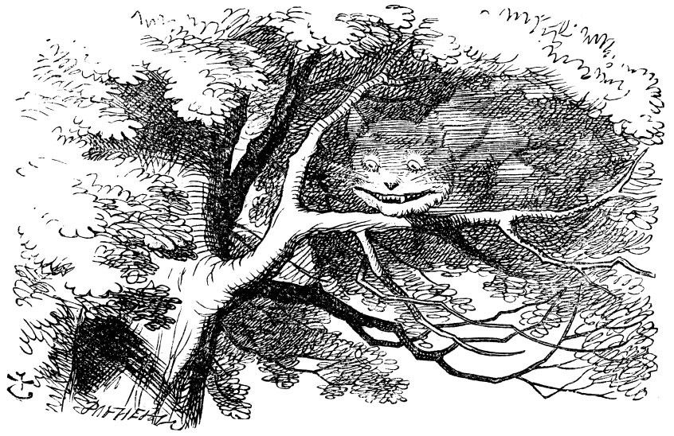
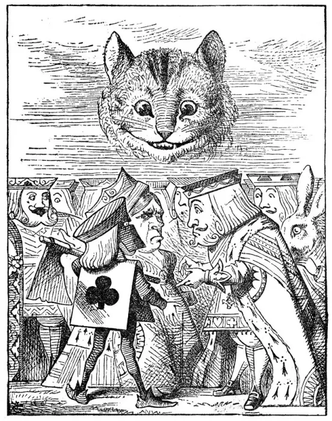

# 今天的文学猫角色：Cheshire Cat（柴郡猫）

柴郡猫出自刘易斯·卡罗尔的《爱丽丝梦游仙境》。原作对它的毛色没有作出明确规定，但给了几个非常鲜明的身体特征：它是一只“大猫”，总是咧着嘴笑，长着很长的爪子和许多牙齿。约翰·坦尼尔为初版小说绘制的经典黑白插图，则把它画成一只体格厚实、带条纹感的猫，这一视觉形象后来影响极大。至于迪士尼动画里粉紫相间、条纹鲜艳的柴郡猫，则属于二十世纪改编重新建立的色彩形象，并不是卡罗尔文本中的设定。

爱丽丝第一次在公爵夫人的厨房里见到它时，就被那种“从一只耳朵笑到另一只耳朵”的表情吸引。离开厨房后，柴郡猫又出现在树林中，为爱丽丝指路，却用一连串看似绕弯、其实逻辑严密的话告诉她：如果不知道自己想去哪里，那么走哪条路都没有区别。它还断言仙境里的人全都疯了，包括爱丽丝，也包括它自己。

柴郡猫真正令人难忘的能力，是它可以让身体随意出现和消失，而且消失得非常讲究次序：有一次它从尾巴开始一点点淡去，最后只剩下笑容悬在空中。爱丽丝因此见到了那幅后来成为整部作品象征之一的画面——“没有猫的笑容”。这种能力也让它处在仙境规则之外：红心王后想砍掉它的头时，现场只剩下一颗悬空的脑袋，于是刽子手陷入了一个荒诞问题——没有身体的头究竟该怎么砍。

“像柴郡猫一样咧嘴笑”这个说法其实早于卡罗尔的小说。卡罗尔没有创造这句俗语，而是把一个已经存在于英语里的比喻真正变成了角色：一只可以消失，却能把笑容留下来的猫。于是柴郡猫既是故事中的向导，也是仙境本身的一种化身——友善、古怪、讲逻辑，却从来不肯按照现实世界的方式行事。

### 视觉参考

1. 约翰·坦尼尔笔下树上的柴郡猫
   - 来源页面：https://www.pinterest.com/pin/677158493950726668/
   - 原始图片：https://i.pinimg.com/originals/54/d0/54/54d05410e8bc91786f7da6ce079cc4ac.jpg
   - 作者/机构：John Tenniel
   - 说明：经典初版插画体系
2. 柴郡猫悬在王室上方的笑脸
   - 来源页面：https://www.fineartstorehouse.com/magical-world-illustration/palmer-illustrated-collection/cheshire-cat-smiling-king-queen-alice-21177459.html
   - 原始图片：https://www.fineartstorehouse.com/p/629/cheshire-cat-smiling-king-queen-alice-21177459.jpg.webp
   - 作者/机构：John Tenniel
   - 说明：突出其身体消失、只剩头部与笑容的经典场景
