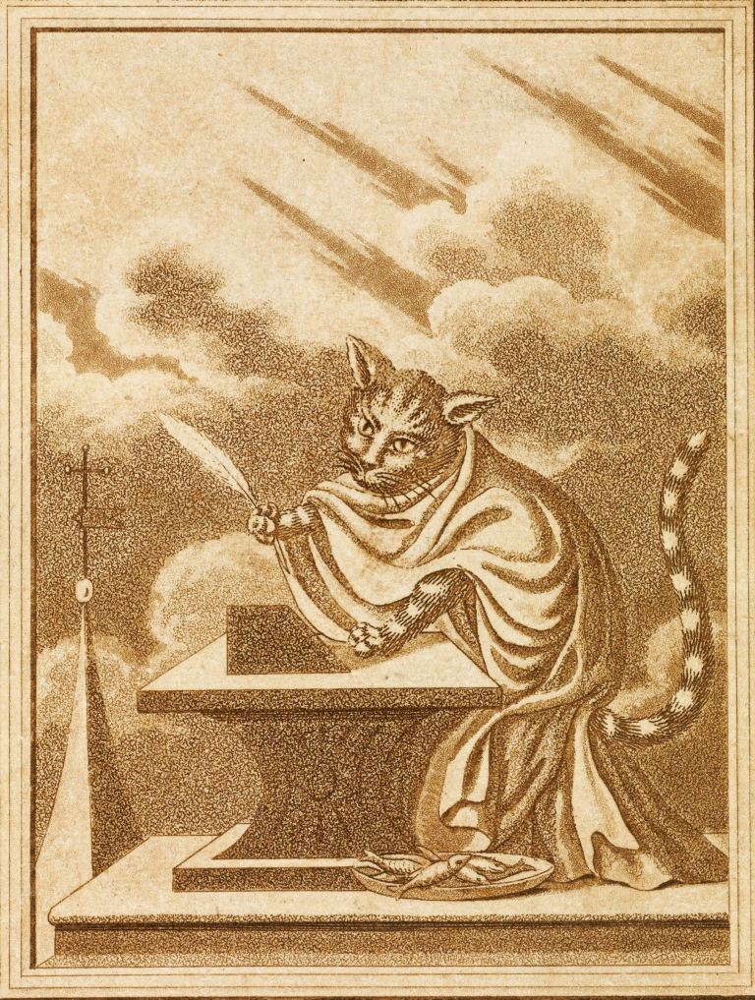
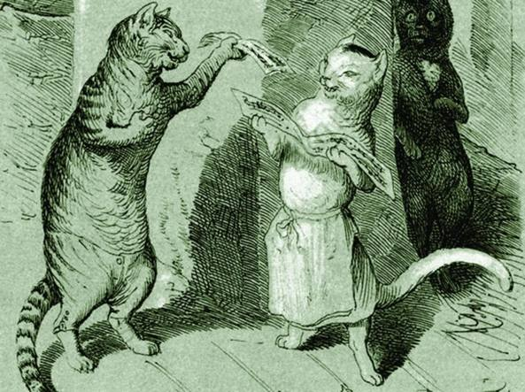

# 今天的文学猫角色：Kater Murr（穆尔猫）

E. T. A. 霍夫曼笔下的穆尔猫有一套非常具体、甚至颇为华丽的外貌设定。它背上是灰黑相间的条纹，这些纹路在两耳之间汇聚，像在额头写出一串精巧的“象形文字”；尾巴同样有条纹，而且格外粗长。阳光照在毛皮上时，黑灰之间还能显出细细的金黄色光泽。它有一双草绿色的眼睛，白色而修长的胡须则让它看上去像一位已经有资格摆出哲人姿态的年轻学者。

穆尔出自霍夫曼的小说《雄猫穆尔的人生观》。它不是谁家的陪衬宠物，而是直接以“作者”的身份写自己的回忆录。它相信自己富有才华、修养和思想深度，会谈论成长、友情、爱情、艺术和教育，也非常乐于把自己的经历提升成普遍的人生哲理。霍夫曼故意让一只猫拥有文人式的自我意识，因此穆尔越认真，讽刺效果往往越强。

整部小说最巧妙的地方，在于穆尔的自传并不是完整地单独出现。按照书中的虚构出版说明，它写稿时拿了一部关于乐长约翰内斯·克莱斯勒的传记手稿当作吸墨和垫纸的废纸，结果印刷时两种稿件被混在了一起。于是读者一会儿读到穆尔洋洋自得的人生回忆，一会儿又突然进入敏感、复杂、充满艺术困境的克莱斯勒故事。两条叙事彼此打断，却又不断形成反照。

这种结构让穆尔不只是“会写作的猫”。它代表了一种非常自信、非常完整的自我理解：它确信自己已经掌握了世界的规律，而小说另一半的克莱斯勒却始终处在矛盾、痛苦和无法安顿的状态里。一个自鸣得意的猫作家和一个真正困顿的艺术家被装订进同一本书，正是霍夫曼最精彩的文学玩笑之一。

### 视觉参考

1. 穆尔猫执笔写作的经典卷首图
   - 本地文件：`../assets/kater-murr/01.jpg`
   - 来源页面：https://etahoffmann.staatsbibliothek-berlin.de/leben-und-werk/literat/werkinterpretationen/
   - 原始图片：https://etahoffmann.staatsbibliothek-berlin.de/wp-content/uploads/Katalog-Ponert-SBBamberg-Abb.167b-Kat.218_L.g.o.391b_Ebd.Vorderseite-Bd.1-Kater-Murr-eingeb_beschnitten-768x1017.jpg
   - 作者/机构：E. T. A. Hoffmann Portal / Staatsbibliothek zu Berlin
   - 说明：强调穆尔作为“作家”的拟人化形象
2. Theodor Hosemann笔下的穆尔猫群像
   - 本地文件：`../assets/kater-murr/02.jpg`
   - 来源页面：https://www.corriere.it/cultura/16_aprile_08/hoffmann-gatto-murr-33afbfb2-fd98-11e5-820b-500d9d51558a.shtml
   - 原始图片：https://images2.corriereobjects.it/methode_image/2016/04/08/Cultura/Foto%20Cultura%20-%20Trattate/09_HOSEMANN_MURR_1844-U430605845976557d-U43170546763225YzF-1224x916%40Corriere-Web-Sezioni-593x443.jpg
   - 作者/机构：Theodor Hosemann
   - 说明：1844年前后早期插画体系
