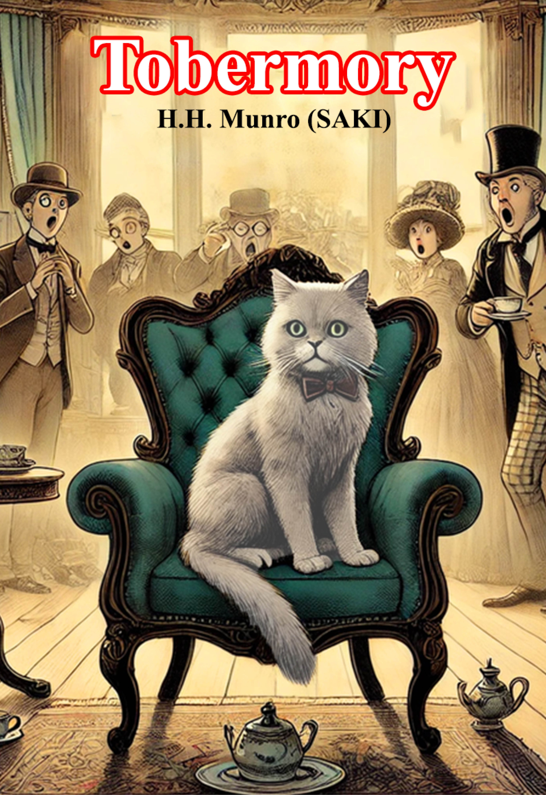
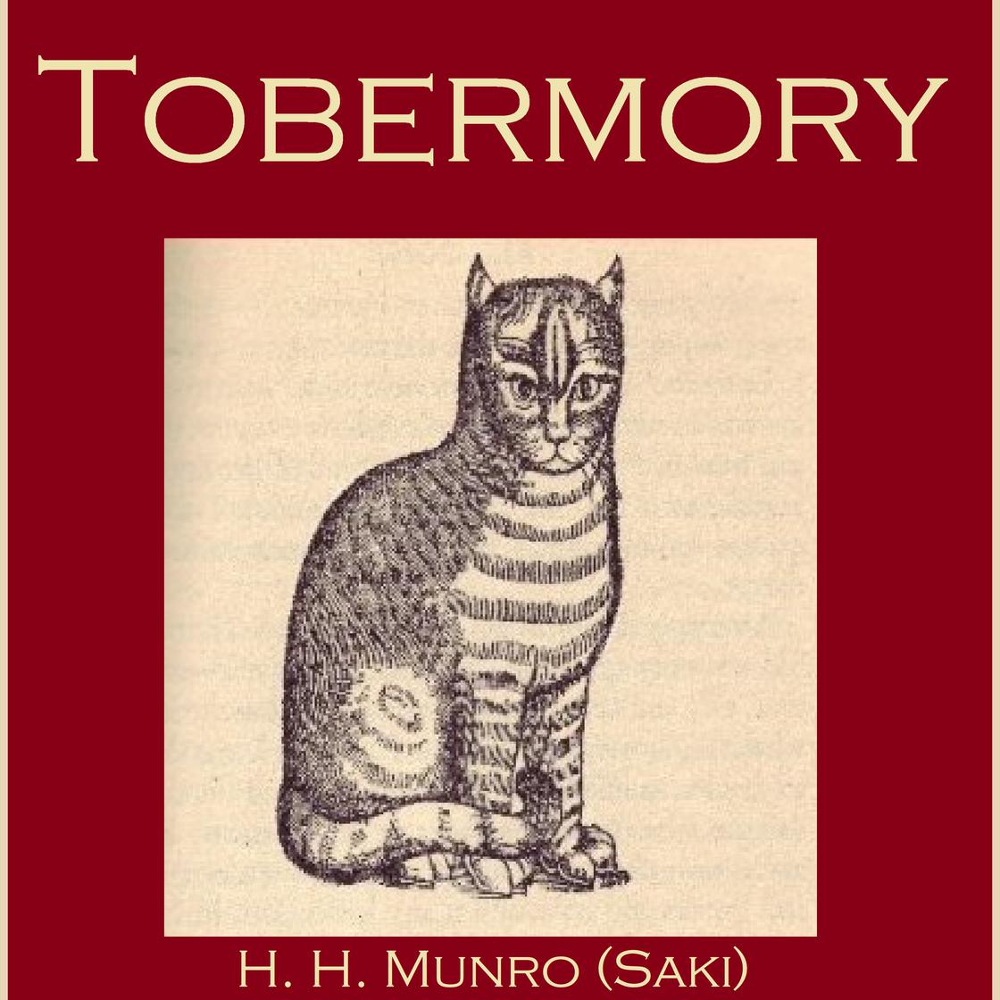

# 今天的文学猫角色：Tobermory（托伯莫里）

托伯莫里出自萨基（Saki，本名 H. H. Munro）的短篇小说《Tobermory》。很特别的一点是，原作几乎没有给这只猫规定明确的毛色或花纹。故事中反而会提到别的猫——例如马厩附近的一只玳瑁猫，以及教区牧师家一只体型很大的黄公猫——但托伯莫里自己的外貌始终没有被细致描述。因此，它没有像柴郡猫或普路托那样固定的“标准长相”；不同插画版本往往会各自发挥。

真正让托伯莫里与众不同的不是样貌，而是语言。一个名叫 Cornelius Appin 的人经过多年实验，声称自己终于成功教会动物说人类语言，而托伯莫里就是第一个成果。起初，庄园里的客人只把这当作一场把戏；但当托伯莫里真的用冷静、准确、甚至有些傲慢的语气开口后，气氛立刻发生了变化。

猫平日里可以自由穿过房间、蹲在窗边、藏在家具下面，而人类往往默认它“听见了也不算听见”。托伯莫里一旦拥有语言，这种优势就变得极其危险。它开始毫不客气地复述自己听到的闲话、虚伪的客套和背后的评价，把宾客们努力维持的体面一点点拆穿。它并没有刻意编造恶毒内容，只是把事实说出来，而这恰恰让所有人更加恐慌。

故事后来迅速滑向黑色喜剧。宾客们开始认真讨论怎样让这只知道太多秘密的猫消失，甚至担心它会把说话能力教给其他猫。托伯莫里最终没有死于人类准备的毒计，而是在外面与教区牧师家的那只大黄公猫打斗时被咬死，爪间还留着对方的黄毛。对屋里的人而言，这个结局带来的不是悲伤，而是如释重负。

萨基真正讽刺的并不是一只爱揭短的猫，而是那些害怕真话的人。托伯莫里只是拥有了把观察说出口的能力，就立刻从宠物变成了威胁；它越平静、越像一只普通猫，人类的慌乱和虚伪就显得越滑稽。

### 视觉参考

1. 现代版本中的托伯莫里形象
   - 本地文件：`../assets/tobermory/01.jpg`
   - 来源页面：https://aliflaila.app/books/tobermory
   - 原始图片：https://cdn.aliflaila.app/books/3954362594/cover_vVmsCYRBfwfM6hxjvDQ7BHtkv1bQliINLihHWPgj.jpg
   - 作者/机构：Ali Flaila
   - 说明：原作未规定毛色，因此作为后世视觉化参考
2. 托伯莫里有声书封面的古典猫形象
   - 本地文件：`../assets/tobermory/02.jpg`
   - 来源页面：https://libro.fm/audiobooks/9781467667951-tobermory
   - 原始图片：https://covers.libro.fm/9781467667951_1120.jpg
   - 作者/机构：Libro.fm
   - 说明：另一种后世视觉呈现，用于体现角色形象并无唯一标准
