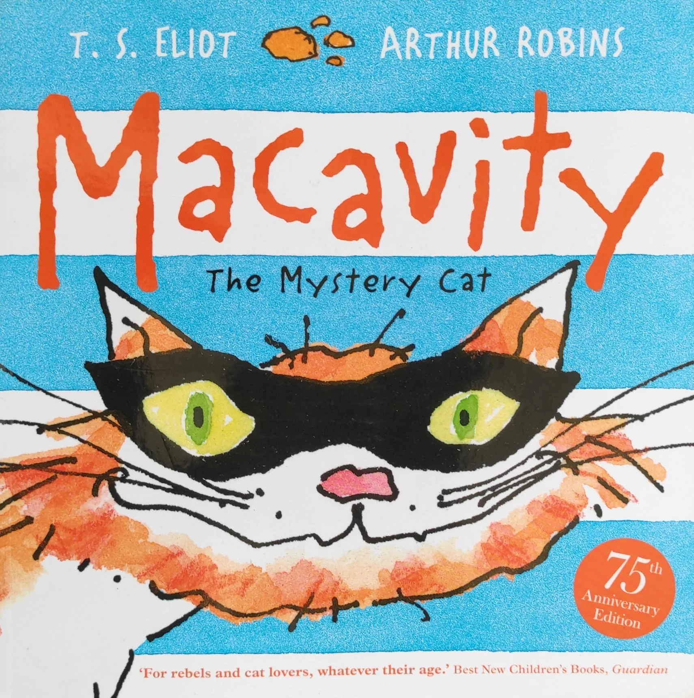
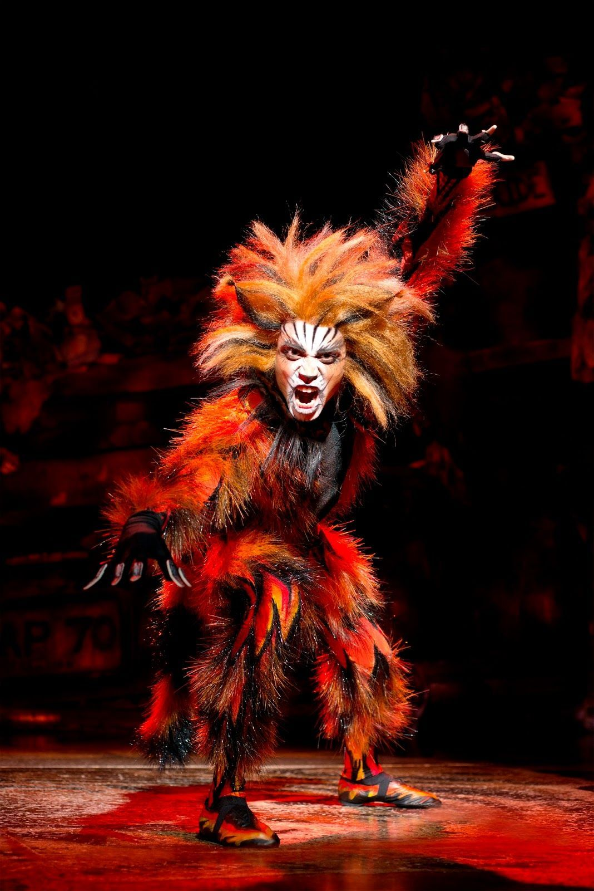

# 今天的文学猫角色：Macavity（麦卡维蒂）

麦卡维蒂出自 T. S. 艾略特的猫诗集《老负鼠的猫经》（Old Possum’s Book of Practical Cats）。它的外貌在原诗中写得非常鲜明：一只姜黄色的猫，身材高而瘦，眼窝深陷，额头布满像是思考留下的皱纹，头顶高而圆；毛因为疏于打理显得灰扑扑的，胡须也乱糟糟。它还会像蛇一样左右摆动脑袋，看起来仿佛半睡半醒，实际上始终保持警觉。

麦卡维蒂不是普通意义上的淘气猫，而是诗中一位真正的“犯罪大师”。各种失窃、破坏和离奇案件似乎都与它有关，可每当苏格兰场或飞行队赶到现场，它总是已经消失，而且还能找到不止一个不在场证明。艾略特不断重复“Macavity’s not there”，让这个角色像一个永远抓不到的幽灵，也让它的危险带上一种轻快的童谣节奏。

这个形象明显借用了柯南·道尔笔下福尔摩斯的宿敌莫里亚蒂教授。诗中称麦卡维蒂为“犯罪界的拿破仑”，正呼应了福尔摩斯对莫里亚蒂的评价。于是，麦卡维蒂可以被理解成一只猫版的犯罪首脑：它并不亲自留下证据，却仿佛站在各种坏事的背后策划一切。

安德鲁·劳埃德·韦伯后来把艾略特的诗集改编成音乐剧《Cats》，麦卡维蒂也因此获得了更加固定的舞台形象。不同制作会采用红棕、橙褐或带黑色斑纹的夸张造型，并把它的动作设计得更尖锐、更具威胁感。舞台版本强化了反派气质，而艾略特原诗中的麦卡维蒂则更像一个带着冷幽默的传奇罪犯：瘦长、邋遢、机警，而且永远在警察抵达前一步消失。

### 视觉参考

1. Arthur Robins绘本版麦卡维蒂
   - 本地文件：`../assets/macavity/01.webp`
   - 来源页面：https://www.bookzters.com/products/macavity-the-mystery-cat
   - 原始图片：https://www.bookzters.com/cdn/shop/files/33_35bfcc42-43db-41a0-a065-8cb517f90750.jpg?v=1714698868
   - 作者/机构：Arthur Robins
   - 说明：现代绘本对角色的代表性视觉化
2. 音乐剧《Cats》舞台上的麦卡维蒂
   - 本地文件：`../assets/macavity/02.jpg`
   - 来源页面：https://www.pinterest.com/pin/513340057527652605/
   - 原始图片：https://i.pinimg.com/originals/01/92/5a/01925a931e2963d37a9ca6d2f3256c06.jpg
   - 作者/机构：《Cats》舞台制作
   - 说明：与原诗形象互补的经典舞台版本
