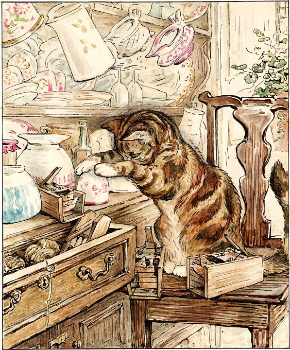
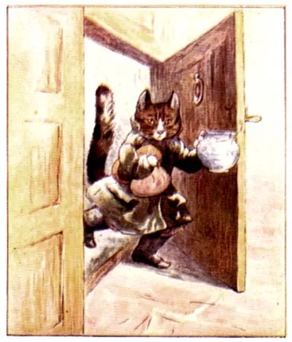

# 今天的文学猫角色：Simpkin（辛普金）

辛普金出自碧雅翠丝·波特的《格洛斯特的裁缝》。原作文字没有用一大段篇幅规定它的毛色和体型，但波特本人同时也是这本书的插画家，因此角色拥有非常稳定的视觉形象：一只结实、圆润的虎斑猫，身上带着明显的深色条纹，口鼻、胸腹和爪部颜色更浅。波特自己的水彩画让辛普金看起来既像真正的家猫，又带着一点神气和不耐烦。

故事里，辛普金陪伴着一位贫穷的老裁缝。它会替主人跑腿买食物和线，也会在屋里捕捉老鼠。圣诞节前，裁缝接到一件关系生计的重要订单，要为市长婚礼缝制一套极其华丽的衣服。偏偏就在这个时候，裁缝发现辛普金把几只老鼠扣在茶杯下面，便把它们全部放走了。

辛普金回来后发现自己的“猎物”没了，立刻大发脾气。它把买回来的最后一束樱桃红色丝线藏了起来，而裁缝又在此时病倒，眼看无法完成订单。被救下的老鼠却在圣诞夜偷偷进入裁缝铺，替老人把绝大部分衣服缝好，只留下最后一个扣眼，并留下那句著名的“NO MORE TWIST”——因为最后一点线不在他们手里。

辛普金并没有被写成一个单纯使坏的角色。到了圣诞节早晨，它最终把藏起来的红线送回主人身边，站在那里显得十分悔悟。这个变化让它更像一只真实的猫：会因为自己的猎物被放走而赌气，会记仇，也会在怒气过去之后重新靠近主人。

《格洛斯特的裁缝》充满童话色彩，但辛普金的猫性始终很具体。它既不是魔法猫，也不会说人话，只是有自己的脾气、欲望和判断。正因为如此，当老鼠在夜里像小裁缝一样工作时，整个奇迹反而显得更加温暖。

### 视觉参考

1. 碧雅翠丝·波特笔下在裁缝铺中的辛普金
   - 本地文件：`../assets/simpkin/01.jpg`
   - 来源页面：https://familychristmasonline.com/stories_other/potter/tailor/tailor.htm
   - 原始图片：https://familychristmasonline.com/stories_other/potter/tailor/7_simpkin.jpg
   - 作者/机构：Beatrix Potter
   - 说明：作者本人原始水彩插画
2. 辛普金外出办事的拟人化形象
   - 本地文件：`../assets/simpkin/02.webp`
   - 来源页面：https://russiskskolebergen.com/%D0%BF%D0%BE%D0%BB%D0%B5%D0%B7%D0%BD%D1%8B%D0%B5-%D1%81%D1%81%D1%8B%D0%BB%D0%BA%D0%B8/%D1%81%D0%BA%D0%B0%D0%B7%D0%BA%D0%B8-2/%D0%BF%D0%BE%D1%80%D1%82%D0%BD%D0%BE%D0%B9-%D0%B8%D0%B7-%D0%B3%D0%BB%D0%BE%D1%81%D1%82%D0%B5%D1%80%D0%B0/
   - 原始图片：https://i0.wp.com/skazkivcem.ucoz.ru/BeatrixPortnoy/the_tailor_of_gloucester_16.jpg
   - 作者/机构：Beatrix Potter
   - 说明：作者本人插画中较拟人化的一面
