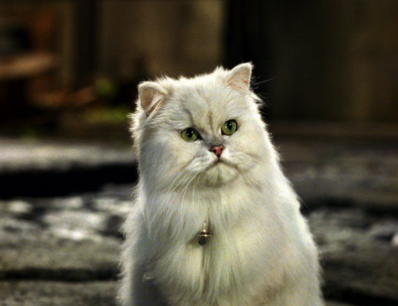
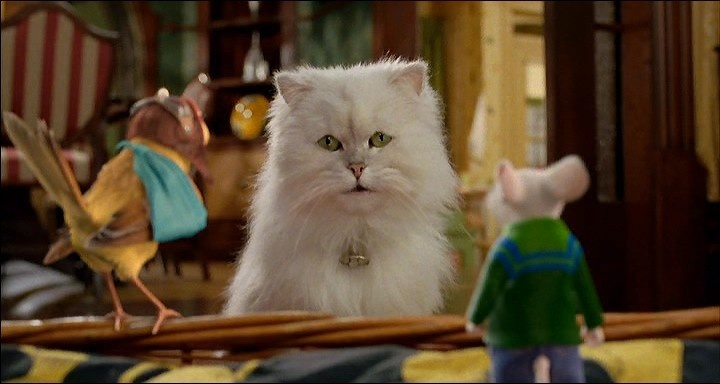

# 今天的文学猫角色：Snowbell（雪球）

Snowbell 出自 E. B. 怀特 1945 年的小说《精灵鼠小弟》（Stuart Little）。原作首先把它定义得很简单：Little 太太养的一只白猫。文字没有进一步规定品种和毛长，却给过一个很有威慑力的特写——Snowbell 张开嘴时，会露出两排闪亮洁白、像针一样尖的牙齿。1999 年电影《精灵鼠小弟》把它的外貌具体化为一只毛发丰厚的白色波斯猫，圆脸、短鼻，配着浅色眼睛和项圈；这个银幕版本后来成为最广为人知的 Snowbell 形象。

在原著中，Snowbell 面临一个对猫来说非常尴尬的家庭关系：Stuart 虽然长得像一只只有几英寸高的老鼠，却是 Little 家真正的家庭成员。Snowbell 的捕猎本能告诉它这应该是猎物，家庭规则却明确告诉它绝不能这么做。怀特由此制造出一种非常冷静的幽默——猫必须和一只“老鼠”共同生活，而且还要承认对方在家庭里的地位。

这种矛盾在小鸟 Margalo 被 Little 家收留后进一步加剧。Snowbell 对鸟同样有强烈的捕猎兴趣，Stuart 甚至曾为了保护 Margalo，用弓箭瞄准逼近她的 Snowbell。后来，Snowbell 向另一只安哥拉猫抱怨自己的处境，无意间把 Margalo 的位置和 Little 家外出的时间透露了出去。安哥拉猫由此萌生了捕杀 Margalo 的计划，幸好一只灰鸽偷听到谈话并提前警告了她。

Margalo 随后离开了 Little 家，这件事也推动 Stuart 踏上寻找她的旅程。因此，Snowbell 并不是一个只负责制造家庭笑料的宠物角色；它的猫性——嫉妒、捕猎欲、领地意识以及对荒唐家庭秩序的不满——实际改变了故事后半段的方向。

电影版对 Snowbell 做了很大的性格调整。它依然会抱怨和排斥 Stuart，却被塑造成更明显的喜剧搭档，并最终与 Stuart 建立起真正的感情。于是，同一只白猫在小说和电影中呈现出两种不同气质：原著里的 Snowbell 更冷、更像一只坚持猫本能的家庭成员；电影里的白色波斯猫则逐渐成为嘴硬心软的伙伴。

### 视觉参考

1. 1999年电影《精灵鼠小弟》中的Snowbell
   - 本地文件：`../assets/snowbell/01.png`
   - 来源页面：https://cheezburger.com/43024901/20-iconic-cats-in-movies-that-made-the-big-screen-their-scratching-post
   - 原始图片：https://i.chzbgr.com/full/10570072576/hF22421AD/snowbell-stuart-little-1999
   - 作者/机构：Columbia Pictures film still
   - 说明：最广为人知的白色波斯猫银幕形象
2. 《精灵鼠小弟2》中的Snowbell
   - 本地文件：`../assets/snowbell/02.jpg`
   - 来源页面：https://teleguide.info/film51779.html
   - 原始图片：https://img.teleguide.info/film/51/51779/10.jpg
   - 作者/机构：Columbia Pictures film still
   - 说明：另一部电影中的近景，补充脸型和毛发细节
