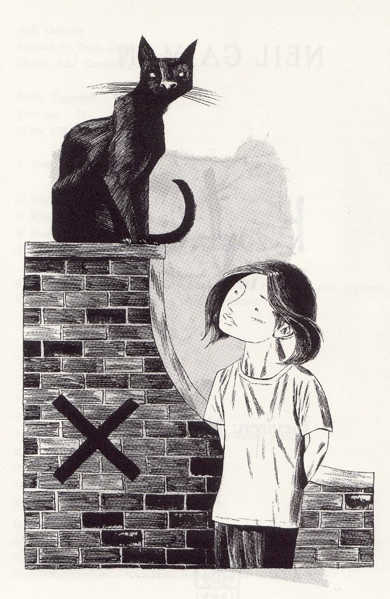
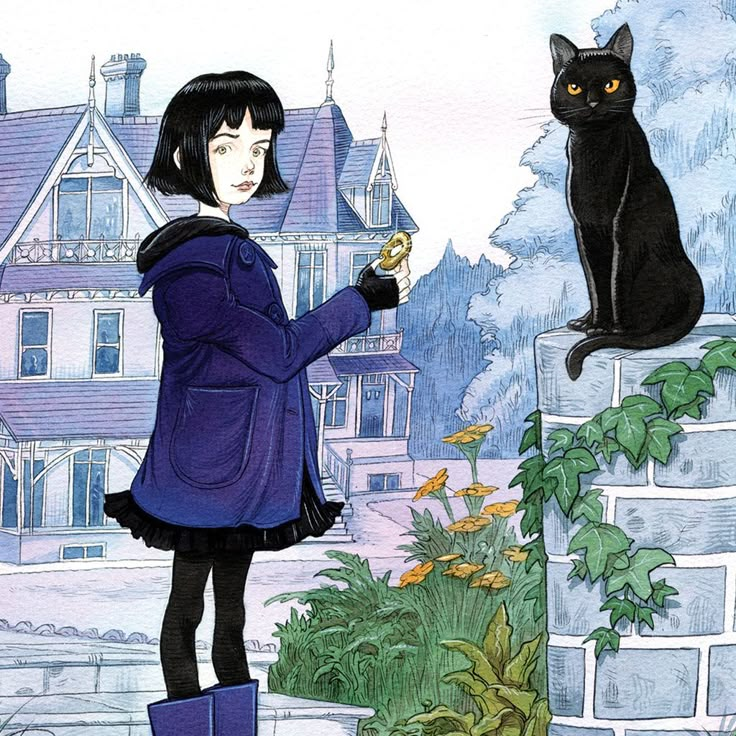

# 今天的文学猫角色：The Cat（《Coraline》中的无名黑猫）

尼尔·盖曼的《Coraline》（中文常见译名有《鬼妈妈》《卡萝兰》）里，这只猫连名字都没有，却有一副非常明确的样子：一只体型颇大的黑猫，眼睛是闪着光的绿色。它打哈欠时会露出异常鲜艳的粉红色舌头，行动则始终带着一种从容而自负的猫科姿态。原作插画家 Dave McKean 把它画得瘦长、尖耳、线条锋利，几乎像一团有生命的黑影；Chris Riddell 后来的插画则让它更接近一只真实而漂亮的黑猫，圆润一些，却仍保留那双醒目的眼睛和冷静的神情。

这只猫住在 Coraline 新家附近。起初它只是院子里一只似乎总在观察人的黑猫，但当 Coraline 穿过小门进入“另一个世界”后，它突然开口说话。更奇怪的是，那里所有熟悉的人似乎都有一个被“另一个妈妈”制造出来的替代品，猫却没有。Coraline 以为自己遇见了“另一只猫”，它却很不客气地纠正她：它不是“另一个什么”，它就是它自己。猫解释说，人类之所以需要名字，是因为不知道自己是谁；猫知道自己是谁，所以根本不需要名字。

这种近乎傲慢的自信，其实正是它在故事中的力量。另一个世界看上去比现实更漂亮、更体贴，另一个妈妈也比 Coraline 忙碌的亲生父母更愿意满足她，但猫从一开始就不受这种幻象迷惑。它可以在两个世界之间自由出入，也知道那个世界远比表面看起来危险。它告诉 Coraline，那地方更像一张蜘蛛网：不需要无限广大，只需要大到足以抓住猎物。

猫并不扮演传统童话里温柔耐心的向导。它经常话说一半就走掉，会突然蹲下捕捉只有它注意到的东西，也会对 Coraline 的问题表现得漫不经心。但在关键时刻，它几乎总在场。Coraline 的父母失踪后，它用行动把她引到镜子前，让她意识到父母确实被困住；在寻找三个幽灵孩子灵魂的游戏中，它抓住了携带其中一个灵魂的黑老鼠；最终逃离另一个世界时，Coraline 更直接把猫扔向另一个妈妈。黑猫立刻炸毛、亮爪、咬住她的脸，为 Coraline 争取到了冲向门口的几秒钟。

这只猫最有意思的地方，也许就在于它从来没有真正“成为 Coraline 的宠物”。它愿意帮助她，却不属于她；会陪伴她，却始终保持自己的距离。故事结束后，它仍旧是那只可以忽然出现、又忽然不见的黑猫。它没有姓名，也没有主人，而它自己显然认为，这两样东西都完全没有必要。

### 视觉参考

1. Dave McKean 笔下的无名黑猫与 Coraline
   - 本地文件：`../assets/coraline-cat/01.jpg`
   - 来源页面：https://imgur.com/gallery/dave-mckeans-sketches-coraline-book-by-neil-gaiman-OVKIQ
   - 原始图片：https://i.imgur.com/eZNQGVpg.jpg
   - 作者/机构：Dave McKean
   - 说明：Dave McKean 是 2002 年原版《Coraline》的插画家；这幅黑白图突出黑猫瘦长、尖耳和略显诡秘的气质。
2. Chris Riddell 笔下的无名黑猫与 Coraline
   - 本地文件：`../assets/coraline-cat/02.jpg`
   - 来源页面：https://www.pinterest.com/pin/aleatrios--741053313728078941/
   - 原始图片：https://i.pinimg.com/736x/2a/4e/a7/2a4ea7fa5a21d9e1c0dba6099f306f4e.jpg
   - 作者/机构：Chris Riddell
   - 说明：Chris Riddell 为后来的 Bloomsbury 插图版绘制了大量《Coraline》插画，这个版本让黑猫显得更接近真实家猫，也清楚呈现了它与 Coraline 并肩出现的关系。
