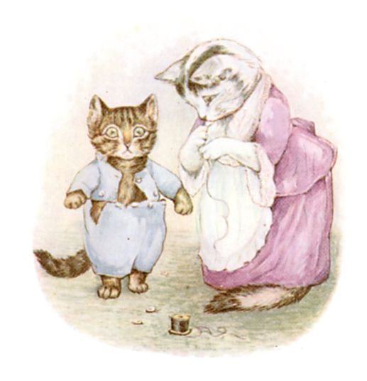
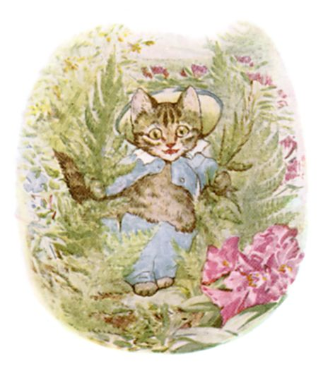

# 今天的文学猫角色：Tom Kitten（小猫汤姆）

碧雅翠丝·波特的《小猫汤姆的故事》（The Tale of Tom Kitten）里，Tom 是一只圆滚滚的虎斑小公猫。原文没有逐项规定他的毛色，但波特本人既写故事又画插图，因此她的水彩几乎就是角色最直接的视觉设定：棕灰色的条纹毛、浅色口鼻和胸腹、粗粗的环纹尾巴，以及一双总显得有点惊讶的大眼睛。文字倒明确告诉我们，他已经胖到“长大了不少”，母亲替他穿上正式衣服时，纽扣会一颗接一颗崩开；到了后来的《The Tale of Samuel Whiskers》，Tom 自己还惦记着那件“小蓝夹克”和漂亮尾巴。

Tom 和两个姐妹 Mittens、Moppet 住在母亲 Tabitha Twitchit 夫人的乡间小屋里。一天，母亲要请朋友来喝茶，于是先把三个孩子洗干净、梳好毛，再给他们穿上体面的衣服。Tom 对这一整套仪式显然兴趣不大：梳尾巴和胡须时他会抓人，换上礼服后又根本不适合安静地当一个“体面小孩”。母亲把他们放到花园里，只叮嘱不要弄脏衣服、要用后腿走路，结果几乎等于给一场灾难按下了开始键。

三个小猫很快就在花园里摔倒、爬岩石、钻花草。Tom 尤其倒霉：裤子让他没法好好跳跃，只能一步一步挪上岩石区，沿途撞断蕨类植物、把纽扣掉得到处都是。等他好不容易爬到墙头，整套衣服已经几乎散架。更糟的是，路过的 Puddle-Ducks 还把掉下来的衣帽捡走穿在自己身上。Tabitha 发现孩子们最后几乎没穿衣服地待在墙上，只好把他们拎回屋里，并对客人撒谎说孩子们“得了麻疹”。

Tom 的可爱之处就在这里：他不是一个有明确目标的冒险英雄，他只是天生不适合被塞进过分整齐的秩序。波特让一只真正像小猫的小动物，去扮演爱德华时代礼仪里的“乖孩子”，于是每个细节都会出错。衣服太紧、走路方式不自然、花园比客厅有趣得多，而猫真正想做的只是爬、跳、抓和探索。故事的喜剧感并不是来自 Tom 故意反抗母亲，而是来自“猫就是猫”这件事本身。

书末波特还开玩笑说，自己有一天也许要写一本更大的书，继续讲 Tom Kitten 的故事。她后来真的这样做了：在《The Tale of Samuel Whiskers》中，Tom 又因为乱钻乱爬闯进烟囱和屋顶夹层，甚至差点被两只老鼠裹进面团做成布丁。于是那件被纽扣折磨的蓝色小礼服，也成了 Tom 很鲜明的象征——无论大人怎样把他打扮得规规矩矩，他总会设法重新变回那只到处乱钻的小猫。

### 视觉参考

1. 碧雅翠丝·波特笔下穿着蓝色礼服的小猫汤姆
   - 来源页面：https://www.gutenberg.org/cache/epub/14837/pg14837-images.html
   - 原始图片：https://www.gutenberg.org/cache/epub/14837/images/tom20.jpg
   - 作者/机构：Beatrix Potter / Project Gutenberg
   - 说明：原作插图，清楚呈现 Tom 的虎斑毛色、体型和蓝色正式服装。
2. 小猫汤姆穿过花园岩石区时纽扣一路崩落
   - 来源页面：https://www.gutenberg.org/cache/epub/14837/pg14837-images.html
   - 原始图片：https://www.gutenberg.org/cache/epub/14837/images/tom28.jpg
   - 作者/机构：Beatrix Potter / Project Gutenberg
   - 说明：原作插图，表现 Tom 穿着不合身礼服在花园中挣扎前进的经典场面。
