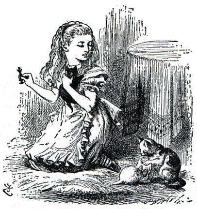
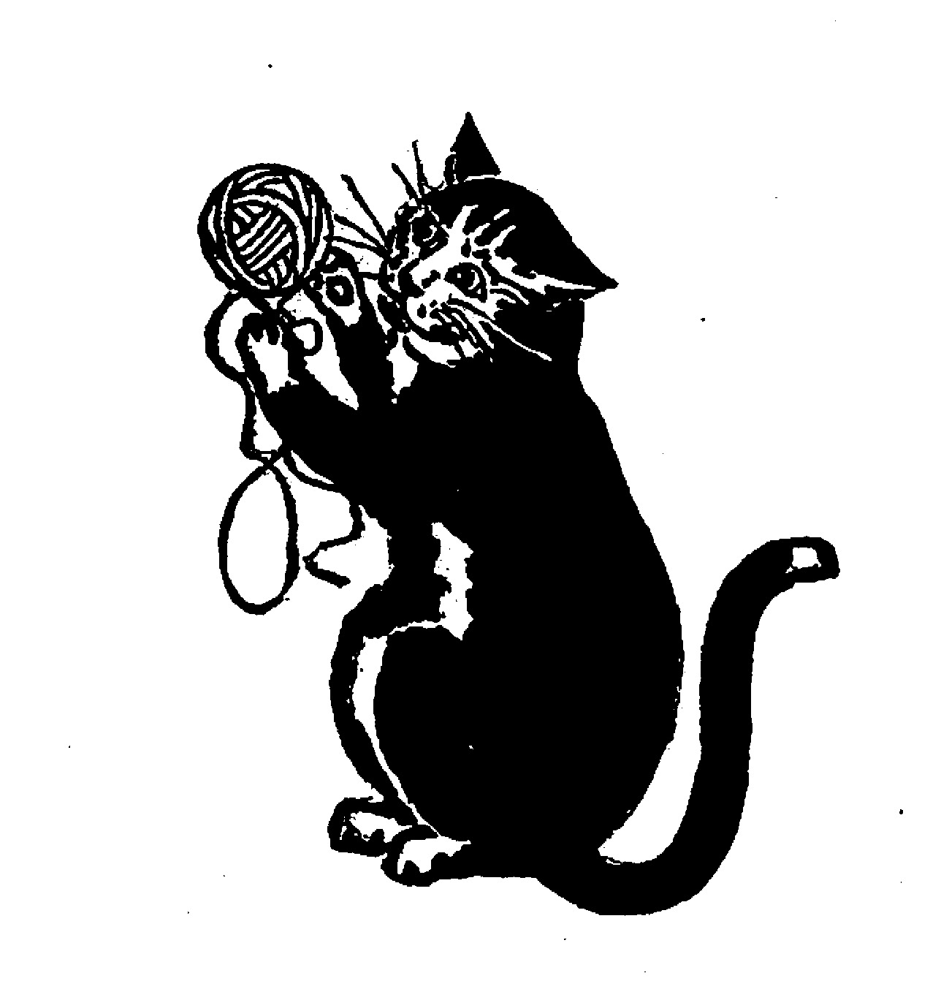

# 今天的文学猫角色：Dinah（黛娜）

在刘易斯·卡罗尔的“爱丽丝”故事里，Dinah 是爱丽丝现实生活中的家猫。卡罗尔并没有规定她究竟是什么毛色，只让读者从爱丽丝的话里认识她：柔软、安静，喜欢坐在炉火旁呼噜呼噜地舔爪洗脸，却又是一个非常厉害的捕鼠能手。约翰·坦尼尔后来在《爱丽丝镜中奇遇》的插图中把她画成一只有明显深浅斑纹、体格结实的家猫；到了十九世纪末，布兰奇·麦克马纳斯又给了她另一种更深色、更醒目的黑白花视觉形象。于是 Dinah 没有一个唯一的“标准毛色”，但她始终是一只非常真实、非常家常的猫。

在《爱丽丝梦游仙境》中，Dinah 几乎完全没有真正登场，却一直跟着爱丽丝进入仙境——不是以身体，而是以记忆。爱丽丝掉进兔子洞时，最先惦记的事情之一就是家里有没有人记得给 Dinah 的碟子里倒牛奶；她甚至在下坠途中迷迷糊糊地想，如果 Dinah 也在这里，会不会去抓天上的蝙蝠。进入眼泪池后，爱丽丝又向老鼠热情推荐自己的猫，说 Dinah 是“那么亲爱的、安静的东西”，抱起来又软又舒服。问题在于，她紧接着就夸起 Dinah 捕鼠有多么出色，立刻把面前的老鼠吓得浑身发抖。

这种笑话很快又升级了一次。赛跑结束后，爱丽丝再次提到 Dinah，告诉一群鸟类她的猫不仅会抓老鼠，而且见到小鸟也毫不客气。于是刚刚还围在爱丽丝身边的一群动物立刻找各种借口散去。爱丽丝这才委屈地意识到，在她看来“世界上最好的猫”，在老鼠和鸟的眼里却显然完全是另一回事。Dinah 因此成了一个很有卡罗尔味道的角色：她甚至不需要真正出现，只凭爱丽丝天真而自豪的描述，就足以把仙境里的社交场面搅得一团糟。

到了续作《爱丽丝镜中奇遇》，Dinah 终于真正出现在家中，而且已经成了两只小猫的母亲。故事开头，她正把白色小猫按住，认真地从鼻子开始逆着毛给它洗脸；黑色小猫则因为早早洗完，已经在壁炉旁把爱丽丝的毛线团玩得乱七八糟。爱丽丝一边训小猫，一边又责怪 Dinah 没把孩子教好。这里的 Dinah 与第一本里那个被爱丽丝神化的“天下第一好猫”一下子接上了日常生活：她不是仙境里的奇兽，而是一只会抓猎物、会给孩子洗脸、也管不住淘气小猫的母猫。

更有趣的是，这一家三口还悄悄进入了《镜中奇遇》的梦境结构。爱丽丝醒来后，把黑色小猫认作梦里的红皇后，把白色小猫认作白皇后，最后又认真地问 Dinah：“你是不是变成了 Humpty Dumpty？”她自己也拿不准答案，却已经把现实炉边的三只猫与刚刚经历的镜中世界重叠在了一起。Dinah 因而像一枚留在现实中的书签：当爱丽丝走得再远、遇到再荒诞的东西，故事最终仍会回到炉火、牛奶碟、毛线团，以及她熟悉的猫身边。

### 视觉参考

1. 约翰·坦尼尔笔下，Dinah 与两只小猫
   - 本地文件：`../assets/dinah/01.jpg`
   - 来源页面：https://commons.wikimedia.org/wiki/File:Dinah_and_kittens.JPG
   - 原始图片：https://upload.wikimedia.org/wikipedia/commons/2/2b/Dinah_and_kittens.JPG
   - 作者/机构：John Tenniel / Wikimedia Commons
   - 说明：表现《爱丽丝镜中奇遇》开头 Dinah 与两只小猫的家庭场景，是十九世纪经典原作插图体系中的形象。
2. 布兰奇·麦克马纳斯笔下的 Dinah
   - 本地文件：`../assets/dinah/02.jpg`
   - 来源页面：https://commons.wikimedia.org/wiki/File:Alice-looking-glass-illustrated-by-blanche-mcmanus00001_05.jpg
   - 原始图片：https://upload.wikimedia.org/wikipedia/commons/7/79/Alice-looking-glass-illustrated-by-blanche-mcmanus00001_05.jpg
   - 作者/机构：Blanche McManus / Wikimedia Commons
   - 说明：1899 年《Through the Looking-Glass》插图版中的 Dinah，提供了与 Tenniel 不同的黑白花视觉诠释。
