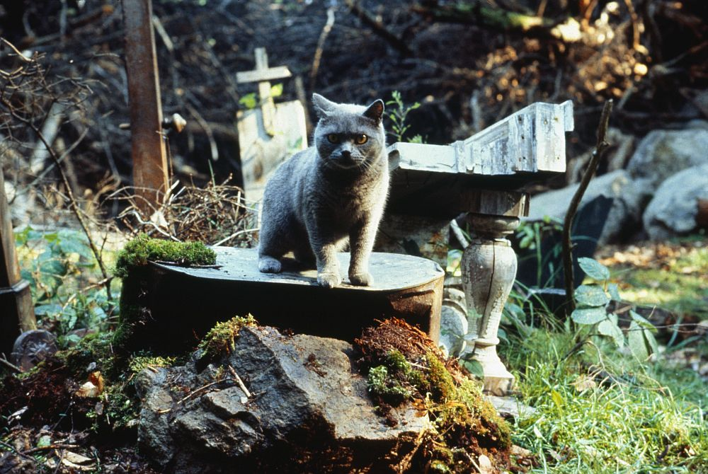

# 今天的文学猫角色：Church（邱吉）

史蒂芬·金的《Pet Sematary》（中文常见译名有《宠物公墓》《宠物坟场》）里，Church 的全名是 Winston Churchill，是 Creed 一家五岁女儿 Ellie 最心爱的猫。原作把它写成一只体型颇大的灰猫，毛发蓬松，胸前有一块白色“围兜”，眼睛原本偏黄；死而复生之后，那双眼睛逐渐显得浑浊、黄绿色，原先属于活猫的灵活感也消失了。两次著名电影改编给了它很不一样的外貌：1989 年版采用厚实、圆脸的灰色英国短毛猫，2019 年版则把它变成一只毛发凌乱、体型更大的棕灰色长毛猫。两种形象都抓住了同一个核心——它看上去仍然像 Church，却已经让人本能地觉得哪里不对。

故事开始时，Church 并没有任何超自然之处。它是一只真正属于家庭生活的猫，会睡在 Ellie 的床上，也会在屋里懒洋洋地度日。Creed 一家搬到缅因州 Ludlow 后，新家门前那条不断有重型卡车高速驶过的公路很快成为一种挥之不去的威胁。感恩节期间，Church 被车撞死。Ellie 不在家，父亲 Louis 无法面对告诉女儿真相这件事；邻居 Jud Crandall 于是带他越过林中的“Pet Sematary”，进入更深处一片具有诡异力量的古老墓地，把 Church 埋在那里。

第二天下午，Church 自己回来了。真正可怕的并不是一具腐烂尸体突然出现，而是它几乎完整地保留了猫的外形，却失去了原来的生命质感。它动作迟钝，身体散发出难以洗掉的泥土与腐败气味，常常只是坐着，用浑浊的眼睛盯着人看。它开始频繁捕杀老鼠和鸟，却不是为了进食，而是把撕碎的猎物带回家。连最爱它的 Ellie 也因为那股怪味，不再愿意让 Church 睡在自己的房间里。

Church 因而成为整部小说最早、也最清楚的一次警告。那片墓地确实能够让死者“回来”，但回来并不等于复原。Church 的身体证明了死亡可以被越过，它的存在却同时证明了越过死亡并不会取消死亡带来的改变。Louis 明明每天都能看到这个结果，却仍然在后来遭遇更大的丧失时说服自己：也许下一次会不同，也许只要处理得更快、更谨慎，就能把真正失去的人带回来。

这也是 Church 比许多文学中的“邪恶猫”更令人不安的地方。它本身并没有复杂的恶意，更像一个被某种力量掏空后留下的外壳。它曾经是一只普通、被孩子深爱的家猫，因此那副熟悉的身体重新走进厨房、卧室和走廊时，恐怖才格外贴近生活。到故事后段，Louis 最终亲手结束了 Church 第二次生命；但真正无法消除的，是它已经留下的那个念头——既然死者可以回来，人是否真的能够忍住不去尝试？

### 视觉参考

1. 1989 年电影《Pet Sematary》中的 Church
   - 来源页面：https://stopklatka.pl/aktualnosci-filmowe/smetarz-dla-zwierzakow-tajemnice-kultowego-horroru
   - 原始图片：https://stopklatka.pl/wp-content/uploads/2021/02/smetarz-dla-zwierzakow-tajemnice-kultowego-horroru.jpg
   - 作者/机构：Paramount Pictures / 1989 film still（经 Stopklatka）
   - 说明：1989 年版使用灰色、短而浓密被毛的猫来塑造 Church，形成近似“毛绒玩具活过来”的不自然感。
2. 2019 年电影《Pet Sematary》中的 Church 与 Ellie
   - 来源页面：https://www.syfy.com/syfy-wire/the-pet-sematary-screenwriter-explains-why-they-made-those-big-changes
   - 原始图片：https://www.syfy.com/sites/syfy/files/2019/04/pet_sematary_church_vs_ellie.jpg
   - 作者/机构：Paramount Pictures / 2019 film still（经 SYFY）
   - 说明：2019 年版采用棕灰色长毛猫，让复生后的 Church 更显凌乱、野性，也更强调它与 Ellie 之间从亲密到疏离的关系。
