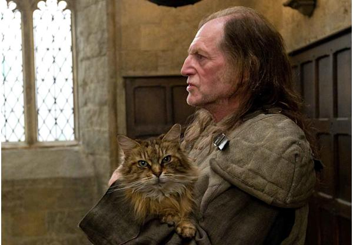
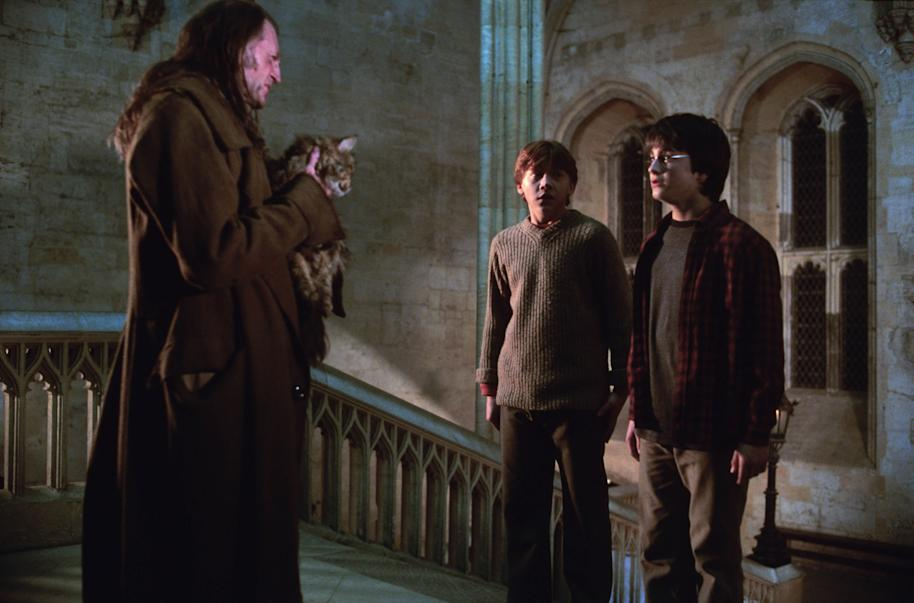

# 今天的文学猫角色：Mrs Norris（洛丽丝夫人）

《哈利·波特》系列里的 Mrs Norris（洛丽丝夫人）是霍格沃茨管理员阿格斯·费尔奇形影不离的猫。原作对她的外形写得相当刻薄而具体：她是一只瘦骨嶙峋、灰尘色的猫，长着鼓凸、像灯一样发亮的眼睛；她和费尔奇在气质上甚至有一种奇怪的相似。电影改编没有照字面把她塑造成一只近乎病态消瘦的猫，而是采用了毛量更丰厚的棕灰色长毛猫形象，因此银幕上的洛丽丝夫人看起来比小说文字里的她漂亮、厚实得多，但那种始终盯着走廊、仿佛下一秒就会发现谁在违规的神情保留了下来。

她在霍格沃茨的身份几乎可以理解成费尔奇的“第二双眼睛”。洛丽丝夫人会独自在城堡走廊里巡逻，只要发现学生违反校规，便会立刻去找主人，而费尔奇往往很快就会赶到。两者之间似乎不需要语言就能理解彼此；官方角色资料也把她称作费尔奇忠诚的助手。对于常常夜游的哈利、罗恩和赫敏来说，遇到洛丽丝夫人往往比直接撞见费尔奇更麻烦，因为看到猫就意味着管理员可能已经在路上。

这种近乎告密者的角色，使她很自然地成了学生们讨厌的对象，但小说又给了这对古怪搭档一层并不滑稽的感情。在《哈利·波特与密室》中，洛丽丝夫人成了密室重新开启后的第一个受害者之一。她通过地面的积水看见蛇怪的目光，因此没有直接死亡，而是被石化，僵硬地挂在走廊的火把支架上。费尔奇赶到时以为她已经死去，悲痛得几乎无法自持。这个场面第一次非常直接地说明：那个平日里阴沉、刻薄、总想着惩罚学生的管理员，对自己的猫却有真正而深厚的依恋。后来曼德拉草复活药剂成熟，洛丽丝夫人也终于恢复正常。

她之所以让人印象深刻，还因为作品始终没有把她解释成什么隐藏的魔法生物。她的聪明、巡逻能力以及和费尔奇异常默契的关系，很容易让读者怀疑她是不是阿尼马格斯、混血猫狸子，或者拥有其他秘密；但在故事呈现里，她最重要的身份仍然就是“一只特别会抓违规学生的猫”。这反而让她更像霍格沃茨城堡本身的一部分：楼梯会改变方向，画像会互相传话，而昏暗走廊的某个角落里，也永远可能亮起一双属于洛丽丝夫人的眼睛。

她的名字还藏着一个很有文学意味的小机关。J. K. Rowling 曾说明，Mrs Norris 这个名字来自简·奥斯汀《曼斯菲尔德庄园》中的同名人物。奥斯汀笔下的诺里斯太太同样喜欢干涉别人、监视周围的人和事，也很难称得上讨喜。把这个名字交给霍格沃茨里最著名的“巡逻猫”，于是成了一次跨越近两个世纪的文学玩笑：一个总在背景里盯着别人、随时准备插手的名字，从摄政时代的姨妈身上，落到了一只在魔法学校走廊里巡查的猫身上。

### 视觉参考

1. 电影中的洛丽丝夫人与费尔奇
   - 本地文件：`../assets/mrs-norris/01.jpg`
   - 来源页面：https://www.harrypotter.com/fact-file/characters-and-pets/mrs-norris-fact-file
   - 原始图片：https://contentful.harrypotter.com/usf1vwtuqyxm/1V2TaZbK85XRReTih0baQX/c7c446cd49117befc39bdd8a1ade1eca/hp-f6-filch-mrs-norris-cropped-app-landscape.jpg?fit=pad&fm=jpg&h=416&q=75&w=600
   - 作者/机构：Warner Bros. / HarryPotter.com
   - 说明：官方角色资料采用的电影形象，能够清楚看到她棕灰色长毛、宽阔面部和警觉目光。
2. 洛丽丝夫人与费尔奇在霍格沃茨走廊中发现哈利和罗恩
   - 本地文件：`../assets/mrs-norris/02.jpg`
   - 来源页面：https://www.harrypotter.com/features/in-defence-of-argus-filch
   - 原始图片：https://contentful.harrypotter.com/usf1vwtuqyxm/6cyDtFMyFaGW48u6G62o44/f48bda84c984e13773c57779c6755cdc/ArgusFilch_WB_F1_FilchWithMrsNorrisCatchingHarryAndRon_9897.jpg?fm=jpg&q=75&w=914
   - 作者/机构：Warner Bros. / HarryPotter.com
   - 说明：以电影场景呈现她作为费尔奇巡逻搭档、发现违规学生的典型角色功能。
