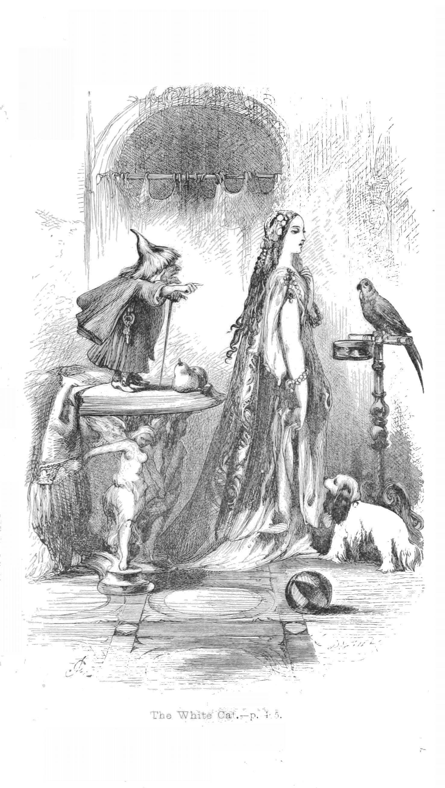
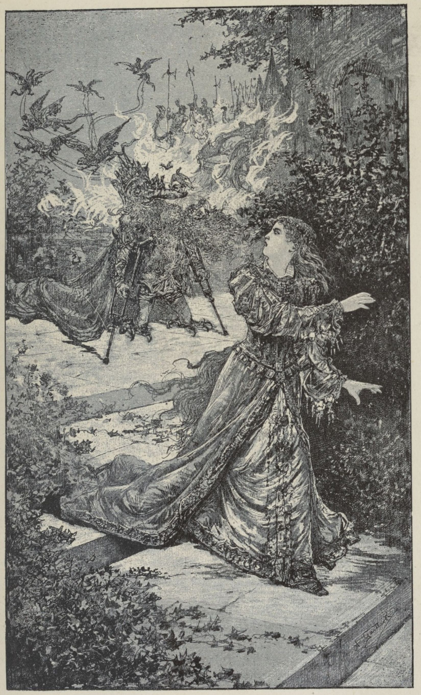

# 今天的文学猫角色：The White Cat（白猫）

玛丽-凯瑟琳·德·奥诺瓦夫人的童话《白猫》（La Chatte Blanche / The White Cat）里，这位角色最初出现时并不是一只普通的家猫，而像一位藏在猫皮里的小小宫廷女王。原作写她是一只极其漂亮的小白猫，身形很小，神情年轻而忧郁，第一次现身时披着长长的黑色绉纱面纱；她掀开面纱后，用又轻又甜的叫声向迷路的王子问好。故事没有进一步规定她的眼睛颜色或斑纹，因此后世插画往往把重点放在“白猫 + 贵族女性”的反差上：有的让她穿礼服、戴珠宝、拿扇子，有的干脆把猫的头与十八世纪宫廷裙装组合在一起。

王子遇见她，是因为父王迟迟不愿让位，便连续给三个儿子布置近乎不可能完成的任务。最年轻的王子在暴风雨中迷路，来到一座华丽得不像现实世界的城堡。这里的门由漂浮在空中的手打开，房间里到处是宝石、金器和描绘“著名猫族故事”的壁画；宴会上还有猫乐队弹琴唱歌。就在王子还分不清自己究竟闯进了仙宫还是巫术世界时，白猫带着一整队穿丧服、佩剑的猫走进大厅，并以城堡真正主人的姿态接待他。

她的性格也始终处在两种气质之间。一方面，她非常像猫：会带着五百多只猫去狩猎，骑在猴子背上，戴着龙骑兵式帽子，号角一响便能召来全国的猫；她还把自己调侃成“除了抓老鼠什么也不会的小白猫”。另一方面，她又比故事中的大多数人类更聪明、更有分寸。王子必须找到能穿过戒指的小狗时，她把小狗装在一颗橡子里交给他；父王又要求一块能穿过针眼的布，她让猫们纺织，再把那匹神奇布料藏进一连串越来越小的果核与种子中。王子每次以为自己必败无疑，她都已经替他准备好了答案。

两人相处三年之后，父王最后提出的条件变成“带回世上最美丽的女子”。这一次，白猫没有再掏出某件魔法物品，而是要求王子亲手砍下她的头和尾巴，并把它们投入火中。王子几乎无法下手，因为他已经真正爱上了这只猫，但最终还是照做。下一瞬间，猫的身体迅速变成人形，她恢复成一位年轻的女王，宫廷里那些猫也重新变回贵族，而那些一直漂浮着侍奉客人的手，则属于此前被魔法隐藏了身体的人们。

这时故事才揭开她一直戴着黑纱、神情忧郁的原因。白猫原本是一位国王的女儿，继承着六个王国。她年轻时被仙女囚禁，并爱上了一位偷偷来到塔楼下的国王；两人秘密成婚，却被仙女发现。她眼看爱人被龙吞噬，自己随后被惩罚性地变成白猫，整个宫廷也一同遭到变形。解除诅咒的条件，是遇到一个与死去丈夫容貌、声音和气质都极为相似的王子。故事开始时，她腕上的小画像之所以与眼前的王子如此相像，也正是在提前暗示这一秘密。

因此，《白猫》虽然有“动物新娘”童话的外壳，真正让这个角色特别的却不是最后变回美女，而是她在猫的形态里已经拥有完整的身份。她统治自己的宫廷，会作诗、下棋、狩猎、处理政治，也一次次帮助王子解决难题；她并不是等着被救出的被动公主。甚至故事的结尾，她也不是靠嫁给王子才获得王国——她本来就拥有六个王国，还主动提出分出其中几个，让王子和他的兄长们都不必再争夺父王的一顶王冠。那只披黑纱的小白猫，从第一次登场起其实就比所有争夺王位的人都更像真正的君主。

### 视觉参考

1. 1875 年丹麦改写本中的白猫与王子
   - 本地文件：`../assets/white-cat/01.jpg`
   - 来源页面：https://www.xn--forlst-sua.dk/den-hvide-kat-bearbejdet-af-r-s-feveile-efter-eventyret-af-daulnoy
   - 原始图片：https://www.xn--forlst-sua.dk/sites/default/files/2022/katte1.03.jpg
   - 作者/机构：画家不详；R. S. Feveile 1875 年丹麦改写本相关插图
   - 说明：把白猫直接塑造成身着华服、与王子并坐交谈的贵族女性化猫形象，突出故事的宫廷童话气质。
2. Elizabeth MacKinstry 1928 年笔下的白猫
   - 本地文件：`../assets/white-cat/02.jpg`
   - 来源页面：https://mflibra.com/products/1928-rare-1sted-the-white-cat-by-mme-daulnoy-illustrated-by-elizabeth-mackinstry
   - 原始图片：https://mflibra.com/cdn/shop/products/20220408white-015_grande.jpg?v=1649441771
   - 作者/机构：Elizabeth MacKinstry
   - 说明：出自 1928 年《The White Cat and Other Old French Fairy Tales》插图体系，以拟人化宫廷礼服强化白猫作为“猫中女王”的形象。
