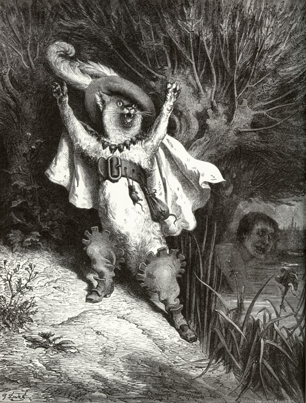
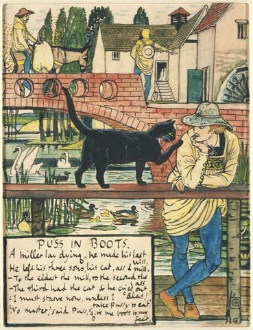

# 今天的文学猫角色：Puss in Boots（穿靴子的猫）

夏尔·佩罗的《穿靴子的猫》（法文原题 *Le Maître chat ou le Chat botté*）其实从来没有规定这只猫究竟是什么毛色。原作真正反复强调的，是他给自己创造出来的“装束”：一个袋子，再加一双能让他穿过泥地和灌木的靴子。后来的插画家因此获得了很大自由。古斯塔夫·多雷在十九世纪的经典插图里，把他画成一位几乎可以登台演出的猫科游侠，戴着宽边羽饰帽、披风和腰带，双爪高举，靴子也被夸张成醒目的服装部件；沃尔特·克兰笔下的版本则更接近一只黑色家猫，只是已经学会戴帽、穿靴并和人类一本正经地谈判。对这个角色来说，最重要的外貌特征并不是花色，而是那双靴子——它们把一只磨坊里的猫变成了一个能自由进出宫廷和城堡的行动者。

故事开始时，一个磨坊主去世，把磨坊、驴和猫分别留给三个儿子。最小的儿子只分到猫，沮丧得甚至盘算着把猫吃掉，再拿皮做一个暖手筒。猫听见后却异常镇定，只要求主人给自己一个袋子和一双靴子，并保证这份遗产并没有看上去那么糟。原作还特意补充说，这只猫此前抓老鼠就很会用计：他会躲进面粉里，或者倒挂着装死，等猎物自己靠近。靴子并没有突然赋予他智慧，它只是让原本就非常擅长设局的猫有了更大的舞台。

接下来几个月里，他先用袋子诱捕兔子和鹧鸪，再一趟趟送进王宫，声称这些猎物都来自自己主人的领地，并随口替主人发明了一个显赫头衔——“卡拉巴侯爵”。于是，一个贫穷磨坊主的儿子甚至还没有见过国王，就已经在宫廷里拥有了持续数月的名声。等国王带公主沿河出游时，猫又安排主人下水洗澡，随后高喊“卡拉巴侯爵溺水了”，并谎称侯爵的衣服刚被强盗偷走。国王立刻拿出华服给这个“侯爵”换上；原本什么也没有的青年，仅仅换了一身衣服，便在国王和公主眼中突然变得像真正的贵族。

猫随即跑到车队前方，对沿途割草和收割庄稼的人发出相当不童话式的威胁：如果国王问起土地属于谁，他们必须回答“卡拉巴侯爵”，否则就会被剁成肉末。于是整条道路都开始替这个虚构身份作证。最后，他来到真正拥有这些土地的食人魔城堡。猫事先已经打听清楚食人魔可以变形成各种动物，先奉承他变成狮子，自己吓得爬上屋顶；等食人魔恢复原形后，他又故意表示不相信对方能变成老鼠。食人魔为了炫耀立刻照做，猫扑上去把他吃掉，随后转身迎接正好抵达的国王，宣称这座宏伟城堡也是“卡拉巴侯爵”的产业。

骗局至此全部变成了现实。国王看到土地、城堡和衣着，又见公主已经爱上这个年轻人，当天便同意两人结婚。至于穿靴子的猫，故事最后说他也成了“大人物”，从此不再为了生计追老鼠，只在想消遣时才抓几只。

这只猫最耐人寻味的地方，是他几乎没有靠魔法完成任何事。他真正使用的工具是服装、称号、礼物、表演、恐吓，以及对别人如何判断“身份”的精确理解。他先发明“卡拉巴侯爵”，再逐步替这个名字制造证据，直到连国王也无法分辨真假。佩罗在故事后的寓意诗里也没有把重点放在忠诚，而是说懂得如何行动、再配合勤勉，往往比继承庞大家产更有用；另一段寓意甚至直接提醒读者，漂亮衣服、好相貌和体面的举止很能影响爱情。于是故事里最著名的那双靴子并不仅仅是可爱的童话道具——它们从一开始就在讲同一件事：一个人、甚至一只猫，只要足够懂得社会如何观看他，就有可能穿出一个全新的身份。

### 视觉参考

1. 古斯塔夫·多雷笔下的穿靴子的猫
   - 本地文件：`../assets/puss-in-boots/01.jpg`
   - 来源页面：https://commons.wikimedia.org/wiki/File:Gustave_Dor%C3%A9_Puss_in_Boots.jpg
   - 原始图片：https://upload.wikimedia.org/wikipedia/commons/5/56/Gustave_Dor%C3%A9_Puss_in_Boots.jpg
   - 作者/机构：Gustave Doré / Wikimedia Commons
   - 说明：1862 年《Les Contes de Perrault》插图中的代表性形象，突出羽饰帽、披风、腰带与靴子的拟人化游侠气质；作品为公版。
2. 沃尔特·克兰笔下的穿靴子的猫
   - 本地文件：`../assets/puss-in-boots/02.jpg`
   - 来源页面：https://commons.wikimedia.org/wiki/File:Walter_Crane-Cat01.jpg
   - 原始图片：https://upload.wikimedia.org/wikipedia/commons/c/c4/Walter_Crane-Cat01.jpg
   - 作者/机构：Walter Crane / Wikimedia Commons
   - 说明：沃尔特·克兰绘制的经典版本，以更接近真实黑猫的外形配合帽子和靴子，和多雷高度戏剧化的形象形成互补；作品为公版。
