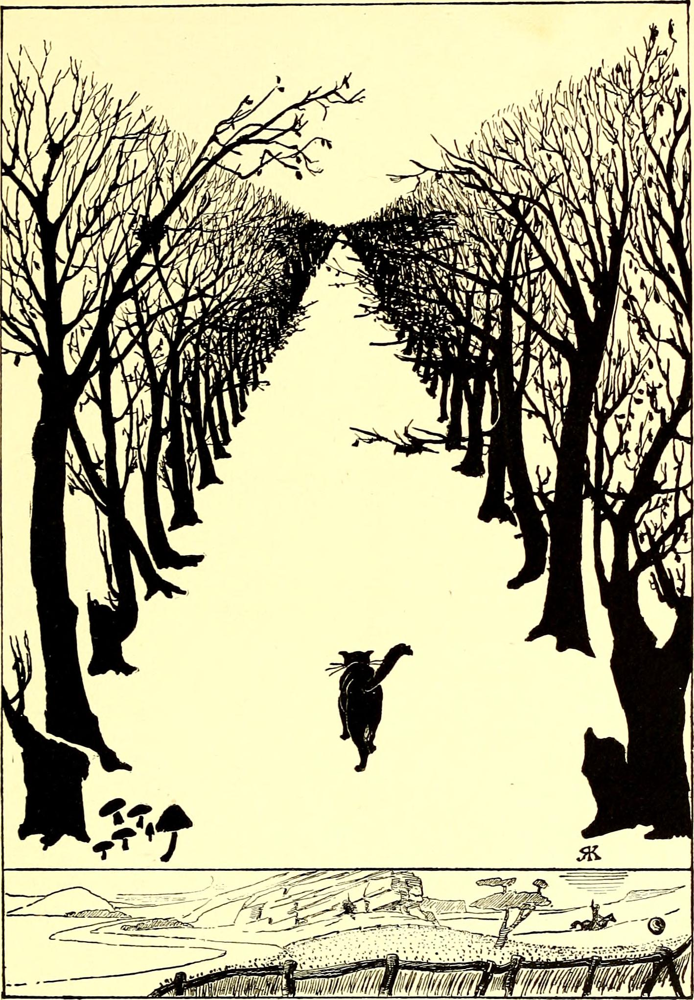
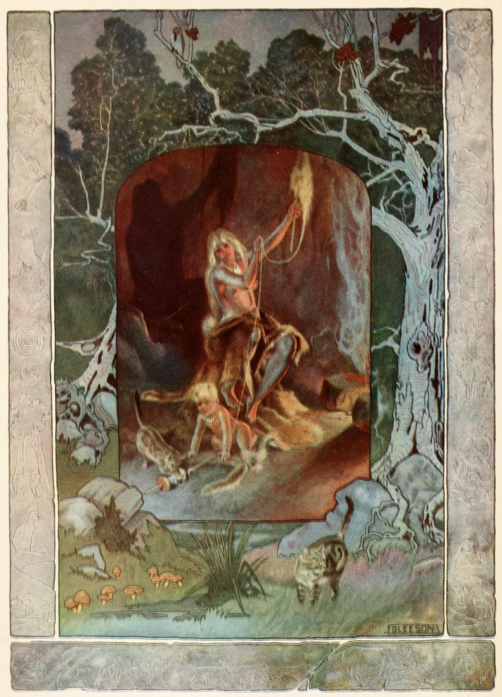

# 今天的文学猫角色：The Cat That Walked by Himself（独来独往的猫）

鲁德亚德·吉卜林的《The Cat That Walked by Himself》出自 1902 年的《Just So Stories》。故事没有规定这只猫究竟是什么毛色，也没有给他一个名字；他就叫“Cat”。真正固定住形象的，是吉卜林自己为故事画的插图：一只深色的猫独自在“潮湿的荒野森林”里向前走，尾巴高高扬起，周围只有树木、苔藓和蘑菇。画面下方却另有一个很小的人类居所——男人、女人、孩子、狗、马和牛已经组成了家庭生活。猫既在这个世界之外，又显然始终知道那个温暖的洞穴在哪里。

故事把自己伪装成一则关于动物如何被人类驯化的远古传说。最开始，狗、马、牛和猫都住在荒野里。女人点起火、准备食物，用自己的“魔法”逐渐把动物吸引到洞穴旁。狗为了肉成为“第一位朋友”，马为了青草成为“第一位仆人”，牛则用牛奶换取照料。每一次，猫都偷偷跟在后面听完谈判，然后轻蔑地认为他们很愚蠢。他坚持自己既不是朋友，也不是仆人；他是那只“独自而行的猫”，任何地方对他来说都一样。

可猫并不是不喜欢舒适。他看见炉火，也闻到了温热的牛奶，于是主动找到女人，巧妙地给自己谈出一份完全不同的契约：如果女人说一句赞美他的话，他就可以进入洞穴；说两句，他就可以坐在火边；说三句，他就可以每天喝三次温牛奶。女人认为自己绝不会赞美这只傲慢的野猫三次，于是答应下来。猫随即离开，耐心地等到一个婴儿出生，才重新出现。

他先用爪子和尾巴逗得孩子发笑，让忙碌的女人第一次称赞了他；随后追逐线团、打滚、发出呼噜声，把哭闹的婴儿哄到在自己怀里睡着，又赢得第二次赞美；最后，一只小老鼠从角落跑出来，猫一跃将它捉住，女人忍不住说他比狗更会抓老鼠，而且非常聪明。三次赞美全部兑现，洞帘、炉火和牛奶罐也像契约的见证人一样“记住”了承诺。从此，猫获得了进入家门、坐在炉边和喝牛奶的权利，却始终没有承认自己属于谁。

男人和狗回来后，又分别和他补上了自己的条件：猫如果住在洞穴里，就必须抓老鼠，也必须善待孩子；否则男人会拿东西扔他，狗会追着他上树。猫接受这些义务，却仍然重复同一句话——他依旧是独自而行的猫。故事最后也没有把这句话推翻：在家里，他会捕鼠、陪孩子、享受炉火和牛奶；但月亮升起来以后，他仍会走到荒野、树梢和屋顶上，摇着尾巴独自出门。

这正是这个角色经久不衰的地方。吉卜林并没有把猫写成“拒绝驯化”的纯粹野兽，也没有把他写成像狗那样把忠诚作为交换条件的伙伴。他懂得家庭生活的好处，却坚持把进入家庭变成一场平等谈判；他愿意承担有限的责任，同时为自己保留随时离开的自由。于是这篇看似解释“为什么猫会住在人家里”的儿童故事，最后给出的答案很像所有养猫人熟悉的经验：猫当然可以住在你的房子里，但这并不等于他认为自己属于你。

### 视觉参考

1. 鲁德亚德·吉卜林原版插图中的独来独往的猫
   - 本地文件：`../assets/cat-that-walked-by-himself/01.jpg`
   - 来源页面：https://commons.wikimedia.org/wiki/File:Just_so_stories_for_litle_children_(1902)_(14761890286).jpg
   - 原始图片：https://upload.wikimedia.org/wikipedia/commons/7/70/Just_so_stories_for_litle_children_%281902%29_%2814761890286%29.jpg
   - 作者/机构：Rudyard Kipling；扫描来源 Internet Archive Book Images / University of North Carolina at Chapel Hill
   - 说明：1902 年《Just So Stories》原版体系中的插图，画面直接对应吉卜林对“独自在潮湿荒野森林中行走”的猫的说明。
2. Joseph M. Gleeson 1912 年版插图中的猫与人类洞穴
   - 本地文件：`../assets/cat-that-walked-by-himself/02.jpg`
   - 来源页面：https://commons.wikimedia.org/wiki/File:Illustration_to_The_Cat_that_Walked_by_Himself_(Doubleday_ed.).jpg
   - 原始图片：https://upload.wikimedia.org/wikipedia/commons/a/a9/Illustration_to_The_Cat_that_Walked_by_Himself_%28Doubleday_ed.%29.jpg
   - 作者/机构：Joseph M. Gleeson（Wikimedia Commons 标注为可能作者）；New York Public Library 扫描来源
   - 说明：1912 年 Doubleday 版本的代表性插图，以更具童话色彩的画面补充猫与人类洞穴生活之间的关系。
