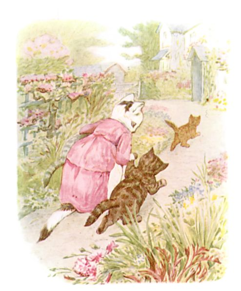
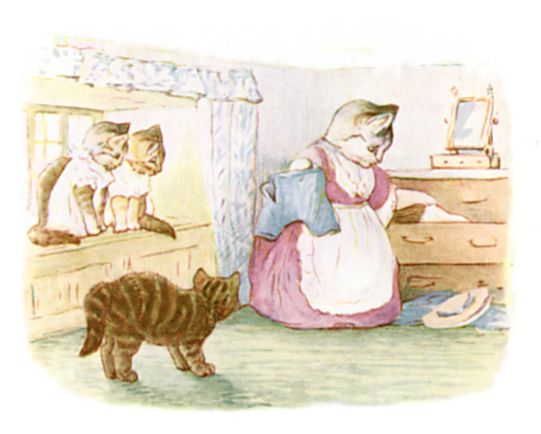

# 今天的文学猫角色：Mrs. Tabitha Twitchit

碧雅翠丝·波特并没有在文字里逐项规定 Mrs. Tabitha Twitchit 的毛色，但她自己画的水彩几乎已经替这个角色建立了稳定的外观：一只体格结实的成年母猫，脸部、胸腹和四肢有大片白色，头顶、背部和长尾则带着深色虎斑；她常穿粉紫或玫瑰色的长裙，外面系着白围裙。这样的打扮让她看上去很像爱德华时代一位极讲究体面的家庭主妇，但露在裙摆之外的条纹尾巴、尖耳朵和猫爪又不断提醒读者，她始终是一只真正的猫。

在 1907 年的《The Tale of Tom Kitten》中，Tabitha 是 Tom、Moppet 和 Mittens 三只小猫的母亲。她当天要请朋友来喝茶，于是把孩子们叫进屋洗脸、梳毛、梳尾巴，再给他们穿上整洁却很不舒服的衣服。收拾妥当以后，她又把三只小猫放回花园，只叮嘱他们必须用后腿走路、保持衣服干净，并远离灰坑、猪圈和鸭子。结果孩子们很快就摔得一身草渍，Tom 的扣子一路崩掉，最后衣服还被 Puddle-Ducks 捡走穿在了自己身上。Tabitha 发现三个孩子几乎光着身子待在墙头时，气得把他们拽下来拍了一顿，再送上楼，并对即将到来的客人谎称孩子们“出了麻疹”。

如果只看这一篇，她很容易被记成一个严厉又爱面子的母亲；但 1908 年的《The Tale of Samuel Whiskers》让她变得更立体。故事开头直接称她是一只“焦虑的母猫”：她的孩子总是不见，而且每次不见都意味着正在闯祸。烘焙日那天，她想把孩子们关进柜子里确保安全，却偏偏找不到 Tom，只好从食品室一路搜到阁楼，边找边叫，最后甚至担心儿子已经被屋里的老鼠抓走。她和邻居 Ribby 一起翻遍房间，听见阁楼地板下面传来奇怪的“滚来滚去”声，才终于意识到事情不对，并叫来木匠锯开地板，救出了差点被 Samuel Whiskers 和 Anna Maria 裹进面团做成布丁的 Tom。

Tabitha 对老鼠的态度也很有意思。她会告诉 Ribby，自己曾经从厨房墙洞里抓出七只小老鼠，一家人还把它们当作晚餐；可真正面对体型巨大的老鼠父亲时，她又被对方露出的黄牙吓退，并承认“这些老鼠弄得我神经紧张”。于是她既不是完全人类化的家庭主妇，也不是被衣服包起来的普通捕鼠猫。她会系围裙、办茶会、为孩子的礼仪发愁，也会抓鼠、吃鼠、因为闻到危险而焦躁地喵叫。这种两种身份毫不冲突地叠在一起，正是波特动物世界最迷人的地方之一。

在《The Tale of the Pie and the Patty-Pan》中，Tabitha 还以更日常的方式出现在 Sawrey 的小型社交网络里。故事提到村里的餐具可以在她那里买到，Ribby 去商店时也顺便和“Cousin Tabitha Twitchit”聊了一阵；听说 Ribby竟然请一只小狗来喝下午茶，她还颇为不屑地评论，仿佛村里已经没有猫可以邀请似的。到故事最后，Ribby经历完一场关于馅饼的混乱之后，反而决定下次请客就请 Tabitha。这样一来，她不再只是 Tom Kitten 的母亲，也成了这个动物村庄里经营店铺、交换消息、维持礼节和邻里关系的一位熟面孔。

Tabitha Twitchit 最有趣的地方，或许正是她对“秩序”的执着永远敌不过猫和孩子本身。她希望家里整洁、茶会体面、孩子穿戴齐整，却一次次被乱跑的小猫、失踪的衣服、阁楼里的老鼠和邻居的闲话打乱计划。波特没有把她写成纯粹的笑柄：她会发脾气，会说谎替孩子遮掩，也会在儿子真正遇到危险时急得流泪、满屋寻找。于是那条从围裙后面露出来的虎斑尾巴几乎成了最好的象征——无论生活被安排得多么像一个规规矩矩的人类家庭，这始终还是一家猫。

### 视觉参考

1. 碧雅翠丝·波特笔下，Tabitha Twitchit 追着跑进花园的三个孩子
   - 来源页面：https://www.gutenberg.org/cache/epub/14837/pg14837-images.html
   - 原始图片：https://www.gutenberg.org/cache/epub/14837/images/tom04.jpg
   - 作者/机构：Beatrix Potter；Project Gutenberg 数字化
   - 说明：1907 年《The Tale of Tom Kitten》原书插图，清楚呈现 Tabitha 的衣着、虎斑尾巴以及她与三只小猫的家庭关系。
2. Tabitha Twitchit 在家中为小猫们整理衣服
   - 来源页面：https://www.gutenberg.org/cache/epub/14837/pg14837-images.html
   - 原始图片：https://www.gutenberg.org/cache/epub/14837/images/tom19.jpg
   - 作者/机构：Beatrix Potter；Project Gutenberg 数字化
   - 说明：同书原版插图，表现 Tabitha 在室内照料、打扮孩子的家庭主妇形象，并可看到她头部与尾部的深色斑纹。
