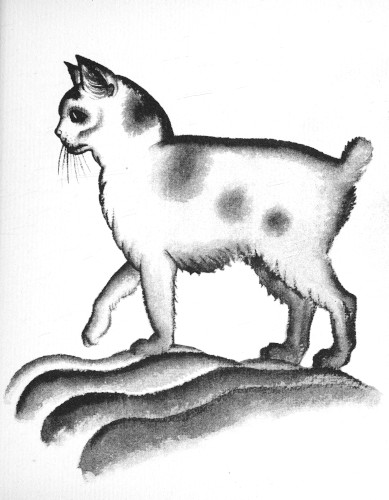
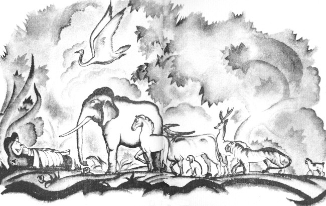

# 今天的文学猫角色：Good Fortune（好运）

Elizabeth Coatsworth 的《The Cat Who Went to Heaven》写于 1930 年，第二年获得纽伯瑞奖章。故事里的 Good Fortune 是一只小小的三花母猫：底色像新雪一样白，身上点着金色和黑色的斑块，圆圆的下巴洁白，胡须被形容得像蓟绒一样轻软。原作还几次写到她白色的小爪和像白色纽扣似的小尾巴；Lynd Ward 的原版插图则把她画成一只短尾、身形紧凑的三花猫，背部和头顶有大片深色斑纹。她并不华丽，却有一种极端安静、克制的神情。

故事发生在一个贫穷的日本画师家中。画师原本让老管家拿着仅剩的一点钱去买食物，老人却从市场带回了这只猫，因为她觉得屋子里实在太孤单。画师起初很不高兴，甚至把猫和妖怪联系在一起；可当他仔细看见她白、金、黑三色相间的毛，想到三花猫象征好运，才勉强让她留下，并接受管家替她取的名字 Good Fortune。

真正改变画师态度的，并不是所谓的好运，而是这只猫异常体贴的举止。Good Fortune 看见主人吃饭时会把脸转向墙壁，不盯着食物；即使饿得胡须发颤，也只有在受到邀请后才来吃，而且只吃掉一半，仿佛有意把另一半留给明天，尽量不增加这个穷家的负担。她还曾扑住一只麻雀，却在饥饿中迟疑片刻，慢慢抬起两只白爪，把鸟放走。画师第一次因此觉得，自己曾把这样一只猫叫作妖怪，实在有些惭愧。

不久，寺院委托画师绘制一幅佛陀临终时接受众生告别的画卷。为了把每一种动物真正画好，他在动笔前逐一思索它们与佛陀相关的故事；Good Fortune 则总在一旁安静观看。蜗牛、象、马、天鹅、水牛、鹿、虎等动物陆续出现在画中，她每看见一种新的动物，就显得更失落一些。故事中的传说设定认为，猫因为骄傲而拒绝向佛陀致敬，因此没有得到祝福，也不能出现在通往涅槃的动物队列中。画师知道寺院期待的正是这种传统构图，所以始终不敢画猫。

等到老虎也被画进去以后，Good Fortune 终于再也掩饰不住悲伤。她望着画，又望着主人，仿佛在问：既然连老虎都能够前来告别，为什么温顺的小猫不能？后来她甚至拒绝进食。画师听见厨房里微弱的猫叫，终于决定不再遵守这条排除猫的规则。他宁愿失去寺院的酬劳，也拿起最好的画笔，在所有动物的最后添上了一只猫。

Good Fortune 被放进房间后，立刻跑到画前久久凝视。她又转头看向画师，眼里满是感激，随后竟在这一刻死去——书里说，她是因为快乐得再也无法多活一分钟。寺院的住持第二天看到画卷，果然因为其中出现了猫而拒绝接受，并决定将作品焚毁；但真正到了次日，寺中却出现了奇迹：画上的佛陀改变了姿势，伸出手祝福那只原本不该存在于画中的小猫。于是故事的标题，在最后一刻有了最直接的含义。

Good Fortune 很少做出传统儿童文学里那种轰轰烈烈的英雄行为。她不会说话，也没有魔法，甚至总在努力让自己少占一点空间：少吃一点，安静一点，不妨碍画师工作一点。可正是她的温顺、克制和怜悯，让画师开始质疑一条已经被所有人当作理所当然的规则。Coatsworth 最终写的并不只是“一只猫能不能上天堂”，而是一个人在面对既定传统与眼前一个真实生命时，是否还能保有自己的同情心。那幅画上的小猫因此既是 Good Fortune，也是画师最终选择相信的那一点慈悲。

### 视觉参考

1. Lynd Ward 笔下的 Good Fortune
   - 来源页面：https://www.gutenberg.org/cache/epub/78393/pg78393-images.html
   - 原始图片：https://www.gutenberg.org/cache/epub/78393/images/illus11.jpg
   - 作者/机构：Lynd Ward；Project Gutenberg 数字化
   - 说明：1930 年《The Cat Who Went to Heaven》原书插图，直接呈现 Good Fortune 的三花斑块、短尾和紧凑体型。
2. 佛陀与动物队列
   - 来源页面：https://www.gutenberg.org/cache/epub/78393/pg78393-images.html
   - 原始图片：https://www.gutenberg.org/cache/epub/78393/images/illus12.jpg
   - 作者/机构：Lynd Ward；Project Gutenberg 数字化
   - 说明：同书原版插图，描绘画师构想中的佛陀临终与动物队列；画面最右侧可以看到被加入其中的小猫，正对应故事最重要的转折。
