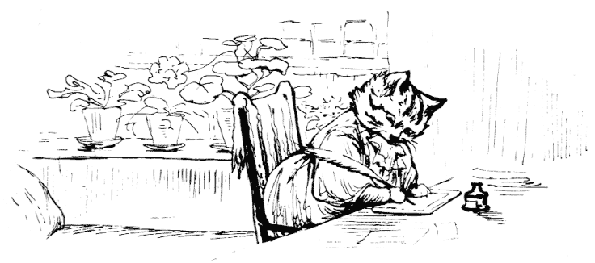
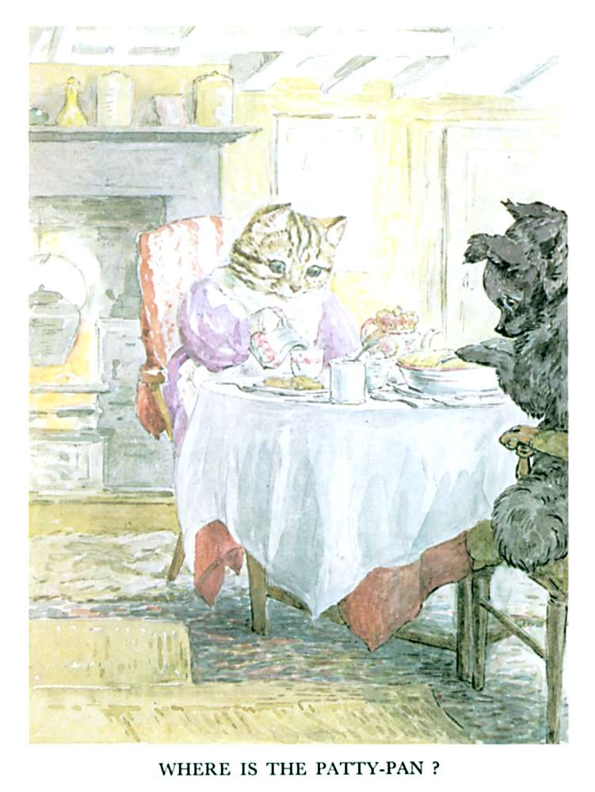

# 今天的文学猫角色：Ribby

在碧雅翠丝·波特自己的水彩里，Ribby 是一只很有“乡间主妇”气质的虎斑母猫：棕灰色条纹覆盖头顶和背部，脸颊和胸前较浅，身形敦实而端庄。原作文字没有专门规定她的毛色，却明确写到她为了招待客人，换上了淡紫色丝绸长裙、绣花细棉布围裙和披肩。波特的插画让这套衣着几乎成为 Ribby 的固定形象——一张猫脸从爱德华时代的家常礼服上露出来，既完全像一位认真操持家务的女主人，又始终保留着猫的胡须、尖耳和条纹尾巴。

Ribby 是 1905 年《The Tale of the Pie and the Patty-Pan》的主人公之一。故事从一封极其客气的邀请开始：她请住在村子另一头的小狗 Duchess 来喝下午茶，并特意告诉对方，自己已经准备好一只粉边烤盘里的馅饼，“你一定从来没有吃过这么好吃的东西”。问题在于，Ribby 打算端上桌的是鼠肉与培根馅饼。对一只猫来说这当然是体面的待客菜，可 Duchess 一想到自己必须在正式茶会上把鼠肉吃下去，就紧张得反复读那封邀请信，最后偷偷决定把自己的小牛肉火腿馅饼换进去。

Ribby 对这场茶会的认真程度几乎到了仪式化的地步。她添煤、扫炉灰、抖地毯、擦桌椅，铺上洁白桌布，又从壁橱里拿出带粉红玫瑰纹样的好茶具；随后去农场取牛奶和黄油，再戴上帽子、披好披肩，到村里购买茶叶、方糖、橘子酱和松饼。她甚至提前把鼠肉里的骨头全部剔掉，因为 Duchess 上次做客时差点被鱼刺噎住。这个细节很能说明 Ribby：她有一点挑剔，有一点自以为是，却又确实是一个细心而尽责的主人。

麻烦来自 Ribby 家那台有上下两个烤箱的炉子。Ribby 把自己的鼠肉馅饼放进温度较合适的下层；Duchess 趁她外出时溜进屋，却没能打开那个炉门，于是误把自己的馅饼放进了上层。等下午茶真正开始，Ribby 端出来的仍然是自己的鼠肉馅饼。Duchess 却以为换包已经成功，不但大口吃了四份，还越来越担心自己放在馅饼里支撑酥皮的小锡盘——patty-pan——怎么不见了。

这时 Ribby 展现出一种非常好笑的严肃。她一再坚持自己绝不会在馅饼里放金属物件，还郑重举出家族旧事：一位姨祖母曾因为圣诞布丁里的一枚顶针而送命。Duchess 越听越确信自己已经把锋利的锡盘吞进肚子，最后嚎啕着宣布自己要死了。Ribby 虽然觉得整件事不可能，仍旧替她垫好靠枕，跑遍村子去请 Dr. Maggotty——一只喜鹊医生——回来诊治。她甚至临出门前还不忘先把银匙锁好，仿佛这是处理医疗急症时理所当然的一部分。

等 Ribby 带着医生回来时，Duchess 已经发现真正的小牛肉火腿馅饼仍在上层烤箱，终于明白自己刚刚吃下去的其实一直是鼠肉。她不好意思解释，只好偷偷把自己的馅饼藏到后院，并迅速声称身体已经好多了。随后院里的喜鹊和寒鸦吃掉了那只馅饼，打碎了粉边盘子；Ribby 最后发现地上的碎片和失而复得的 patty-pan，才惊讶地意识到 Duchess 的故事居然并非凭空捏造。她的结论也非常实际：下次再办茶会，还是请自己的猫表亲 Tabitha Twitchit 比较省心。

Ribby 最迷人的地方，正是她把“猫的常识”和“人类的礼节”同时执行得无比认真。在她看来，穿丝绸裙、使用最好的瓷器、准时喝茶都很自然，把老鼠剁碎配培根烤成馅饼也同样自然。整个故事的笑料因此并不来自谁真正恶意欺骗了谁，而是两位朋友都太在意礼貌，以至于谁也不肯把最简单的话直接说出来。Duchess 不敢坦白自己不吃鼠肉，Ribby 也从未想到客人的口味会与猫不同；一声接一声的“my dear”之下，误会反而越来越大。波特借 Ribby 写出了一场很小的乡村社交喜剧，也让一只系着围裙、认真招待客人的虎斑猫，成为她笔下最有生活气息的成年动物之一。

### 视觉参考

1. Ribby 写邀请信
   - 来源页面：https://www.gutenberg.org/files/15234/15234-h/15234-h.htm
   - 原始图片：https://www.gutenberg.org/files/15234/15234-h/images/pie11.gif
   - 作者/机构：Beatrix Potter；Project Gutenberg 数字化
   - 说明：1905 年《The Tale of the Pie and the Patty-Pan》原书插图，直接呈现 Ribby 的虎斑外貌和拟人化衣着。
2. Ribby 与 Duchess 的下午茶
   - 来源页面：https://www.gutenberg.org/files/15234/15234-h/15234-h.htm
   - 原始图片：https://www.gutenberg.org/files/15234/15234-h/images/pie42.jpg
   - 作者/机构：Beatrix Potter；Project Gutenberg 数字化
   - 说明：原书茶会场景插图，Ribby 与 Duchess 围坐桌边，正对应故事围绕馅饼与 patty-pan 展开的核心误会。
