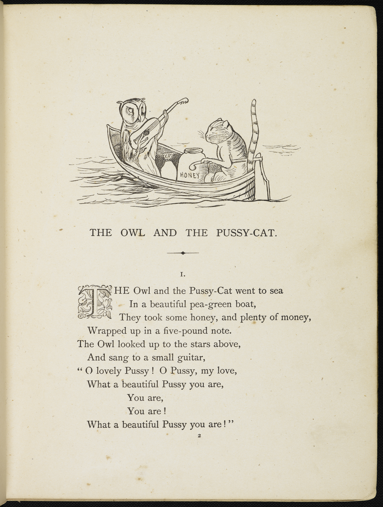
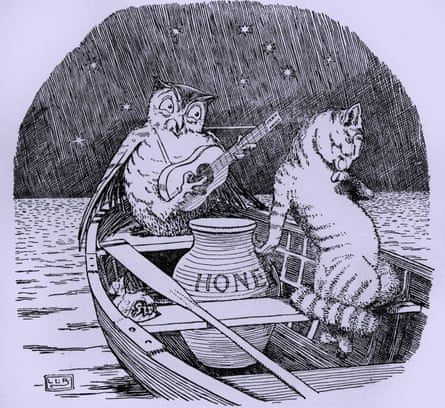

# 今天的文学猫角色：Pussy-cat

爱德华·李尔的《The Owl and the Pussy-Cat》几乎没有替 Pussy-cat 规定毛色、眼睛或体型；诗里最直接的外貌评价，只是 Owl 一遍遍赞美它“美”。真正让这只猫有了具体轮廓的，是李尔自己的插图：一只短毛、带明显条纹和环纹长尾的猫端坐在小船里，和抱着小吉他的猫头鹰面对面。后来 L. Leslie Brooke 等插画家又把它画得更圆润、更像一只安稳的家猫，但条纹、长尾和那种一本正经参与荒诞旅行的神态，逐渐成了这个角色很有辨识度的视觉传统。

这首诗讲的是一段几乎没有阻力的爱情冒险。Owl 和 Pussy-cat 一起乘着一艘“豌豆绿色”的小船出海，带着蜂蜜，也带着用一张五英镑钞票包起来的钱。夜里，Owl 抬头看星星，弹着一把小吉他唱歌，反复夸赞同行的猫漂亮。Pussy-cat 听完并没有羞怯地沉默，而是立刻称赞 Owl 歌唱得甜美，接着直接提出：既然已经等了这么久，不如结婚。唯一的问题是，他们没有戒指。

于是故事从浪漫小夜曲自然滑进了李尔式的荒诞世界。两位旅伴继续航行“一年零一天”，抵达长着 Bong-tree 的地方，在树林里遇见一只鼻尖正好戴着圆环的 Piggy-wig。Pussy-cat 和 Owl 用一先令把圆环买下来，第二天便请住在山上的 Turkey 主持婚礼。婚宴也同样郑重其事又完全不讲现实逻辑：他们吃肉馅和木瓜海棠片，用的是后来变得格外有名的“runcible spoon”，最后牵着手，在海滩上一直跳舞到月光之下。

Pussy-cat 在这首很短的诗里并不是被动接受求爱的对象。真正把“相爱”推进到“结婚”的，是它自己说出口的愿望；发现缺少戒指这一现实问题的也是它。李尔没有为它设置成长线、背景故事或心理独白，却用几句回答让它显得异常爽快：听见好歌就赞美，想结婚就提出，缺东西就一起出发去找。它和 Owl 的关系因此不像传统童话里需要重重考验的追求，更像两个早已默认彼此属于同一阵营的旅行伙伴。

这种从容也是整首诗最迷人的部分。五英镑钞票、一先令、蜂蜜和婚戒都是极其具体的日常物件，Bong-tree、鼻环恰好可以当婚戒的猪、住在山上的火鸡证婚人却完全不可能存在；Pussy-cat 从头到尾都不觉得这两类东西之间有什么矛盾。它接受一个由现实细节和无意义想象共同组成的世界，并在其中非常认真地完成了一次恋爱、远航和婚礼。李尔的“nonsense”因此并不是混乱，而是一套所有角色都欣然遵守的新常识。

故事最后的画面也几乎决定了 Pussy-cat 留在读者记忆里的方式：婚礼结束，两位新婚者来到沙滩边，牵着手在月亮下面跳舞。没有宫殿，没有财宝，也没有“从此统治王国”的结局，只有船、食物、音乐和月光。对于一只文学中的猫来说，Pussy-cat 的特别之处正在于它从未需要证明自己聪明、忠诚或神秘；它只需要坐进那艘小小的船里，接受一场歌唱，然后很自然地把爱情变成一次共同出发。

### 视觉参考

1. 爱德华·李尔笔下的 Owl 与 Pussy-cat 出海场景
   - 来源页面：https://www.mylearning.org/resources/first-page-of-the-owl-and-the-pussy-cat-by-edward-lear-c1861
   - 原始图片：https://s3.eu-west-2.amazonaws.com/grpl-mylearning/resources/4PgC5tZZw8zBz6JTdXRJmgLbho3Hg2GStTsHq2Rq.jpeg
   - 作者/机构：Edward Lear；British Library 藏品；MyLearning 展示
   - 说明：李尔本人绘制的《The Owl and the Pussy-cat》页面，直接呈现 Pussy-cat 在小船中的条纹外形和环纹长尾。
2. L. Leslie Brooke 笔下的 Owl 与 Pussy-cat
   - 来源页面：https://www.theguardian.com/news/2015/nov/30/looking-back-childrens-literature
   - 原始图片：https://i.guim.co.uk/img/media/a3f53cbbabfc2db0702ca25c2b2e4ccf5287029f/0_15_1356_1244/master/1356.jpg?crop=none&dpr=1&s=none&width=445
   - 作者/机构：L. Leslie Brooke；The Guardian 转引（Culture Club/Getty Images）
   - 说明：经典后期插画版本；Owl 弹奏乐器，Pussy-cat 与蜂蜜罐同坐船中，形成与李尔本人线描风格互补的视觉形象。
