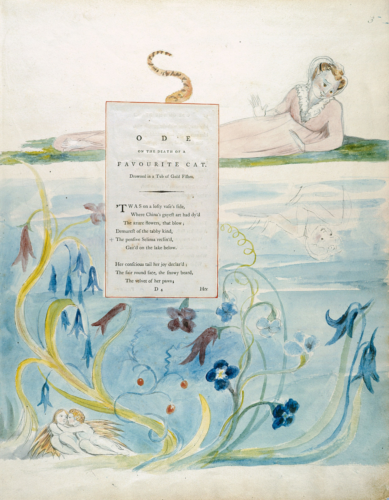
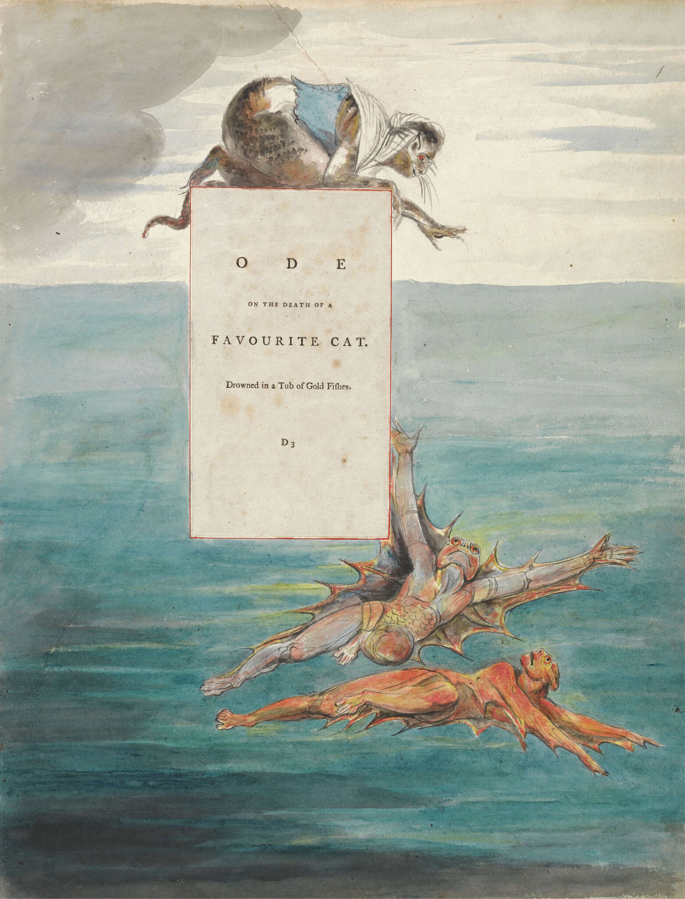

# 今天的文学猫角色：Selima

托马斯·格雷笔下的 Selima 有一副在十八世纪诗歌里少见地具体的猫相。她被称作“tabby kind”中最娴静的一位，有一张圆润的浅色脸、雪白的颏毛和像天鹅绒一样的爪子；皮毛又被比作玳瑁，耳朵乌黑，眼睛则是鲜明的祖母绿色。格雷没有像自然观察笔记那样把这些特征拼成一份标准花色说明，而是让它们逐个映在水面上：Selima 趴在一只巨大的中国瓷缸边，看见自己的脸、耳朵、眼睛和尾巴倒影，满意得轻轻打起呼噜。她的第一次亮相因此既是一幅猫咪照镜子的日常画面，也已经埋下了后面的麻烦——她实在太专注于眼前闪闪发亮的东西。

Selima 出现在格雷的《Ode on the Death of a Favourite Cat, Drowned in a Tub of Gold Fishes》中。这首诗写于 1747 年，主角并非虚构宠物，而是格雷好友、作家兼收藏家 Horace Walpole 家中真实养过的一只猫。Selima 在 Walpole 位于伦敦 Arlington Street 的住宅里失足落入一只盛着金鱼的大型中国瓷缸，最终溺死。朋友的宠猫遭遇这种意外，格雷没有写一首沉痛的挽歌，而是故意采用庄严的颂歌语气，把一场家庭事故抬高成了一出带有神话气势的小型悲剧。

诗里的转折发生在 Selima 从自己的倒影移开视线之后。水中游过两条金鱼，在她眼里仿佛成了披着紫金鳞甲的“天使”和“水中精灵”。她先伸出胡须，再探出一只爪子，几次想把这份漂亮的猎物够到手。格雷故意把猫最普通的捕猎冲动写成一种几乎属于古典悲剧女主人公的欲望：Selima 被称作“nymph”和“maid”，金鱼则像诱惑人的黄金宝物。她越探越远，终于在光滑的缸沿失去平衡，一头栽进水里。

接下来的几行既滑稽又残酷。Selima 连续八次从水中浮起，向所有“水神”喵叫求救，却没有海豚游来，也没有水泽仙女伸手；家中的 Tom 和 Susan 同样没有听见她。格雷用极其郑重的神话辞藻描写一只湿透的猫在鱼缸里挣扎，最后突然落下一句近乎冷酷的判断：受宠者到了真正需要帮助的时候，也未必有朋友。这种语气上的巨大落差，让 Selima 的死既保留了真实的悲哀，又始终带着十八世纪讽刺诗特有的黑色幽默。

诗的最后，Selima 又被变成一则关于诱惑的寓言。格雷劝告那些会被漂亮事物吸引的“美人”不要因为眼前闪耀就贸然伸手，因为并非所有诱人的东西都属于自己，也并非所有发光之物都是黄金。那句后来极为著名的“Nor all that glisters, gold”因此从一只猫追逐金鱼的事故中生长出来。今天读来，这段训诫甚至有一点故意过头：Selima 明明只是做了一件再正常不过的猫事，却被诗人拿来承担关于虚荣、欲望和谨慎的整套人类道德。也正是这种不成比例，让她从一只不幸的宠物变成了真正的文学角色。

Selima 的故事后来还有一段很长的视觉生命。1797 至 1798 年间，William Blake 为格雷的诗作绘制了一组水彩设计。他没有满足于画一只猫和两条鱼，而是把格雷诗里“猫”“少女”“仙女”“水中精灵”彼此转换的比喻直接画成混合形态：Selima 时而仍有猫的耳朵、尾巴和身体，时而又像穿着衣裙的人类女子；金鱼也被画成带有人形和翅翼的奇异生物。布莱克等于把格雷语言中的玩笑认真视觉化了——在他的画里，这场猫咪意外真的变成了一则神话。

最有趣的是，Selima 留下的不只是一首诗。她溺死的那只十八世纪中国青花大瓷缸后来被 Walpole 带到 Strawberry Hill，并在 1773 年配上专门制作的哥特式底座和刻有诗歌首节的铭牌。两百多年之后，这只瓷缸仍作为藏品被保存和展示。于是 Selima 的生命虽然短暂，她却留下了一条异常完整的痕迹：一场宠物事故变成诗，诗又变成布莱克的画，最后连那只造成事故的鱼缸也成了文学遗物。她大概不会想到，自己当年在水面上满意端详的那双祖母绿眼睛，会被人记上将近三个世纪。

### 视觉参考

1. William Blake 为 Thomas Gray《Ode on the Death of a Favourite Cat》绘制的水彩设计，Selima 凝视水中金鱼
   - 来源页面：https://arthive.com/williamblake/works/500006~Illustrations_to_the_poems_Ode_on_the_death_of_a_beloved_cat_Sheet_3_the_beginning_of_the_poem
   - 原始图片：https://arthive.com/res/media/img/oy1000/work/c43/472513%402x.jpg
   - 作者/机构：William Blake；原作藏于 Yale Center for British Art
   - 说明：1797–1798 年间的格雷诗歌插图设计之一，将 Selima、人物化的女性形象和水中金鱼放在同一画面中。
2. William Blake 为 Thomas Gray《Ode on the Death of a Favourite Cat》绘制的水彩设计
   - 来源页面：https://www.ctinsider.com/living/article/new-haven-yale-william-blake-21019911.php
   - 原始图片：https://s.hdnux.com/photos/01/54/31/47/28416506/5/1920x0.jpg
   - 作者/机构：William Blake；Yale Center for British Art（CT Insider 图片署名 Courtesy of Yale Center for British Art）
   - 说明：1797–1798 年间的相关设计，以猫形与拟人形象交叠的方式呈现 Selima 和水中诱惑，是对格雷诗中神话化语言的视觉转译。
