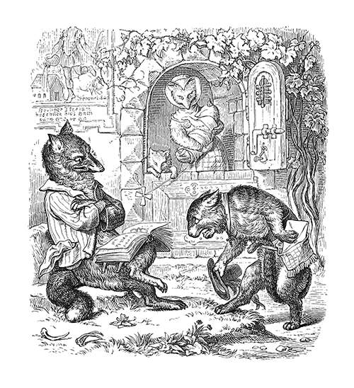
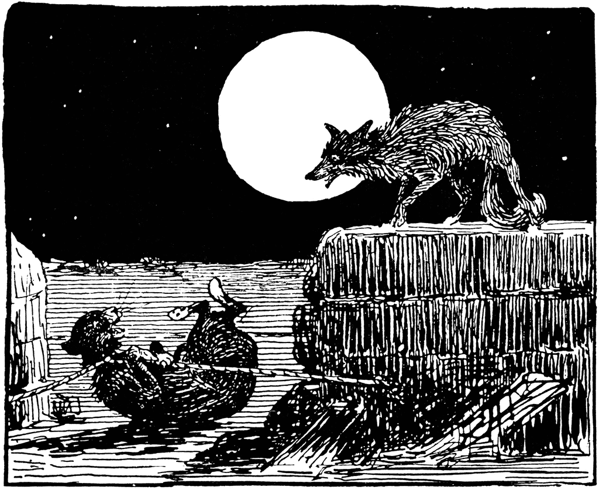

# 今天的文学猫角色：Tibert

Tibert 是欧洲中世纪“列那狐”故事群里那只总要和 Reynard 打交道的猫。他的名字在不同语言和版本中会写成 Tibert、Tybert、Thibert，后来甚至衍生出 Tybalt。原作传统并没有给他规定一种固定毛色；几百年来的插画家更关心的，是怎样把一只猫画成宫廷社会里的小贵族。十九世纪威廉·冯·考尔巴赫的插图让他直立着向 Reynard 躬身递交王命，衣着、姿态都像一位谨慎的使者；1895 年 Joseph Jacobs 版的插图则把他重新拉回更接近动物本能的处境——月夜、老鼠、圈套，以及在一旁看热闹的狐狸。

“列那狐”并不是一部由单一作者一次写成的小说，而是一整套在中世纪欧洲不断流传、改写和扩充的动物叙事。英国文学里最重要的早期版本之一，是 William Caxton 在 1481 年印行的英文《The History of Reynard the Fox》。在这个世界里，动物拥有宫廷爵位、亲属关系和法律程序，却又始终保留着各自的兽性：狮王 Noble 召开御前审判，熊 Bruin、狼 Isegrim、獾 Grymbart 都是臣属，而 Tibert 则是一位体型不大、被国王评价为“聪明而有学问”的猫廷臣。

Tibert 最著名的一次出场，是奉命去把拒不到庭的 Reynard 召回王宫。上一位使者 Bruin 已经被狐狸用蜂蜜诱骗，弄得遍体鳞伤；Tibert 因而一开始就很不情愿。他提醒国王，连强壮的大熊都拿 Reynard 没办法，自己又小又弱，怎么可能成功。国王的回答恰好点出 Tibert 的角色定位：力量并不是一切，聪明和技巧往往能做到蛮力做不到的事。Tibert 只得上路，而且途中还遇到一个令他不安的凶兆，心里早已预感这趟差事不会顺利。

到了 Reynard 的巢穴 Maleperduys，狐狸却表现得像最热情的亲戚。他一口答应第二天跟 Tibert 去王宫，还坚持把这位“亲爱的表亲”留下过夜。真正让 Tibert 放松警惕的并不是礼貌，而是一种非常猫的东西：老鼠。Reynard 先拿蜂蜜招待他，Tibert 毫无兴趣，直说如果有一只肥老鼠会好得多；听说附近神父家的谷仓里老鼠多得几乎装不完时，他立刻来了精神，甚至夸张地说，一只肥老鼠比鹿肉、馅饼乃至金币都更值得。

这正是 Reynard 等待的破绽。狐狸前一晚刚从那座谷仓偷过母鸡，明知神父已经在墙洞前安好了套索，却仍带着 Tibert 来到那里。Tibert 到洞口其实再次起了疑心，担心神父家的圈套；Reynard 只消嘲笑他胆小，他便因为羞耻而钻了进去。套索立刻勒住他的脖子。狐狸站在外面听着猫的惨叫，还故意问那些老鼠是不是又肥又好吃，把 Tibert 的挣扎说成宫廷里的“歌声”。

随后赶来的神父一家把原本以为抓到的“偷鸡狐狸”围住痛打，Tibert 被打得浑身是伤，一只眼睛也在混乱中被打瞎。可他并没有像 Reynard 预想的那样死在那里。眼看神父还要给自己致命一击，Tibert 猛扑到对方两腿之间，用牙和爪发动了一次极其凶狠的反击；趁全家忙着救人的空当，他又一点点咬断套索，从洞口逃出去，拖着伤躯在天亮时回到王宫。这个场面把 Tibert 的两面性写得很清楚：他确实会被食欲和自尊心骗倒，却又有猫在绝境里突然爆发出的狠劲和求生本能。

Tibert 因而不是一只单纯负责衬托 Reynard 聪明的笨猫。在整个故事传统里，他自己也会耍手段、在危险时迅速自保，只不过当对手是 Reynard 时，总有人比他更擅长把别人的弱点变成陷阱。几百年后，这只中世纪猫还留下了一个意外的文学回声：莎士比亚《罗密欧与朱丽叶》中的 Tybalt 与 Tibert/Tybalt 这一猫名传统相连，Mercutio 嘲弄 Tybalt 时称他为“猫王子”，又叫他“捕鼠者”。于是，一只在中世纪谷仓里为老鼠吃尽苦头的猫，竟把自己的名字和那股骄傲、敏捷、好斗的气质，一路带进了莎士比亚的维罗纳。

### 视觉参考

1. 来源页面：https://www.oldbookillustrations.com/illustrations/towards-malepartus/  
   原始图片 URL：https://www.oldbookillustrations.com/site/assets/files/13537/towards-malepartus.jpg  
   作者/机构：Wilhelm von Kaulbach（画）；Julius Schnorr von Carolsfeld（雕版）；Old Book Illustrations 收录。  
   说明：出自 1857 年《Reineke Fuchs》插图，画面中 Tibert 携带信件向 Reynard 躬身，突出他作为宫廷使者的身份。

2. 来源页面：https://etc.usf.edu/clipart/71900/71949/71949_rey_tibert.htm  
   原始图片 URL：https://etc.usf.edu/clipart/71900/71949/71949_rey_tibert_lg.gif  
   作者/机构：来源书为 Joseph Jacobs，London: Macmillan and Co., 1895；数字图由 ClipArt ETC / Florida Center for Instructional Technology, University of South Florida 提供。  
   说明：Tibert 被 Reynard 以谷仓里的老鼠为诱饵骗入圈套的月夜场景。