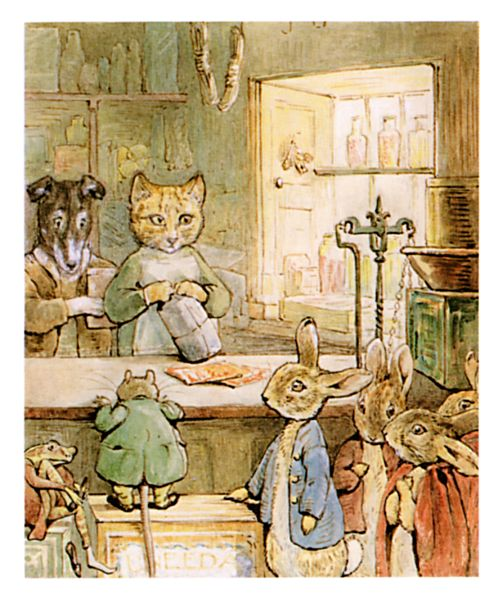
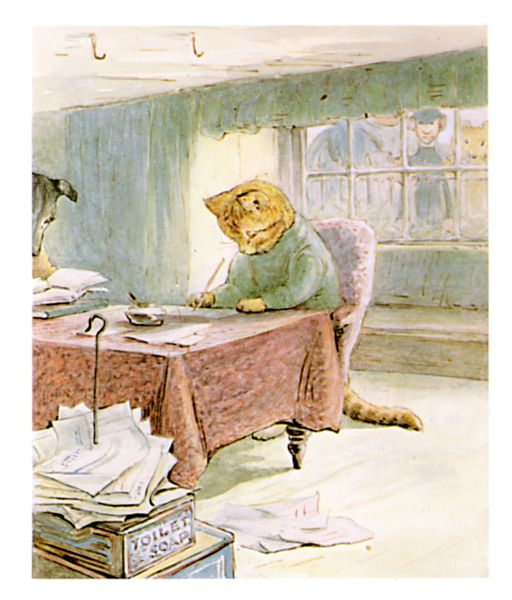

# 今天的文学猫角色：Ginger

碧雅翠丝·波特在《The Tale of Ginger and Pickles》里，对 Ginger 的外貌只给了一个非常明确的核心设定：他是一只“yellow tom-cat”，也就是黄色的公猫。波特自己的水彩把这个简单设定具体化成了一只暖黄偏橙的虎斑猫，额头和脸颊带着较深的条纹，口鼻一带较浅，身形圆实，穿着绿色上衣，在柜台后像个真正的乡村杂货店老板。比起她笔下那些常常奔跑、闯祸的小猫，Ginger 出场时已经是一只完全进入成年世界的猫——他会包货、记账、算账，也会在生意失败以后显得越来越疲惫。

1909 年的《The Tale of Ginger and Pickles》写的是一间几乎什么都卖的小村商店。柜台高度刚好适合兔子，货架上有糖、鼻烟、套鞋、手帕和各种杂货；店主则是 Ginger 和他的搭档 Pickles，一只梗犬。这个组合本身就带着波特式的笑意：兔子有点怕 Pickles，老鼠则很怕 Ginger。每当老鼠来买东西，Ginger 通常让 Pickles 去接待，因为他承认看见这些小顾客提着包裹走出店门，会让自己“直流口水”。Pickles 提醒他，绝不能把自己的顾客吃掉；Ginger 却阴沉地回答，如果真吃掉了，他们当然也就不会去别家购物了。

真正毁掉这间店的却不是捕食本能，而是一项看起来异常友善的商业政策：Ginger 和 Pickles 给所有顾客无限赊账。客人拿走肥皂、糖果、黄油和其他商品，只说以后再付钱，Pickles 就鞠躬答应，把账记进本子里。于是商店每天人满为患，销售额甚至达到竞争对手 Tabitha Twitchit 店铺的十倍，可钱箱里始终没有现金。波特把“销量很好”和“生意很好”这两件事故意拆开，让一群动物用最简单也最滑稽的方式演了一遍现金流危机。

Ginger 在这场危机里显得比 Pickles 更冷静，也更尖刻。他很早就看出 Samuel Whiskers 根本没打算偿还欠账，又怀疑 Anna Maria 会顺手拿走店里的东西；可两个店主自己也已经穷到只能吃库存过日子。关门以后，Pickles 吃饼干，Ginger 则吃一条风干黑线鳕。等他们终于退到后屋认真算账，桌上堆满账单，数字越加越长，却依然换不来真正的钱。波特画 Ginger 坐在桌前写账的那幅图尤其好笑：他神情专注得像一个很有责任心的会计，可整套账务体系从根本上已经无可挽救。

最后一根稻草来自税款。Pickles 因为没钱购买狗牌，早已害怕警察；某天店里突然出现一个拿着笔记本的“警察”，吓得他狂吠不止，Ginger 还躲在糖桶后面催他去咬，直到发现那其实只是一个德国玩偶。真正留下来的信封却不是玩笑，而是一张数额不小的地方税单。面对已经完全失控的账目和新的支出，Pickles 终于说“把店关了吧”，两位店主于是拉下百叶窗，结束营业。

Ginger 并没有因此迎来悲惨结局。故事后来轻描淡写地说，他住进了兔子窝，作者也不知道他如今靠什么谋生，只知道他看起来“又胖又舒服”。这句收尾很有波特的味道：一只原本不得不压抑捕鼠本能、穿衣服、记账、追债的猫，在退出人类式商业生活之后，反而显得过得不错。至于村民，他们很快发现失去 Ginger 和 Pickles 的廉价赊账商店极其不便；Tabitha Twitchit 立刻涨价，后来接手商店的 Sally Henny Penny 则吸取了最关键的教训——她坚持现金交易，不再赊账。

Ginger 因而是一只很少见的“商业猫”。他的故事没有魔法，也没有英雄冒险，真正推动情节的是信用、欠账、库存、税费和现金流；与此同时，所有这些成人世界的麻烦又始终和一件最简单的事实并置在一起：店主本质上仍是一只见到老鼠会嘴馋的猫。波特让他认真地做一个人类商人，最终却用最猫的方式给他安排了退场——离开柜台，住进兔子窝，变得圆滚滚而舒适。正因为这样，Ginger 的失败并不显得真正可怜，反而像是他终于从一份并不适合猫的职业里解脱了出来。

### 视觉参考

图 1：来源页面：https://www.fiction.us/potter/ginger/ginger.htm ；原始图片 URL：https://www.fiction.us/potter/ginger/pic123/ginger_fig13.jpg ；作者：Beatrix Potter；说明：1909 年原作插图，Ginger 与 Pickles 在柜台后接待兔子与老鼠顾客，可见 Ginger 的黄色虎斑外形和绿色店员服装。

图 2：来源页面：https://www.fiction.us/potter/ginger/ginger.htm ；原始图片 URL：https://www.fiction.us/potter/ginger/pic123/ginger_fig33.jpg ；作者：Beatrix Potter；说明：1909 年原作插图，Ginger 坐在桌前处理账目，突出他作为商店经营者的成人化形象。
