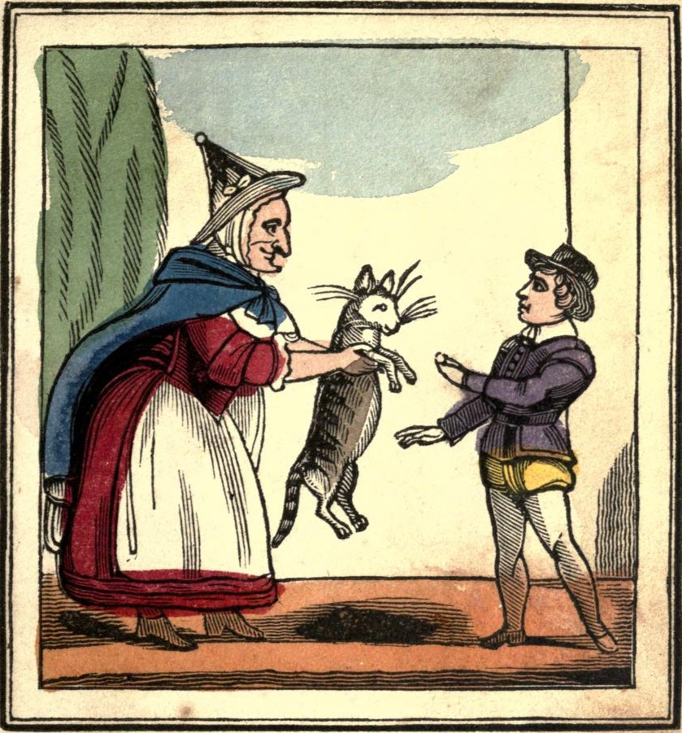
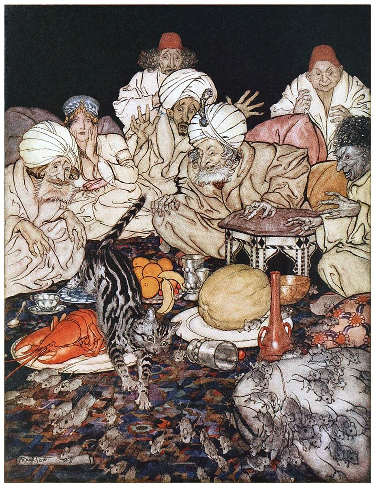

# 今天的文学猫角色：Dick Whittington's Cat（惠廷顿的猫）

在“迪克·惠廷顿和他的猫”的故事传统里，这只猫没有正式名字，通常只是被叫作 the cat、Puss，甚至颇亲昵地称作 Mrs. Puss。故事也没有规定她的毛色、眼睛或体型，只明确把她写成一只母猫，而且是一位极其出色的捕鼠者。后来的插画因此拥有很大自由：约1850年的儿童书彩色插图把她画成一只身形修长、灰褐色调的家猫，被一个女孩递到少年 Dick 手中；Arthur Rackham 1922年的版本则把她画成条纹鲜明、尾巴高扬的虎斑猫，在满地乱窜的鼠群中显得几乎像一位孤身出战的猎手。两种形象虽然相隔七十多年，却都没有把她神奇化——她看起来始终只是一只普通而能干的猫。

这只猫属于英国著名的“Dick Whittington and His Cat”民间文学传统。故事借用了真实存在的中世纪伦敦商人 Richard Whittington 的姓名与后来担任伦敦市长的经历，却把他的青年时代重新编成一则从贫穷走向幸运的传奇。关于“Whittington 和他的猫”的文字记录在十七世纪初已经出现，十九世纪末 Joseph Jacobs 又把流传已久的材料收入《English Fairy Tales》。在 Jacobs 的讲法里，猫并不是陪衬，而是 Dick 命运真正发生转向的那件唯一财产。

刚到伦敦时，Dick 在富商 Fitzwarren 家里做厨房杂役，晚上只能睡在屋顶下的小阁楼。那里老鼠和耗子成灾，常常爬过床铺，让他无法入睡。一天，他替别人擦鞋挣到一便士，正巧看见一个女孩抱着猫，便把这一便士全部拿出来将猫买下。女孩告诉他，这是一只“极好的捕鼠猫”。Dick 把她偷偷养在阁楼里，用自己饭里省下的碎屑喂她；很快，困扰他的鼠患就被清理干净，他终于能够安稳睡觉。对于一个几乎一无所有的孩子来说，这只猫最早带来的并不是财富，而是一个可以真正休息的夜晚。

Fitzwarren 有个习惯：每当自家的船队远航，也允许家中仆人拿出一点私人物品随船交易，希望大家都能从航海贸易中分得一点好运。Dick 没有金钱，也没有别的东西可以拿出来，唯一属于自己的就是这只猫。于是猫被作为他的“venture”送上船。这个决定其实让他非常难过，因为她既是他唯一的财产，也是保护阁楼免受老鼠侵扰的伙伴；猫离开以后，他甚至想到自己又要彻夜听着鼠群折腾。

船后来抵达故事所谓的 Barbary 海岸，当地国王热情款待船长，却有一个几乎无法解决的麻烦：宫殿里到处都是老鼠和耗子，宴席刚摆上桌，它们就成群扑来抢食。船长这才想起 Dick 的猫，告诉国王自己船上有一只能够对付这些动物的奇兽。猫一被放出来便扑向鼠群，杀死许多，剩下的也纷纷逃走。她随后又显出完全不同的一面：王后起初害怕她，船长便抱起猫、抚摸并呼唤她；等猫被放到王后膝上，她立刻打起呼噜、撒娇玩耍，最后竟安稳地睡着了。正是这两个连在一起的场面——猛烈捕鼠与安静亲人——让宫廷相信她既有用又可以成为家庭动物。

国王因此愿意付出惊人的价格买下她，并认为只要她以后生下小猫，整个国家就能逐渐摆脱鼠患。Jacobs 的版本甚至说，国王为这只猫付的钱，是购买船上其余全部货物金额的十倍。船长回到伦敦后把收益如数交给 Fitzwarren；而 Fitzwarren 坚持这笔财富真正属于 Dick。于是，那个曾经只有一便士和一只猫的厨房杂役突然成了富人，随后迎娶 Alice，并最终走向传说中“三任伦敦市长”的人生。

这只猫最有意思的地方，是她从来没有说话、施法、穿衣服，甚至没有表现出超越普通猫的智慧。她改变一个人的命运，只因为把猫最寻常的本领发挥到了极致。故事先让一便士变成一只捕鼠猫，又让这只猫变成一次跨海贸易中最珍贵的“货物”；可在 Dick 最贫穷的时候，她同时又是能让他睡好觉的同伴。Bow Bells 的钟声后来成了 Whittington 传奇里最著名的象征，但真正把贫穷少年和财富连接起来的，其实始终是这只没有名字的猫。她不是会创造奇迹的魔法动物，而是一只普通猫被送到了一个最需要猫的地方——而童话般的幸运，恰好就从这种再实际不过的本领开始。

### 视觉参考

1. 约1850年《The adventures of Whittington and his cat》彩色插图：Dick 从女子手中买下猫。
   - 来源页面：https://commons.wikimedia.org/wiki/File:Adventuresofwhit00newyiala_0007.jpg
   - 原始图片：https://upload.wikimedia.org/wikipedia/commons/4/47/Adventuresofwhit00newyiala_0007.jpg
   - 作者/机构：作者不详；原书由 Edwd. Dunigan（New York）出版；Wikimedia Commons 保存
   - 说明：约1850年的儿童书版本，展示 Dick 以一便士买下猫的核心情节。
2. Arthur Rackham，When Puss Saw the Rats，1922。
   - 来源页面：https://www.oldbookillustrations.com/illustrations/rats-mice/
   - 原始图片：https://www.oldbookillustrations.com/site/assets/high-res/1922/rats-mice-1200.jpg
   - 作者/机构：Arthur Rackham；收录于 Flora Annie Steel《English Fairy Tales》（Macmillan，1922）；Old Book Illustrations
   - 说明：描绘猫在鼠患席卷的宫廷宴席中出手捕鼠，是故事高潮的经典视觉化。
