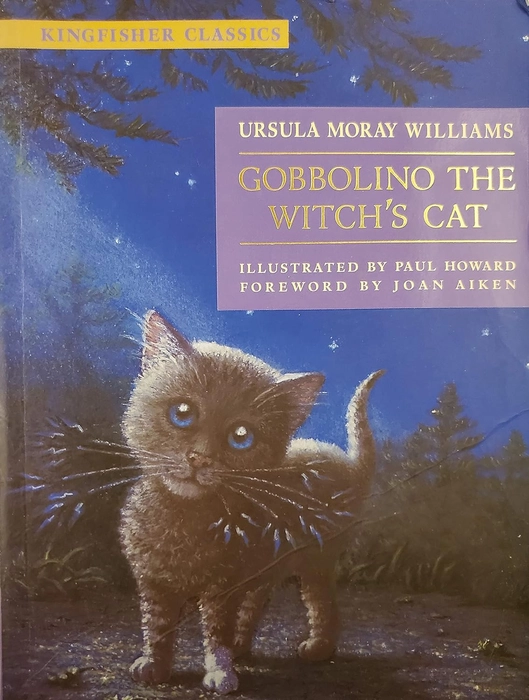
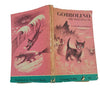

# 今天的文学猫角色：Gobbolino

Gobbolino 一出生，就因为长得“不像一只合格的女巫猫”而暴露了自己的不同。月光下，他的一只前爪像穿着纯白的小袜子，脚垫还是粉红色的；本该乌黑发亮的毛皮隐约透出虎斑的纹理，圆圆的眼睛则是明亮的蓝色。和他同时出生的双胞胎妹妹 Sootica 恰好相反：她通体漆黑，长着女巫猫应有的绿色眼睛。对于一个出生在飓风山女巫洞穴里的小猫来说，这几处看似可爱的特征，从一开始就像几张写在身上的“不合格证明”。

Ursula Moray Williams 在 1942 年出版的《Gobbolino, the Witch's Cat》里，把这种外貌差异和性格差异紧紧放在一起。Sootica 对骑扫帚、学习魔法和成为女巫的伙伴充满期待，Gobbolino 却害怕这些事。他真正想要的生活朴素得近乎反童话：做一只厨房猫，坐在炉火边呼噜，捉家里的老鼠，看着孩子和婴儿，在女主人膝上安稳睡觉。后来 Penguin 的纪念版仍用“一只白爪和明亮蓝眼睛”概括他的样貌，因为这些特征不仅让他好认，也正是故事最初拒绝他的世界用来判断他的依据。

没有女巫愿意带走 Gobbolino，最后连母亲 Grimalkin 和原本的女主人也把他留了下来。短暂的绝望之后，他却意识到这也意味着自由：既然做不成别人期待的女巫猫，他终于可以去寻找自己想要的家。于是这本书的大部分篇幅，都成了一次不断“试住”的漫长旅程——农场、孤儿院、市长家、展览会、船、宫殿、木偶戏班，以及后来遇到的各种人家，都曾一度像是他梦想中的终点。

问题在于，Gobbolino 越努力做一只普通猫，他身上的魔法越容易突然冒出来。在农场，他被怀疑让牛奶变酸；到了孤儿院，他看见孩子们吃着难以下咽的灰色稀粥，出于好心偷偷施法，结果锅里的食物变得甜美而不可思议。对 Gobbolino 来说，这是帮助；对周围的人来说，却再次证明这只猫“有问题”。类似的误会一次又一次发生：他会用魔法救人，也会因为魔法被害怕，甚至当他什么坏事都没做时，仅仅“女巫猫”这个身份就足以让新的主人改变态度。

这也让 Gobbolino 和许多会魔法的儿童文学动物很不一样。魔法通常意味着特殊能力和冒险的入口，在他这里却更像一件甩不掉的行李。他并不渴望掌握更强的力量，也没有把“我其实很特别”当作值得证明的秘密；他一次次想做的，只是被允许成为普通家庭里的一员。甚至当他做过皇家宠物、表演猫和船猫之后，真正吸引他的仍然不是身份、掌声或远方，而是那幅最初就没有改变过的图景：厨房、炉火、家人与稳定的日常。

故事最后把这个愿望实现得有些苦涩。Gobbolino 在漫长旅程后重新遇见 Sootica 和女巫，女巫最终施法拿走了他的魔力；与此同时，他原本显眼的外貌也发生变化，黑色皮毛褪成不起眼的虎斑，几乎让人认不出他。失去魔法之后，他回到最初待过的农场，终于不再被当作危险的异类，而是作为一只真正的厨房猫被接纳下来。表面看，这是一个“愿望终于成真”的圆满结局；可读到这里，也很难忽略其中那点复杂意味——Gobbolino 得到普通生活的代价，恰恰是那些使他显得不同的力量和外貌标记被一一抹去。

也因此，Gobbolino 最容易让人记住的并不是某一次奇遇，而是他那种近乎固执的温和。他被抛下、被误会，也一次次被新的家庭拒绝，却很少因此变得刻薄；遇到别人受苦时，他仍会忍不住帮忙，哪怕这样做很可能再次暴露魔法。Williams 后来亲自绘制的早期线稿、1960 年代 Puffin 版本，以及 Paul Howard、Catherine Rayner 等后来的插画，都不断重新解释这只蓝眼睛、白爪的小猫，但他的核心始终没有改变：他生来属于童话里最容易令人着迷的那一边——女巫、扫帚和魔法——却偏偏把幸福想象成一只普通猫在炉边找到的位置。

### 视觉参考

图 1：来源页面：https://bookforest.in/products/gobbolino-the-witch-s-cat-kingfisher-classics ；原始图片 URL：https://dukaan.b-cdn.net/700x700/webp/media/2da911cd-dcd8-4373-8b2d-89c91edda634.jpg ；作者/机构：Paul Howard（插画），Kingfisher Classics；说明：该版本封面直接突出 Gobbolino 的蓝眼睛、深色毛皮与一只白色前爪，是后期具有代表性的角色视觉形象。

图 2：来源页面：https://countryhouselibrary.co.uk/products/gobbolino-the-witchs-cat-by-ursula-moray-williams-puffin-1965 ；原始图片 URL：https://countryhouselibrary.co.uk/cdn/shop/products/orig_253568_jpg_small.jpg?v=1681829943 ；作者/机构：Puffin Books；说明：1965 年 Puffin 版书影，提供较早版本中 Gobbolino 的封面视觉参考。
