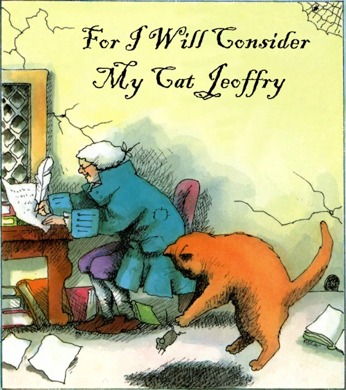
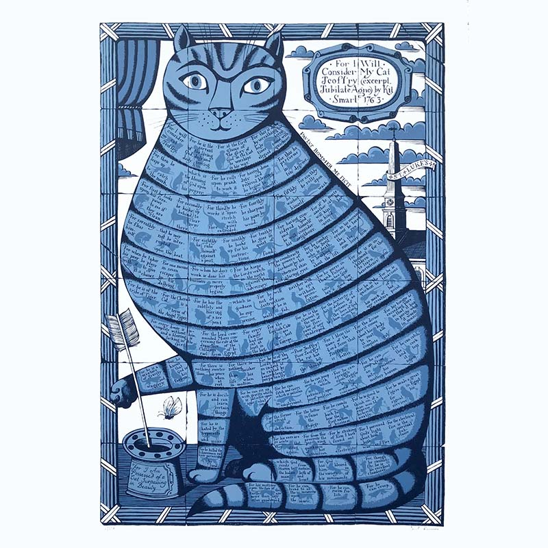

# 今天的文学猫角色：Jeoffry

Christopher Smart 并没有告诉我们 Jeoffry 究竟是什么毛色。诗里没有固定的斑纹、眼色或体型说明，只有一句近乎毫不犹豫的判断：这是一只“美得出众”的猫。后来的人因此可以把他画成完全不同的样子。Emily Arnold McCully 在 1984 年的插图里让 Jeoffry 成为一只暖橙褐色的大猫，贴在伏案写作的 Smart 身旁；另一种现代视觉化则把他的身体画成蓝色虎斑般的巨大文字容器，一行行诗句沿着皮毛展开。这些都不是十八世纪留下来的肖像，却很适合表现 Jeoffry 在文学里的特殊存在方式：关于他的形象，最可靠的“外貌”其实不是颜色，而是动作。

Jeoffry 是英国诗人 Christopher Smart 的真实宠物，也是长诗《Jubilate Agno》中最著名的一位角色。Smart 在 1750 年代末至 1760 年代初遭到精神病院式的长期禁闭，期间仍被允许读书、写作、整理花园，也可以养猫。他就在这段生活里写下《Jubilate Agno》；诗稿在他生前没有出版，直到 1939 年才重新进入公众视野。Jeoffry 所在的段落后来经常被单独摘出，第一句就是那句极有名的“For I will consider my Cat Jeoffry”——“因为我要来细想我的猫 Jeoffry”。

所谓“细想”，在 Smart 笔下真的是从一只猫每天最微小的动作开始。清晨阳光出现，Jeoffry 先以自己的方式迎接它；随后他开始检查身体。Smart 一本正经地把猫咪晨间整理拆成十道程序：查看前爪、伸展、在木头上磨爪、舔洗、翻滚、清理跳蚤、蹭柱子，最后才出去寻找食物。任何养过猫的人都会认出其中许多动作，可 Smart 并不把它们写成滑稽的宠物观察。他相信，一只猫把自己活成一只完整的猫，本身就是对造物的赞美。

Jeoffry 也因此兼具非常日常和非常宏大的两重身份。他遇到别的猫，会亲昵地“吻”对方；捉住猎物时又会先玩一会儿，Smart 甚至替老鼠算出一个颇有希望的比例——因为他的拖延，总有一些能够逃走。到了夜晚，语气忽然转成史诗：Jeoffry 守着上帝的夜班，用“带电的皮肤”和发亮的眼睛抵抗黑暗。他属于“老虎的族类”，有蛇一样的敏锐与嘶声，却在善意中克制这些力量。真正的家猫行为，被诗人毫无缝隙地接到了宇宙、宗教和神话上。

但 Jeoffry 最动人的地方并不是被神化，而是 Smart 对他看得实在太仔细。诗人知道他会在得到夸奖时呼噜，会安静地坐好，也会取物、叼东西、跳过棍子、从高处跃进主人的怀里，还会追逐软木塞再把它拨回来。他把 Jeoffry 概括成“gravity and waggery”的混合物——既庄重，又顽皮；静止时没有什么比他的安宁更甜美，活动起来又没有什么生命比他更轻快。这种描述跨过了两个半世纪，仍像有人刚刚从沙发另一头抬眼观察自己的猫。

诗里还有一个突然让人心里一紧的细节。Smart 写道：“可怜的 Jeoffry，可怜的 Jeoffry，老鼠咬伤了他的喉咙。”下一句马上又说，感谢上帝，Jeoffry 已经好多了。没有英雄式的渲染，也没有继续解释伤势，只是主人在长长的赞歌中忽然记起一次真实的惊险。正是这样的句子提醒人们，Jeoffry 并不只是宗教寓意中的“神圣之猫”，而是一只会受伤、会恢复、需要被担心的具体动物。

《Jubilate Agno》本身极其庞杂，既像祷告、清单、日记，也像一套只属于 Smart 的宇宙分类学；可一写到 Jeoffry，诗突然拥有了非常清楚的身体感。爪子、背脊、耳朵、舌头、跳跃、伸展、磨蹭，全都变得可以看见。Smart 甚至说，通过抚摸 Jeoffry，他发现了“电”；今天当然不必把这理解成物理学发现，却很容易理解那种感受——手指经过猫毛，细小静电噼啪作响，诗人便把这一瞬间看成神性也在动物身体里流动。

所以 Jeoffry 在文学里的魅力，并不依赖一段完整的冒险故事。他几乎什么“大事”都没有做，只是起床、梳洗、捕鼠、玩耍、巡夜、跳进人的怀里，然后被一个处境艰难的人长久注视。Smart 把这种注视写得如此认真，以至于一只十八世纪家猫的日常生活获得了几乎宗教性的重量。Jeoffry 留下的最鲜明形象，也就不是某种后来画家规定的毛色，而是那句极温柔的判断：一个家如果没有猫，就少了一份祝福。

### 视觉参考

图 1：来源页面：https://www.101bananas.com/poems/smart.html ；原始图片 URL：https://www.101bananas.com/poems/graphics/smart1.webp ；作者：Emily Arnold McCully；说明：出自 Atheneum 1984 年出版的《For I Will Consider My Cat Jeoffry》插图版本，画面表现 Jeoffry 陪伴伏案写作的 Christopher Smart。

图 2：来源页面：https://humanimalia.org/article/view/9652 ；原始图片 URL：https://humanimalia.org/public/journals/8/submission_9652_9653_coverImage_en_US.jpg ；机构：Humanimalia；作者未在页面中注明；说明：2016 年论文“What if Christopher Smart’s Cat Responded?”所采用的封面视觉，将 Jeoffry 画成由诗句构成的巨大虎斑猫形象。
