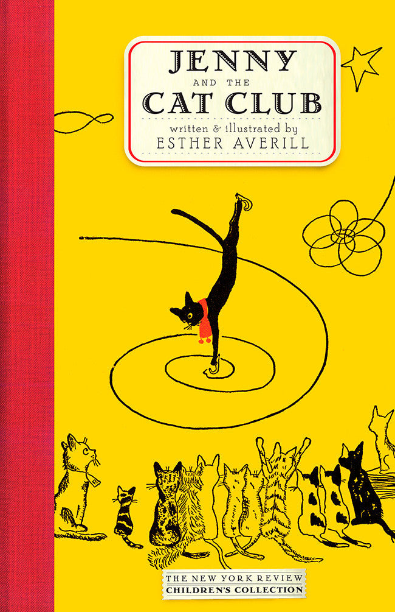
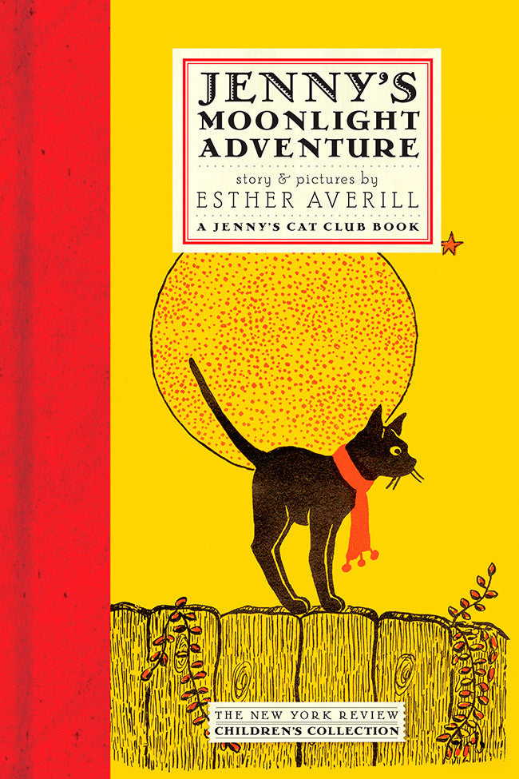

# 今天的文学猫角色：Jenny Linsky

Jenny Linsky 的样子几乎可以一眼认出来：一只小小的黑猫，圆圆的浅色眼睛，脖子上总围着一条鲜红围巾。Esther Averill 的画线条很简洁，常常只用黑、白，再加一点红色，就让 Jenny 从其他猫中跳出来。她的嘴几乎从不被强调，脸上最醒目的反而是那双睁得很大的眼睛，因此即使只是站在窗边、坐在围墙上，也会显得既好奇又有些紧张。那条红围巾后来更像她随身携带的一点勇气：黑色身体可以缩进夜色里，围巾却总把她重新标出来。

Jenny 第一次出现在 Averill 1944 年出版的《The Cat Club》中。她和年老的海员 Captain Tinker 住在纽约格林尼治村，是一只被收养的小猫。夜里，附近的猫会在花园和围墙边举行 Cat Club 聚会：有的会唱歌，有的会跳舞，波斯猫 Madame Butterfly 甚至会吹一种古怪的鼻笛。Jenny 明明非常想加入，却因为害羞一直躲在窗后看。更让她退缩的是，俱乐部里的每只猫似乎都有拿得出手的本领，而她觉得自己什么都不会。

真正改变她的是冬天。池塘结冰以后，Captain Tinker 给 Jenny 做了一双冰鞋。这个平时连走近猫群都需要鼓足勇气的小家伙，一踩上冰面却像突然找到了身体最自然的语言。她学会旋转、滑行，在冰上表现出让其他猫惊讶的灵巧，最后也凭自己的本领被接纳进 Cat Club。这个情节很简单，却几乎奠定了 Jenny 此后所有故事的基调：她并不是从胆小变成无所畏惧，而是在害怕仍然存在的时候，逐渐发现自己也有能够迈出去的那一步。

红围巾正是在这种意义上变得重要起来。在后来的《The School for Cats》中，Jenny 被送去乡间的猫学校，面对陌生环境和爱捉弄别人的 Pickles，她又一次害怕得想逃走；故事会明确提到那条围巾能让她感到勇敢。可 Jenny 真正的成长并不是越来越依赖它。她最后还是回到学校，面对 Pickles，并学会和别的猫相处。Averill 很少把“勇敢”写成豪迈的性格转变，而更像一种小小的、反复练习的能力：害怕，退缩，再想一想，然后回来。

这种性格在《Jenny's Moonlight Adventure》里显得尤其可爱。万圣节夜晚，Cat Club 本来要听 Madame Butterfly 演奏鼻笛，可她受了伤，乐器也遗失在落叶里。有人必须把找回来的鼻笛送还给她，而路上要经过 Jenny 很害怕的地方。偏偏这一次，最胆小的黑猫成了最适合出发的那一个。Jenny 最终接受了任务，在月光下穿过街道去帮助朋友。故事并没有把她突然变成冒险英雄；真正动人的恰恰是，她一路仍然会紧张，只是已经知道，害怕并不等于不能继续往前走。

Jenny 的世界也很有纽约味道。Cat Club 不是童话森林里的秘密王国，而更像格林尼治村街区里一群个性鲜明的邻居：围墙、后院、消防站、街道和公园把猫们的生活连在一起。Averill 本人在回到纽约后曾在纽约公共图书馆工作，她后来说明，Jenny 以及书中的许多猫都取材自自己认识或养过的真实猫，故事中的场景也大量来自格林尼治村。于是 Jenny 的冒险总有一种很特别的尺度——事情对一只小猫来说足够重大，但活动范围仍然只是几个街区，世界既广阔又亲近。

系列往后发展，Jenny 还会经历丢失围巾、收养两只流浪猫做兄弟、嫉妒、分享、远行等各种事情。她并不是那种每次出场都表现得比别人聪明的主角，相反，她会犹豫，会吃醋，会怕陌生人，也会因为自己做得不够好而难过。可她总有一种很稳定的善意：愿意给别人留位置，愿意在朋友需要时想办法，也愿意在犯错后重新调整自己。正因为这些缺点和努力都很小，Jenny 才不像被设计出来的“儿童文学榜样”，而更像一只真的会慢慢长大的猫。

Averill 从 1944 年开始持续写 Jenny 和她的伙伴，最终形成了一整组 Cat Club 故事。几十年后重新出版时，Jenny 仍然没有显得过时，大概正因为她最核心的问题从来不是怎样成为最特别的猫，而是怎样在别人都显得更自信、更有本领的时候，相信自己也可以走进人群。她那条红围巾因此成了一个很温柔的象征：勇气不一定意味着不再害怕，有时候只是在黑色小猫准备后退的时候，仍有一小片鲜红提醒她——再往前走一点。

### 视觉参考

图 1：来源页面：https://www.nyrb.com/products/jenny-and-the-cat-club ；原始图片 URL：https://www.nyrb.com/cdn/shop/products/jennyandthecatclub.jpg?v=1518198784 ；作者：Esther Averill；机构：New York Review Books；说明：NYRB 儿童经典版《Jenny and the Cat Club》封面，Jenny 戴着标志性的红围巾在冰面上滑行，直接对应她在最初故事中发现滑冰天赋并加入 Cat Club 的情节。

图 2：来源页面：https://www.nyrb.com/products/jennys-moonlight-adventure ；原始图片 URL：https://www.nyrb.com/cdn/shop/products/Jennys-Moonlight-Adventure.jpg?v=1518198783 ；作者：Esther Averill；机构：New York Review Books；说明：NYRB 版《Jenny's Moonlight Adventure》封面，Jenny 戴红围巾站在围墙上、身后是一轮巨大月亮，呈现她在夜间街区冒险中的经典形象。
