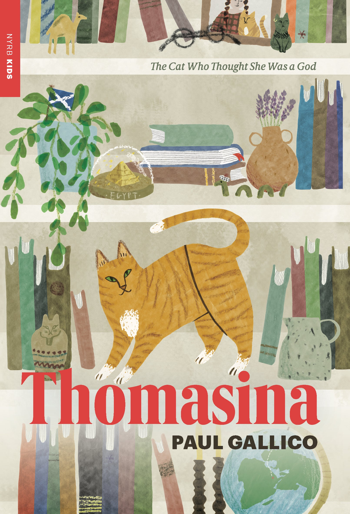
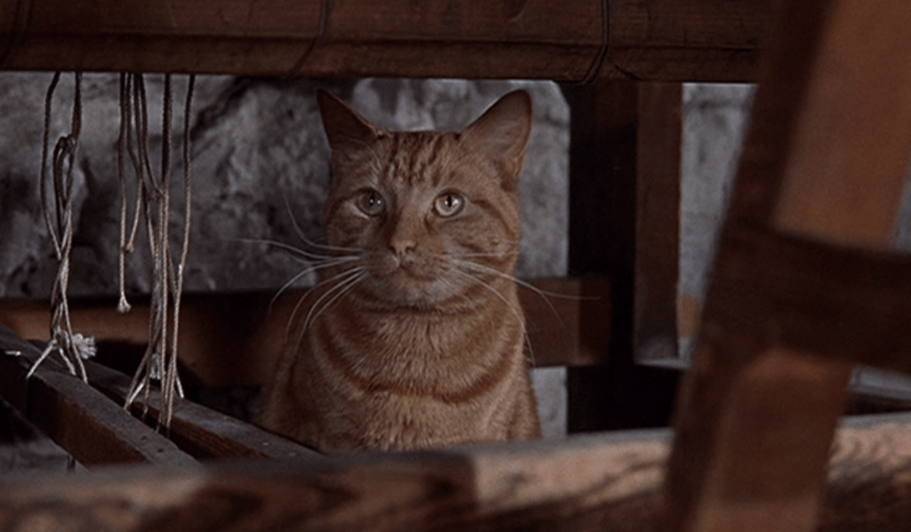

# 今天的文学猫角色：Thomasina

Thomasina 是一只姜黄色、带虎斑纹的母猫。Paul Gallico 在小说里并没有用冗长的外貌描写来固定她的每一处细节，但“ginger”是她最稳定的视觉特征；后来的版本也大多沿着这一点塑造她。New York Review Books 的现代封面把她画成一只占据几乎整个画面的橘色虎斑猫，脸上带着一种理所当然的自信；1960 年代迪士尼改编里的 Thomasina 则由真实的姜黄色虎斑猫出演，毛色更具体，也让这个原本主要依靠文字声音成立的角色，有了一张很多读者能够直接辨认的脸。

1957 年出版的《Thomasina, the Cat Who Thought She Was God》把故事放在 1912 年的苏格兰小镇 Inveranoch。七岁的 Mary Ruadh 很早失去了母亲，Thomasina 是她最亲密的伙伴；Mary 的父亲 Andrew MacDhui 是镇上的兽医，却是一个在妻子去世后越来越把感情锁起来的人。Gallico 还让 Thomasina 自己承担了小说的一部分叙述。于是读者听到的并不只是人类如何爱一只猫，也会听到一只猫如何理解人类——带着十足的自尊、挑剔和猫式的理所当然。

故事真正残酷的转折来自 Thomasina 生病或受伤之后。MacDhui 判断她已经没有救治价值，决定用氯仿让她死去。对一个习惯把动物当作病例处理的兽医而言，这是一项冷静的专业决定；对 Mary 来说，却等同于父亲亲手杀死了她最爱的朋友。孩子们为 Thomasina 举行葬礼，在墓碑和仪式里把这次死亡变成一件无法轻易被成人解释过去的事情。Mary 从此拒绝原谅父亲，而 MacDhui 原本就已经僵硬的情感世界也因此进一步崩裂。

但 Thomasina 实际上并没有真正死去。住在林地里的年轻女子 Lori 发现她仍有生命，把她带回去照料。醒来的 Thomasina 一度失去记忆，于是为自己重新编出了一套极其宏大的身份：她相信自己曾是古埃及的猫神，是 Bast-Ra，也把自己看作一个经历死亡后重新降临的神圣存在。这个设定让书名里的“以为自己是神”变得非常具体，却又不只是一个笑话。Thomasina 本来就拥有猫特有的自我中心和尊贵感，失忆只是把这种气质推到了神话的尺度；与此同时，小说也故意让奇迹、误解、心理变化和宗教式的象征彼此重叠，并不急着替读者划出唯一解释。

Thomasina 被救活以后，真正需要被“救回来”的反而逐渐变成了人。Mary 因失去她而越来越衰弱，MacDhui则不得不面对一个事实：能够诊断病症、决定生死，并不等于真正理解生命。Lori 对动物的耐心和近乎本能的同情，与他的专业冷静形成了鲜明对照。她并不是简单地证明兽医错了，而是迫使 MacDhui重新看见那些被他当成病例、责任甚至麻烦的生命，与人之间其实存在无法用诊断表衡量的感情。Thomasina 因而从一只家庭宠物，逐渐变成了父女关系、医学与怜悯之间的一座桥。

小说后段，Thomasina 的记忆终于恢复。她重新认出自己的旧生活，在暴风雨中回到 Mary 身边。这个回归当然带有童话式的奇迹感，却并不是因为 Thomasina 突然获得了某种英雄能力；相反，她只是重新成为了原来的那只猫，想起自己的家、自己的孩子，也重新走向她曾经依恋的人。Mary 的病情因此出现转机，MacDhui 也终于开始松动。他需要承认的并不是“猫真的有三条命”，而是一个人如果把同情从自己的生活里彻底切掉，即使技术上仍然正确，也可能在最重要的地方失去判断。

Thomasina 最迷人的地方，正在于她既承担了这样沉重的主题，又从来没有被写成一只谦逊圣洁的动物。她很自负，会把人类当作服侍自己的存在，会郑重其事地解释自己的高贵，还能在失忆后顺理成章地相信自己是女神。Gallico 没有削掉这些“很猫”的部分来换取感人效果，反而让它们成为人物成立的基础。Thomasina 的离开和归来改变了好几个人的人生，可她自己始终只是按猫的逻辑生活：接受崇拜，要求照顾，选择亲近谁，并在记忆回来时回家。

1963 年完成、1964 年广泛上映的迪士尼电影《The Three Lives of Thomasina》后来把这段故事变成了更直观的家庭奇幻片，也进一步固定了 Thomasina 作为一只大而醒目的姜黄色虎斑猫的公众形象。电影和小说在若干细节上并不完全相同，但保留了故事最重要的结构：一只被判定应该死去的猫，在另一个人的照料下活了下来，并用自己的归来迫使一个冷硬的大人重新学习如何爱。Thomasina 从头到尾并没有真正成为神，她所做的其实更难一点——让几个以为自己已经懂得生命的人，再重新看一遍生命。

### 视觉参考

图 1：来源页面：https://www.nyrb.com/products/thomasina-1 ；原始图片 URL：https://www.nyrb.com/cdn/shop/products/Thomasina_final.jpg?v=1671233084 ；作者/机构：New York Review Books / NYRB Kids；说明：NYRB Kids 现代版《Thomasina》封面，以一只占据画面主体的橘色虎斑猫呈现 Thomasina，直接对应小说中稳定的 ginger / red tabby 视觉特征。

图 2：来源页面：https://myliveactiondisneyproject.com/2017/07/24/the-three-lives-of-thomasina-1964/ ；原始图片 URL：https://myliveactiondisneyproject.com/wp-content/uploads/2017/07/thomasinacat.png?w=1024 ；作者/机构：Walt Disney Productions（影片）；My Live Action Disney Project（来源页面）；说明：迪士尼真人改编《The Three Lives of Thomasina》中的剧照，Thomasina 以真实姜黄色虎斑猫形象出现在苏格兰家庭场景中，是这一角色最具代表性的后续视觉化之一。
