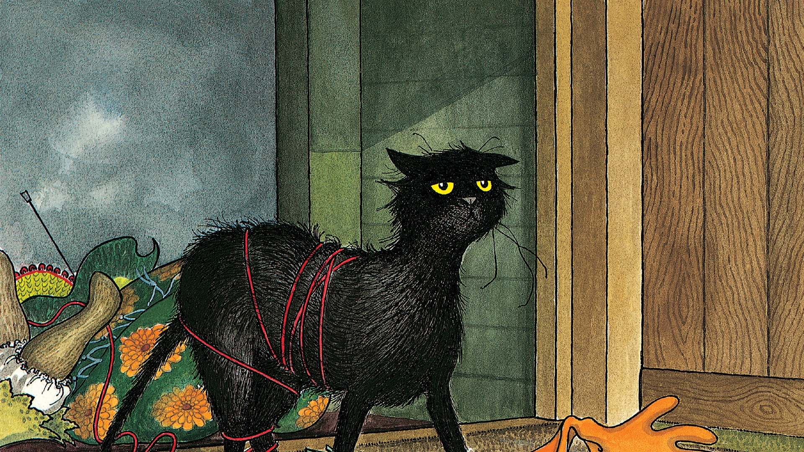
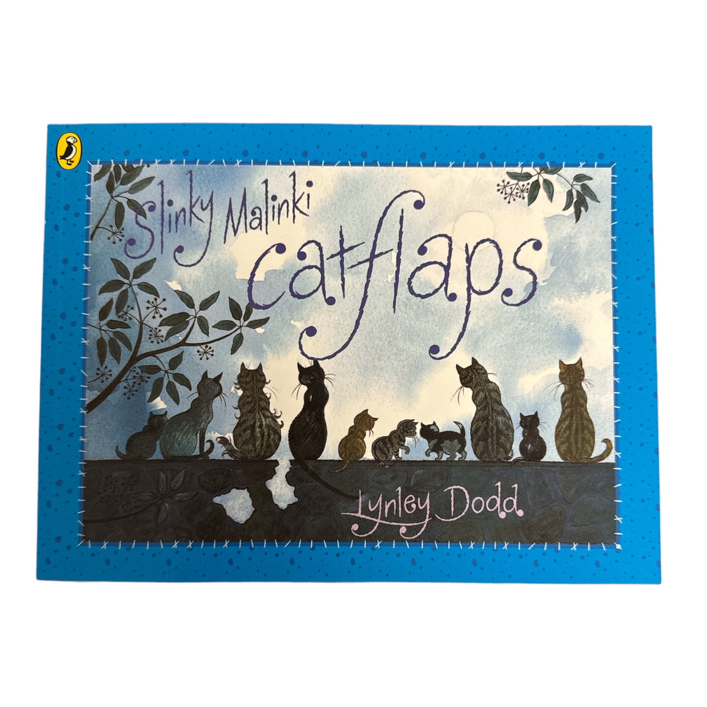

# 今天的文学猫角色：Slinky Malinki

Slinky Malinki 是一只几乎把“黑猫”这个形象写到极致的猫。Lynley Dodd 在文字里把他形容得比黑还黑，眼睛亮黄，尾巴很长，末端带着一个小折弯，叫声则是一种颤悠悠、很有辨识度的哀鸣。Dodd 自己的插画把这些特征变成了极鲜明的轮廓：细长的黑色身体、夸张的黄眼睛、总在运动中的长尾。白天的他看起来只是邻里间一只机灵、友好、爱玩耍的家猫；一到夜里，同一副黑色身影便像被黑暗整个吞进去，只剩两只眼睛和一条偷偷越过围墙的尾巴。

1990 年出版的《Slinky Malinki》属于 Dodd 的“Hairy Maclary and Friends”世界，但它把舞台交给了一只与 Hairy Maclary 性格完全不同的猫。Slinky 白天“cheeky, cheerful, friendly and fun”，夜晚却会变成一个鬼鬼祟祟的窃贼。他沿着围栏、墙头和走廊悄悄巡游，四处寻找可以带走的东西。这里没有什么邪恶计划，也没有真正贵重的赃物；吸引他的可能是香蕉、袜子、手套、牛奶瓶，也可能是针织到一半的毛衣、靠垫、闹钟和一件陶艺罩衫。对 Slinky 来说，重要的似乎从来不是东西值多少钱，而是“能不能把它拖回家”。

这也是故事最好笑的地方。Dodd 没有把 Slinky 写成会策划犯罪的拟人化坏蛋，而是让他的盗窃行为始终带着猫的身体性。他要叼、拖、拉、扛，越拿越多，物品的形状和重量不断妨碍他的行动；整首押韵叙事也跟着这些动作加速。于是读者一边知道“偷东西当然不对”，一边又很难不把他想成那类会半夜把袜子、玩具或不知从哪里找到的小物件叼到床边的猫——只不过 Slinky 把这种习惯扩张成了一项夜间事业。

他的好运终于在一个夜晚耗尽。那一次，Slinky 带回的东西多得离谱，门垫旁堆起一座摇摇欲坠的赃物山。胶水洒了，毛线和半织好的衣服缠住腿，瓶子滚落，闹钟和各种杂物一起制造出巨大的声响。狗开始吠，屋里的人也被惊醒。过去所有神秘失踪的物件突然集中在同一个现场，罪证完整得几乎无需解释。等待 Slinky 的并不是可怕的惩罚，而是一场十分尴尬的善后：东西必须一件件送回原主，他那段神气的夜间窃贼生涯也由此暂时告终。

Slinky Malinki 因而很难被当成真正的反派。他最迷人的地方恰恰在于白天和夜晚之间那种夸张却又很真实的反差。白天，他是熟悉、亲人、好玩的邻家猫；夜里，黑色皮毛让他天然适合潜行，而猫对小物件莫名其妙的兴趣又被 Dodd 放大成了“犯罪动机”。故事的笑点不是一只猫学会了人类的贪婪，而是人类的“所有权”观念撞上了猫的逻辑：我看见了，我喜欢，我叼得动，所以它现在似乎就应该跟我走。

后来 Slinky Malinki 继续拥有自己的系列故事，例如《Slinky Malinki's Catflaps》和《Slinky Malinki, Open the Door》。他仍然是那只会在夜里活动、被好奇心和冲动牵着走的黑猫，只是麻烦不再局限于偷东西。Dodd 的原画后来也随“Lynley Dodd: A Retrospective”等展览巡回展出，和 Hairy Maclary、Scarface Claw 等角色一起成为她最具辨识度的动物形象之一。Dodd 曾谈到，Slinky 的灵感来自自己养过的猫；这大概也解释了为什么即使故事把他的行为夸张到近乎童话，他的许多动作仍然让养猫的人觉得异常熟悉。

如果说很多文学黑猫被赋予神秘、厄运或超自然意味，Slinky Malinki 的黑色却首先是一种喜剧资源：它让他适合在夜里消失，也让那双黄色眼睛和长尾格外醒目。他没有预言灾祸，也没有施展魔法，只是在安静的社区里把夜晚变成自己的寻宝时间。最终真正让人记住他的，也不是“偷窃”这件事本身，而是那种非常猫的自信——仿佛世界上的每一只袜子、每一个瓶子和每团毛线，都有可能在凌晨时分突然成为一只黑猫非带走不可的宝物。

### 视觉参考

图 1：来源页面：https://www.wodonga.vic.gov.au/newsroom/archive/calling-all-hairy-maclary-fans ；原始图片 URL：https://www.wodonga.vic.gov.au/Portals/0/GravityImages/4980/crop/SlinkyMalinki_28x1920x1080.jpg ；作者/机构：Lynley Dodd；Wodonga Council / Penguin Random House New Zealand；说明：1990 年《Slinky Malinki》第 28 页插图，展示 Slinky Malinki 在夜间盗窃惹祸后被物品缠住的场景；来源页面明确标注该图版权归 Lynley Dodd，并经 Penguin Random House New Zealand 授权转载。

图 2：来源页面：https://www.tartanplustweed.com/products/slinky-malinky-cat-flaps ；原始图片 URL：https://www.tartanplustweed.com/cdn/shop/files/Slinky_Malinky_Catflaps_Book_1200x1200.jpg?v=1741360992 ；作者/机构：Lynley Dodd / Puffin（封面）；Tartan Plus Tweed（来源页面）；说明：《Slinky Malinki Catflaps》封面，展示 Slinky Malinki 与夜间猫群，是角色后来系列化后的代表性视觉形象。