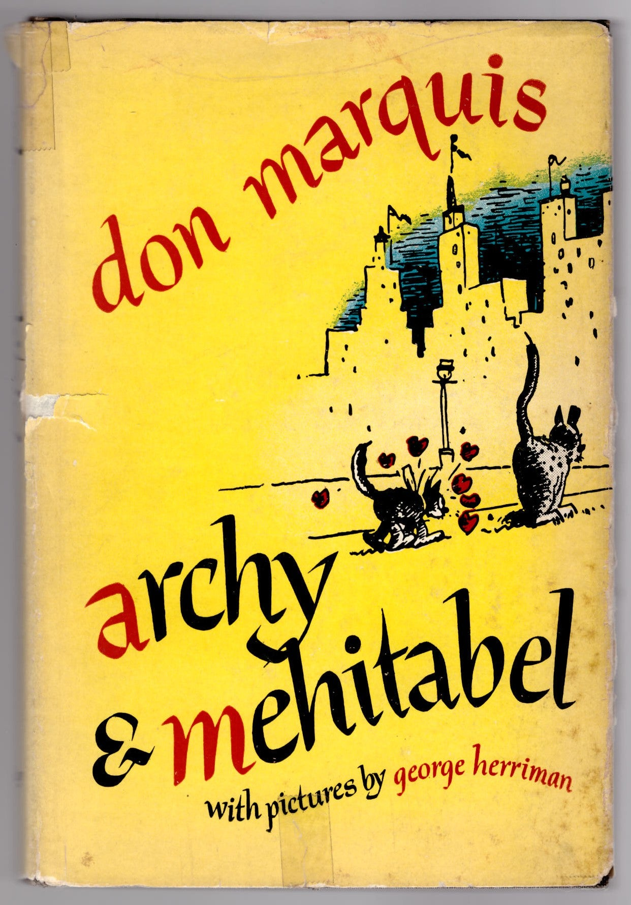
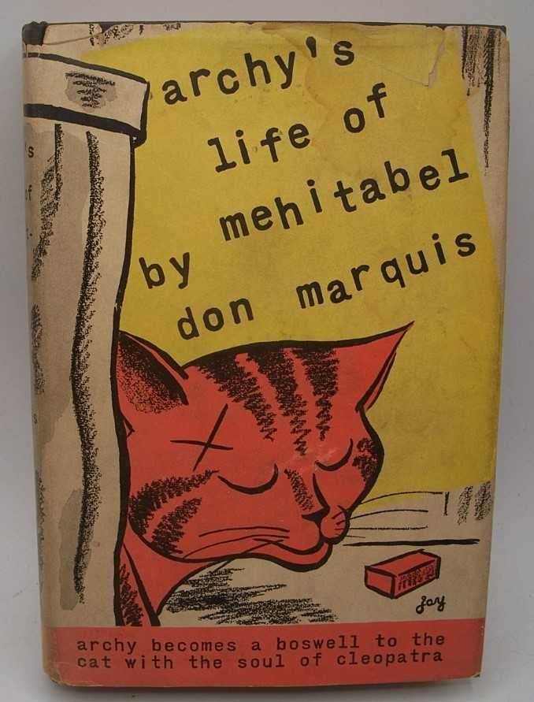

# 今天的文学猫角色：Mehitabel

Don Marquis 并没有替 Mehitabel 规定一种固定毛色。原作里最重要的外貌标签只有一个：她是一只 alley cat，一只属于纽约后巷、屋顶和夜晚街道的流浪母猫。于是她后来可以被画成很多种颜色。George Herriman 为这些故事留下的大量插图，把她画成身形灵活、表情夸张、充满街头气的猫；1933 年《archys life of mehitabel》的初版护封，画家 Jay 又干脆给了她一张醒目的红橙色条纹猫脸。早期版本之间如此明显的差异，反而很符合 Mehitabel：真正定义她的从来不是毛色，而是那股无论生活多狼狈都不肯失去的神气。

Mehitabel 出自美国报人兼诗人 Don Marquis 的“Archy and Mehitabel”系列。1916 年，Marquis 在纽约《Evening Sun》的专栏里虚构出一只名叫 Archy 的蟑螂：它前世是自由诗人，夜深无人时会爬上编辑部的打字机，用整个身体一次撞下一个键，把所见所闻写给“boss”。Mehitabel 很快进入这些夜间记录。她起初甚至还没有名字，只是一只会威胁到 Archy 性命的猫；几个月后，她逐渐成为整个系列最重要的另一位主角。1927 年，这些诗和短篇第一次结集为《archy and mehitabel》，此后 Marquis 又继续写了多年。

Mehitabel 对自己的身份有一套极其宏大的解释：她相信灵魂会轮回，并坚称自己前世曾是埃及艳后 Cleopatra。Archy 问起宫殿生活，她首先回忆的却不是权力、爱情或尼罗河，而是当年那些美味的鱼宴，说着还忍不住舔嘴。Marquis 很喜欢这种落差——Mehitabel 可以用女王般的口气讲自己的“前世”，下一秒又暴露出一只猫最普通的食欲。她的高贵因此并不是庄严端正，而是一种即使睡在垃圾堆旁，也仍然相信自己理应拥有舞台、掌声和好日子的自尊。

她最著名的口头禅是“wotthehell”和法语的“toujours gai”——大意分别接近“管它呢”和“永远快活”。在《The Song of Mehitabel》里，她承认自己的生活经历过无数起落：昨天仿佛还有王冠和天鹅绒长袍，今天已经和街头游民混在一起；夜里唱歌跳舞，会有人从窗户里朝她扔旧鞋，可她仍然坚持“这老姑娘还有舞可跳”。她甚至明确表示，宁可继续在街头游荡，也不要拿自由去换一座城堡。对 Mehitabel 来说，舒适如果意味着被关进笼子，就根本算不上幸福。

这种自由当然并不浪漫得毫无代价。她回忆自己小时候也曾是一只戴着丝带和铃铛的“清白小猫”，后来被一只马耳他公猫吸引，跟着对方跑上街头，从此开始了漫长而混乱的生活。她会谈恋爱，会失恋，会怀孕，也会一再被并不可靠的公猫留下。她把自己称作舞者和艺术家，却发现身体和生活总在打断所谓“艺术事业”。《Mehitabel and Her Kittens》里，她一边咒骂自己为什么又有了一窝小猫，一边又担心它们被汽车撞到；她抱怨公猫可以享受乐趣和自由，而所有后果都落在母猫身上。笑话写得很轻，底下却清楚压着关于女性自由、母职和创作空间的不平。

她和 Archy 的友情也从来不是温情童话式的安全关系。Archy 第一次提到她时就抱怨，这只猫前一晚差点把自己吃掉；后来一只萤火虫被大家捧得得意忘形，等它终于耗尽力气，Mehitabel 又很自然地把它吃了。就连 Archy 难得成功打出一串大写字母时，她突然扑过去的一脚，也把小蟑螂踢进了打字机机械结构里。两者可以彻夜聊天、交换秘密，Archy 也经常替她记录故事，但猫与蟑螂之间最原始的捕食关系始终没有被抹掉。正因为这一点，他们才不像拟人化后彻底忘记物种身份的卡通搭档，而像两个彼此熟悉、彼此嫌弃，又总会重新碰面的后巷邻居。

George Herriman 后来为三本 Archy 书画了九十多幅插图和多张护封，他笔下的 Mehitabel 几乎和 Marquis 的文字一样成为角色的一部分。Herriman 本来就是《Krazy Kat》的创造者，很懂得怎样让一只猫同时保留动物的身体和人的戏剧感：Mehitabel 可以弓着背、甩着长尾、躲在垃圾桶边，也可以摆出歌舞女郎、落魄贵妇和街头老手的神情。不同版本后来又继续重新解释她，因此 Mehitabel 没有唯一“正确”的脸，却有非常稳定的气质——她必须看起来像一只已经跌过很多跤，却依旧准备再去跳一支舞的猫。

这也是 Mehitabel 最耐读的地方。她经常把自己的狼狈说成传奇，把失败说成经验，把明天可能更加糟糕的事实暂时放到一边。Archy 比她清醒、悲观，也更爱分析世界；Mehitabel 却总能用一句“toujours gai”结束争论，然后继续去下一条街、下一场恋爱或下一次麻烦。她并不是因为生活善待她才乐观，而是把快活本身当成一种拒绝被生活打败的姿态。对于一只自称前世是 Cleopatra、今生却睡在纽约后巷的猫来说，这种夸张的自尊和顽强的生命力，也许比任何王冠都更像她真正的贵族身份。

### 视觉参考

图 1：来源页面：https://www.abebooks.com/Archy-Mehitabel-Marquis-Don-Doubleday-Doran/31929588100/bd ；原始图片 URL：https://pictures.abebooks.com/inventory/31929588100.jpg ；作者/机构：Don Marquis；版本页面为 Doubleday, Doran 1930 年版，书中插图署名 George Herriman；AbeBooks（来源页面）；说明：早期《archy and mehitabel》版本的彩色护封/封面照片，画面同时呈现 Archy 与猫角色，能够看到 Mehitabel 在早期出版物中的街头化视觉处理。

图 2：来源页面：https://www.zvab.com/erstausgabe/Archys-Life-Mehitabel-Marquis-Don-Doubleday/31430696399/bd ；原始图片 URL：https://pictures.abebooks.com/inventory/31430696399.jpg ；作者/机构：封面画家署名 Jay；Doubleday, Doran；ZVAB / AbeBooks（来源页面）；说明：1933 年《archys life of mehitabel》初版护封照片，以醒目的红橙色条纹猫脸表现 Mehitabel，并直接以“the cat with the soul of cleopatra”概括角色身份。