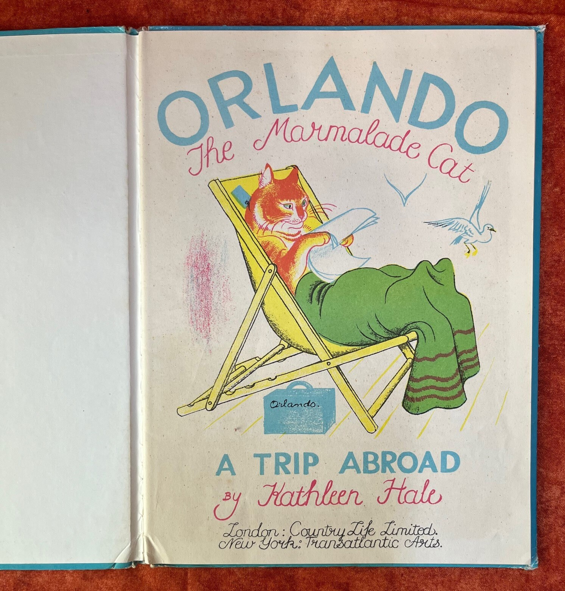
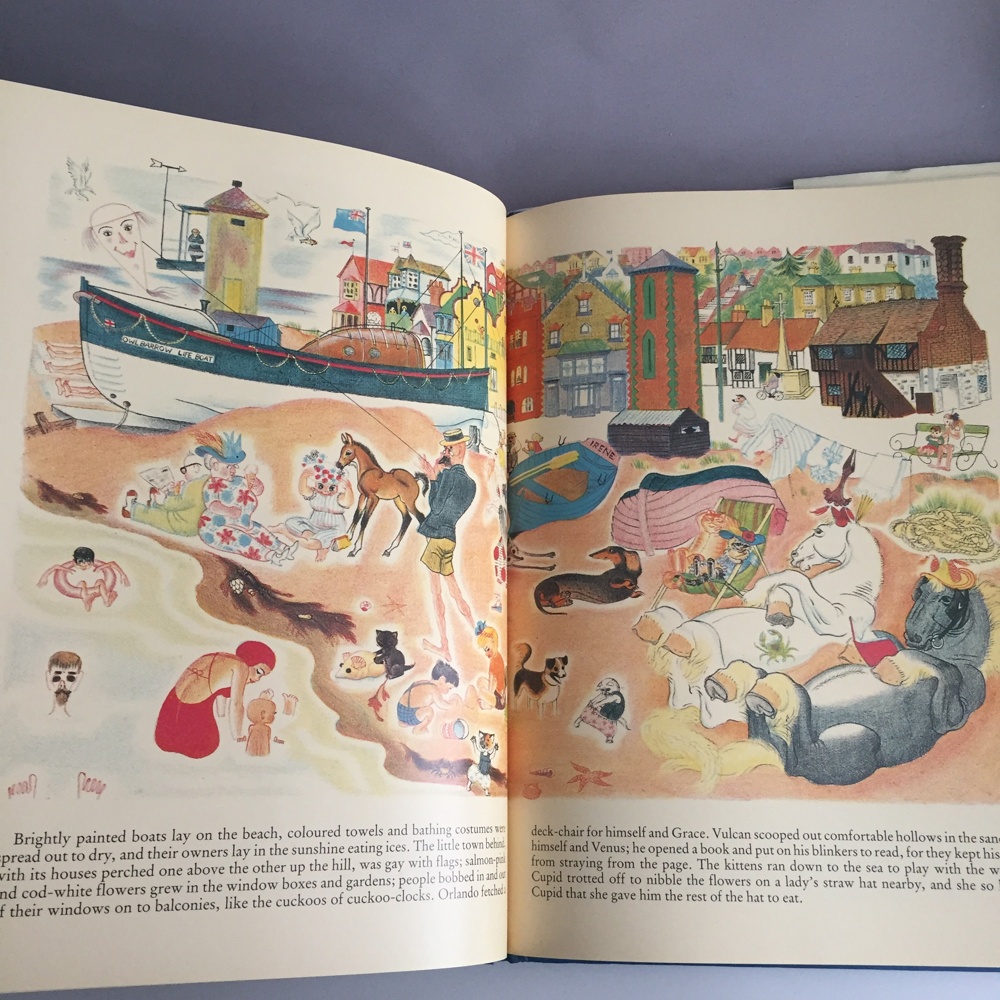

# 今天的文学猫角色：Orlando the Marmalade Cat

Orlando 是一只几乎把自己的名字写在毛色上的猫：他全身是温暖的橘黄色虎斑，Kathleen Hale 把那身皮毛形容成 marmalade 的颜色，眼睛则像两颗绿色醋栗。Hale 的画里，他通常身材敦实，脸颊饱满，尾巴粗而有力；有时像个普通家猫那样趴着晒太阳，有时又会戴帽子、拿手杖、弹吉他，甚至把手表挂在尾巴上。无论动作多么拟人化，他身上始终保留着很强的“猫感”：胡须、耳朵、肉垫和那种有点自得其乐的神情，都让他像一只恰好拥有完整家庭生活的橘猫，而不是披着猫皮的人类角色。

Orlando 出自英国画家兼儿童文学作家 Kathleen Hale 从 1938 年开始创作的系列。第一本《Orlando (the Marmalade Cat): A Camping Holiday》把他和整个家庭一起介绍给读者：妻子 Grace 是一只虎斑母猫，长着像熟杏子一样的小短鼻；三个孩子则各有完全不同的花色——Pansy 是玳瑁猫，Blanche 雪白，Tinkle 乌黑。这样一来，一家五口仅凭轮廓和颜色就能在一大幅画面里被迅速认出来，也给 Hale 那些色彩鲜艳、人物众多的跨页插图提供了天然的视觉节奏。

Orlando 最初并不是为了出版而诞生的。Hale 先把这些故事讲给自己的两个儿子听，后来才将它们整理成书。她把不少真实家庭经验带进故事里，Orlando 温厚、可靠而略带笨拙的性格也吸收了丈夫 Douglas MacLean 的影子。第一本书的露营经历本身就与 Hale 一家的出游有关，所以 Orlando 从一开始就不是典型的“冒险英雄”：他更像一个努力把全家照顾妥当的父亲。露营、买东西、安排孩子、出门旅行这些事情到了他手里，总会因为猫的习性、孩子们的淘气或外界的意外而变成一场有点失控的家庭喜剧。

这种气质在 1939 年的《A Trip Abroad》里尤其明显。Orlando 本来并没有计划展开宏大的异国冒险，却阴差阳错搭上船去了法国。后来他又会买农场、过银婚纪念日、当医生、穿上“隐形睡衣”、收养一只大狗、临时做法官，到海边度假，甚至拥有魔法飞毯并最终登上月球。故事越写越远，尺度从乡间帐篷一路扩张到太空，可 Orlando 本身始终没有被改造成无所不能的英雄。他面对每一件奇事的方式都很居家：先看看妻子和孩子怎么办，再想办法把事情收拾好，最后回到吃饭、睡觉、家庭聚会这些最普通的生活里。

Hale 的图画让这种“家庭日常被推到荒诞边缘”的感觉格外鲜明。她不只是给文字配一张图，而是让文字、人物、建筑、衣物、食物和小道具共同组成整页叙事。Orlando 在画面里有时巨大得像舞台中央的主角，有时又只是海滩、街道或屋子里众多角色中的一个。海边故事尤其能看出这一点：Grace、孩子们、马、狗、游客、船只和小镇挤在同一个跨页里，Orlando 只是其中一员，却又因为那身醒目的橘色虎斑自然成为视觉中心。画面里的笑点经常藏在角落，孩子第一次看故事和多年后重新翻书，往往会注意到完全不同的细节。

这种效果和 Hale 对彩色印刷的投入密不可分。早期 Orlando 图书采用大开本，她后来亲自学习并参与彩色石版印刷制版，让颜色不只是“填进线稿”，而成为构图本身的一部分。战争年代的英国物资紧张、印刷品常显得朴素，Orlando 系列却以大幅、明亮而饱和的色彩给读者留下了很强的视觉记忆。Hale 对文字和图像关系的处理后来也被视为英国现代图画书发展中的重要一步：在她的书里，孩子不是先读完文字再去看插图，而是在一整张页面里同时“读”故事。

Orlando 的家庭也是这个系列真正持久的核心。Grace 并不是永远站在丈夫身后的配角，三个孩子更不会乖乖按照父母的计划行动。尤其是 Tinkle，常常凭一己之力把局面搅乱；Orlando 则必须在父亲的体面和猫爸爸的狼狈之间反复切换。他可以摆出一家之主的姿态，也会被孩子、邻居和意外弄得手忙脚乱。正因为这样，他的“父亲感”并不来自威严，而来自一种持续的可靠：事情再荒唐，他最后大多还在那里，陪着家人把日子过下去。

这个系列一直写到 1972 年的《Orlando and the Water Cats》，前后跨越三十多年。1951 年，Orlando 的故事还被改编成英国 Festival of Britain 的芭蕾；1976 年，Hale 因插画与儿童文学方面的成就获授 OBE。几十年里，Orlando 去过法国、农场、海边、月球，也经历过魔法和各种超现实事件，但他最让人记住的仍然不是某一次奇遇，而是那副像果酱一样温暖的橘色皮毛，以及一种非常具体的幸福想象：有妻子、有三个性格完全不同的孩子，有一屋子的麻烦，也有每次折腾之后仍然可以一起回家的地方。

### 视觉参考

图 1：来源页面：https://www.etsy.com/ie/listing/1808644821/vintage-orlando-the-marmalade-cat-book-a ；原始图片 URL：https://i.etsystatic.com/21984561/r/il/12536b/6390725495/il_fullxfull.6390725495_my0b.jpg ；作者/机构：Kathleen Hale（原作作者与插画家）；Etsy 卖家页面（版本照片）；说明：1958 年第六次印刷《Orlando the Marmalade Cat: A Trip Abroad》的题名页照片，Orlando 躺在黄色折叠椅上读书，能够清楚看到橘色虎斑、绿色眼睛和 Hale 典型的彩色图画风格。

图 2：来源页面：https://www.cha-cha-cha.co.uk/listing/655483181/orlando-the-cat-vintage-picture-book-a ；原始图片 URL：https://i.etsystatic.com/12499385/r/il/c4d294/1717408831/il_fullxfull.1717408831_pntt.jpg ；作者/机构：Kathleen Hale（原作作者与插画家）；Cha Cha Cha / Etsy 图片托管（版本照片）；说明：《Orlando the Marmalade Cat: A Seaside Holiday》版本中的海边跨页，画面同时呈现 Orlando、Grace、孩子与其他动物，适合观察这个系列把家庭群像、环境和大量视觉细节组织在同一页面里的方式。