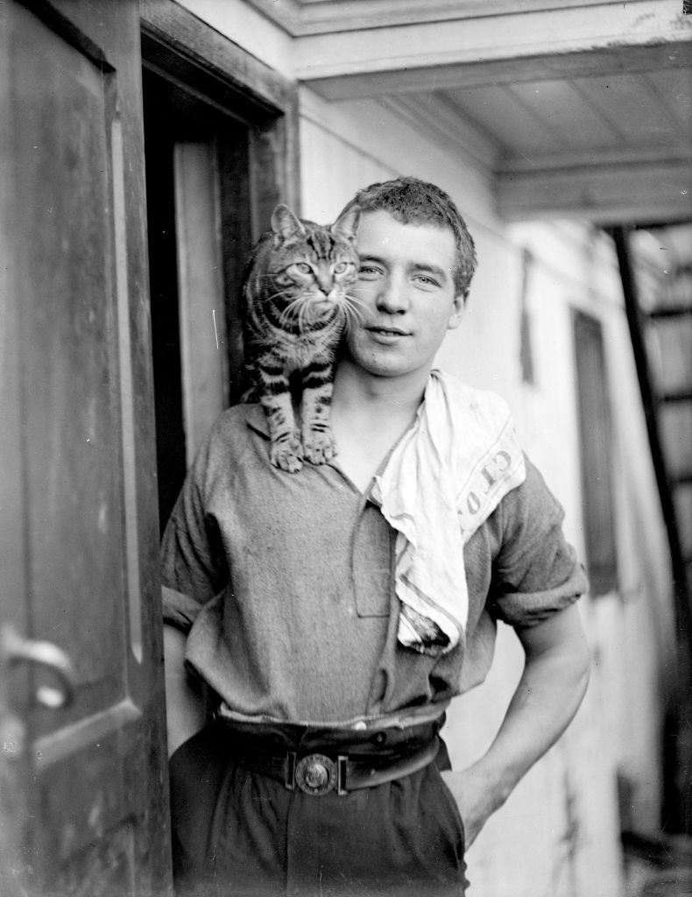
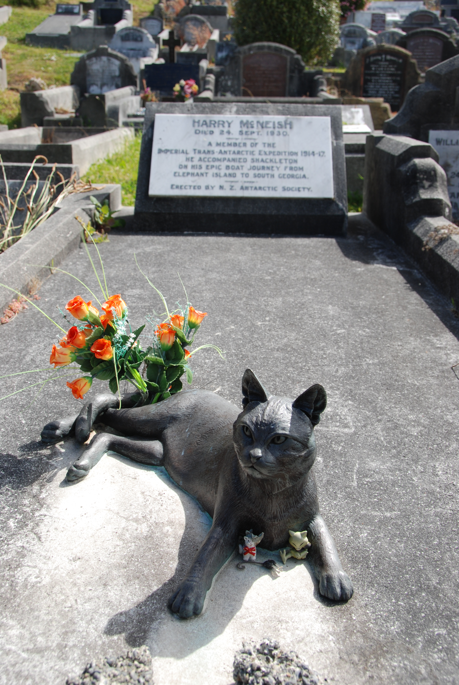

# 今天的文学猫角色：Mrs Chippy

Mrs Chippy 是一只虎斑公猫。现存最著名的照片由“Endurance”号远征摄影师 Frank Hurley 拍摄：他稳稳地趴在年轻船员 Perce Blackborow 的肩头，额头和四肢有清晰的深色条纹，眼睛直视镜头，神情既警觉又十分自在。这个名字听起来像一位“奇皮太太”，其实只是一个船上的玩笑——他的主人是木匠 Harry “Chippy” McNish，猫总跟着 McNish 四处行动，像一个形影不离的伴侣，于是船员们叫他 Mrs Chippy。后来大家发现他其实是公猫，名字却已经牢牢留下来了。

1997 年，Caroline Alexander 在《Mrs. Chippy's Last Expedition: The Remarkable Journal of Shackleton's Polar-Bound Cat》中，把这只真实存在过的船猫重新写成了文学叙事者。书采用日记形式，让 Mrs Chippy 以猫的口吻记录 Ernest Shackleton 的帝国横贯南极远征。它并不是一部脱离史实自由想象的动物冒险，而是紧贴远征成员留下的日记、航海记录和 Frank Hurley 的照片，把那些已经被无数历史书讲述过的事件挪到甲板高度，再从一只猫的眼睛重新看一遍。

对于真正的 Mrs Chippy 来说，“Endurance”号首先就是家，也是工作场所。船猫最实际的职责是捕鼠，防止啮齿动物破坏船上的食物和物资；但他很快又成了船员生活的一部分。远征队长 Frank Worsley 在日记里称赞木匠有一只“非常漂亮的猫”，其他船员则记得他很有性格，能在风浪里沿极窄的护栏行走，甚至会像真正的水手一样往上爬索具。大海对普通家猫本该是一个完全陌生的环境，Mrs Chippy 却像是很快就理解了船的节奏：哪里可以走，哪里可以睡，什么时候去厨房附近看看，什么时候应该离雪橇犬远一点。

这份自信也有过一次代价。1914 年 9 月，Mrs Chippy 从舷窗跳进海里，在黑暗冰冷的水中漂了十分钟左右。值班军官听见猫叫，立即让船掉头；生物学家 Robert Clark 最后用采样网把他捞了上来。对一支尚未真正进入南极困境的远征队来说，这原本只是一次惊险的小插曲；可它也说明了 Mrs Chippy 在船上的地位。为了一个船猫，“Endurance”号会掉头，船员会在夜里搜寻和打捞，因为他已经不只是负责抓老鼠的工具，而是这个封闭共同体里明确的一员。

Alexander 的小说尤其喜欢放大这种日常感。她笔下的 Mrs Chippy 会认真安排起床、伸展、洗脸、去厨房吃东西、向船员巡视问候，也会对雪橇犬保持猫式的优越感。在人类看来，“Endurance”号被海冰困住意味着一场越来越危险的生存危机；在 Mrs Chippy 的日记里，寒冷、天气、配给和船体的变化却常常与午睡、食物、巡逻和观察人类并列出现。正是这种尺度差异，让故事最初带着一种很轻的幽默：人类正在书写探险史，猫则仍然首先关心自己的日常秩序。

可越接近 1915 年秋天，这种幽默就越显得脆弱。“Endurance”号被海冰长期挤压，最终不得不弃船，所有人都转移到浮冰上露营。接下来的生存计划要求尽可能减轻负担，也意味着那些无法在后续迁移中继续发挥作用的动物将被放弃。1915 年 10 月 29 日，Shackleton 在记录中写下，Mrs Chippy 与几只雪橇犬必须被射杀，因为队伍已经无法在新的条件下继续供养它们。那句话在南极探险史里只是许多艰难决定中的一条，对 McNish 来说却成了无法真正翻过去的一页。

《Mrs. Chippy's Last Expedition》把结尾处理得格外残忍，因为猫并不知道发生了什么。书中的 Mrs Chippy 得到了一碗难得的沙丁鱼，在帐篷里舒舒服服地休息，回想一路上的经历，还期待着第二天继续陪大家完成远征。读者当然知道，人类已经作出了最后的决定。于是整本书此前建立起来的“猫看不懂人类焦虑”的轻松视角，在最后突然反过来刺向读者：这一次，猫仍然没有完全理解人类世界，可读者却非常清楚他即将失去什么。

Mrs Chippy 的死亡后来也与 McNish 的命运紧紧缠在一起。McNish 是整次远征最重要的木匠之一，后来加固和改装救生艇，为船员最终逃离南极发挥了关键作用；但他与 Shackleton 的关系在远征中不断恶化，也没有获得许多同伴得到的 Polar Medal。关于这种决裂究竟有多少来自 Mrs Chippy 的死，历史上无法简单归结为单一原因，但 McNish 对这只猫的感情没有疑问。多年后，人们回忆他时，仍会提到他始终无法释怀 Shackleton 杀死了自己的猫。

2004 年，新西兰南极学会在 Wellington 的 Karori Cemetery 为这段关系补上了一个很安静的结尾：他们在 McNish 的墓上放置了一尊真人大小的 Mrs Chippy 青铜像。雕像里的猫没有被塑造成极地英雄，而只是侧卧在墓前，身体放松，耳朵竖着，像又回到主人身边占据了一个熟悉的位置。它也让 Mrs Chippy 的文学形象和真实历史重新合拢在一起——在 Alexander 的书里，他把一场宏大的南极远征缩小成一只猫能够理解的生活；而在墓地里，一只青铜猫又把那段传奇重新缩小成最普通的一件事：一个人曾经非常爱自己的猫，而那只猫也总爱跟着他。

### 视觉参考

图 1：来源页面：https://commons.wikimedia.org/wiki/File:Welsh_sailor_and_stowaway_Perce_Blackborow_and_Mrs_Chippy.jpg ；原始图片 URL：https://upload.wikimedia.org/wikipedia/commons/0/0b/Welsh_sailor_and_stowaway_Perce_Blackborow_and_Mrs_Chippy.jpg ；作者/机构：Frank Hurley；Wikimedia Commons；说明：1914 年远征期间拍摄，Perce Blackborow 肩上趴着 Mrs Chippy，是现存最具代表性的 Mrs Chippy 历史照片之一；Commons 标注该照片为公版作品。

图 2：来源页面：https://commons.wikimedia.org/wiki/File:Harry_McNeish_Gravestone_cat.jpg ；原始图片 URL：https://upload.wikimedia.org/wikipedia/commons/d/d1/Harry_McNeish_Gravestone_cat.jpg ；作者/机构：Nigel Cross；Wikimedia Commons；说明：Wellington 的 Karori Cemetery，Harry McNish 墓上的 Mrs Chippy 青铜纪念像；照片页面注明可在署名条件下自由使用。