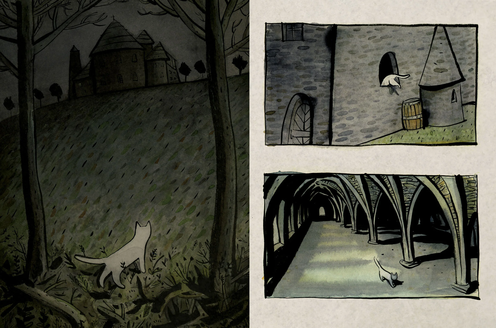
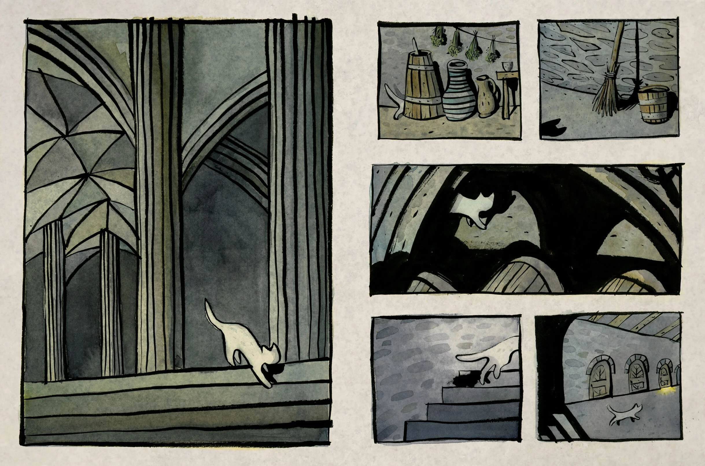

# 今天的文学猫角色：Pangur Bán

Pangur Bán 大概是文学史上最早被认真写进“共同工作”场景里的家猫之一。九世纪那位没有留下姓名的爱尔兰修士没有细细描述他的体型和花纹，却把名字留得非常清楚：Pangur Bán，其中 Bán 是“白”的意思。诗里还能看见一些更具体的瞬间——一双圆而明亮的眼睛盯着墙面，利爪在扑击时伸出，脚步轻柔，注意力长久而集中。2016 年，Sydney Smith 在图画书《The White Cat and the Monk》中把这些零散线索重新视觉化：一只修长的白猫在昏暗石墙、书页与烛光之间穿行，像修道院里另一个安静的住客。这种白猫形象来自现代绘本的再创造，而原诗真正留下来的，首先是 Pangur 专注工作的姿态。

《Pangur Bán》是一首匿名古爱尔兰语短诗，通常被追溯到九世纪。它保存在所谓的 Reichenau Primer 手稿中；这本小小的修士笔记里混杂着拉丁文、希腊文、古高地德语注释和几首古爱尔兰语诗。诗的作者显然是一位离开爱尔兰、生活在欧洲大陆修道院环境中的学者。许多中世纪文本里的动物承担寓言角色，可 Pangur Bán 不需要代表某种抽象德性：他首先就是诗人身边那只真实到可以观察其眼神、爪子和捕鼠习惯的猫。

全诗最迷人的构造非常简单：修士读书，猫捉老鼠。两件事从头到尾平行进行。Pangur 盯着墙角和鼠洞，等待猎物露出破绽；修士则盯着书页和难解的句子，等待意义显露出来。猫突然跃起、抓住老鼠的时刻，对应着读书人终于解开一个难题的瞬间。诗人并没有把自己的学问写得比捕鼠更高贵，反而不断强调两者都需要耐心、技巧、反复练习，以及在成功时那一下很纯粹的满足。

因此，Pangur Bán 在诗里也不是“陪主人读书的可爱宠物”。更准确地说，他像一个同事。修士有自己的技艺，猫也有自己的技艺；两者各忙各的，没有竞争，也不互相打扰。现代英译常常把这种关系处理得非常温柔：同住一室本身就已经是一种奖赏。真正使这种亲密成立的，却不是拥抱或撒娇，而是诗人对猫独立性的尊重——他喜欢 Pangur，并不是因为猫把注意力全部交给了人，而恰恰因为 Pangur 有自己全神贯注去做的事情。

这种平等感也让诗里那些捕猎动作变得格外生动。Pangur 会长时间凝视，会等待，会在机会出现时突然扑上去；他的爪子既是家猫普通的身体工具，也被诗人写得像熟练工匠手里的器具。中世纪文学研究者 Susan Crane 曾特别讨论这个名字，认为 Pangur Bán 可以理解为“白色的漂洗工/缩绒工”，这个带有劳动意味的名字或许同时呼应了猫的浅色皮毛和他认真熟练的“工作状态”。诗里对猫的夸赞于是带着一点幽默：一只捕鼠猫仿佛成了手艺精湛的专业人士，而伏案的修士也借此把自己的学术劳动放到了同样朴素的尺度上。

一千多年以后，人们仍不断重新翻译这首小诗。Robin Flower、W. H. Auden、Seamus Heaney、Paul Muldoon 等人都留下过英文版本，而每个时代似乎都能从这对搭档身上读出新的意味。Heaney 的版本尤其突出他们作为“同行”的感觉：一个寻找猎物，一个寻找被文字遮住的意义。2009 年动画电影《凯尔经的秘密》后来也借用了 Pangur Bán 的名字和白猫形象，但电影里的猫属于新的幻想故事，并不是原诗情节本身的延续。

2016 年 Jo Ellen Bogart 与 Sydney Smith 合作的《The White Cat and the Monk》则更直接地回到那首九世纪诗，把修士与白猫在夜间各自工作的节奏变成图画。Smith 的画面里，人的书桌、猫的脚步、黑暗中的鼠洞和逐渐到来的晨光彼此呼应，让“各自专心，却共享同一空间”这件事变得非常直观。那也正是 Pangur Bán 跨越千年仍显得亲近的原因：他没有说话，没有魔法，也没有完成宏大的冒险，只是安静地把一只猫擅长的事情做好。

关于 Pangur Bán 的诗最后留下的，是一种很少见的陪伴方式。修士不要求猫理解他的书，猫也不需要在意那些艰涩句子；他们甚至不必一直看着彼此。一个伏在书页前，一个守在墙边，各自在自己的世界里专心，偶尔同时获得一次小小的胜利。这样的关系对于今天和猫一起工作、读书或熬夜的人仍然异常熟悉：最好的陪伴有时并不是不断互动，而是知道房间里还有另一个生命，也正在认真做自己的事。

### 视觉参考

图 1：Sydney Smith 为 Jo Ellen Bogart 的图画书《The White Cat and the Monk》（Groundwood Books，2016）绘制的插画，来自插画家官网页面：https://www.sydneydraws.ca/the-white-cat-and-the-monk 。原始图片 URL：https://images.squarespace-cdn.com/content/v1/5a0dec38aeb6250b51582f71/1603374510624-X967UE3SD3OI2XU2UBF0/White%2BCat%2Band%2Bthe%2BMonk%2B1.jpg?format=2500w 。画面以现代绘本方式呈现白猫 Pangur Bán 与修道院空间。

图 2：同为 Sydney Smith 为《The White Cat and the Monk》绘制的插画，来源页面同上：https://www.sydneydraws.ca/the-white-cat-and-the-monk 。原始图片 URL：https://images.squarespace-cdn.com/content/v1/5a0dec38aeb6250b51582f71/1603374512473-QEJD3080GH0ZQH3LW4HO/White%2BCat%2Band%2Bthe%2BMonk%2B2.jpg?format=2500w 。画面延续白猫在修道院环境中活动的视觉叙事，与第一张形成连续而互补的场景。
