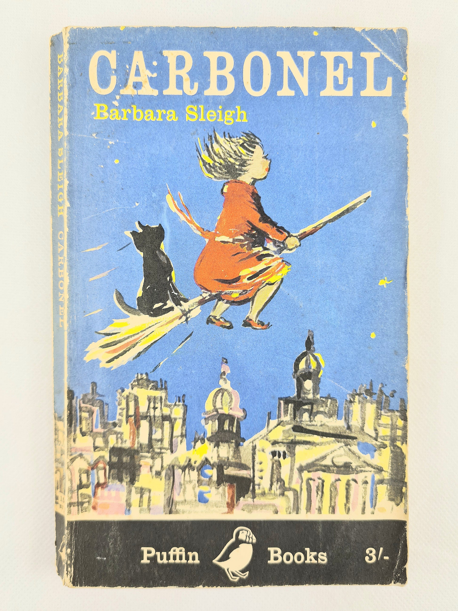
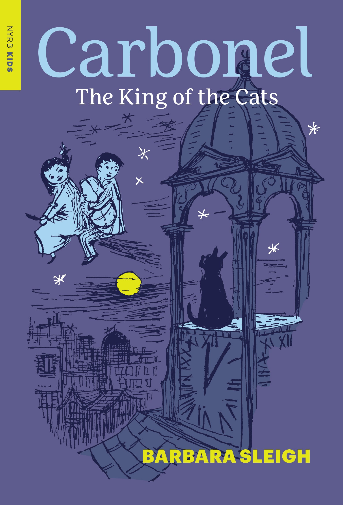

# 今天的文学猫角色：Carbonel

Carbonel 是一只黑猫，而且是一只很知道自己身份的黑猫。Barbara Sleigh 并没有把他写成毛茸茸的可爱伙伴来讨好读者；他最先给人的印象反而是高傲、挑剔，讲话时带着一种理所当然的王室口吻。到了后来的故事里，他还被明确写成有一双大而醒目的黄色眼睛。V. H. Drummond 为早期版本留下的插图则进一步固定了这种形象：乌黑的身体、挺直的坐姿，哪怕只是安静地待在扫帚后面，也像在提醒人类，真正需要被认真对待的并不是“宠物”，而是一位暂时落难的猫王。

1955 年出版的《Carbonel》从一个非常普通的暑假愿望开始。女孩 Rosemary Brown 想帮家里分担一点生活压力，于是准备做清洁工作挣钱，并到市场上寻找一把便宜扫帚。她在那里遇见了古怪的 Mrs Cantrip，最后带走的却不仅是一把破旧扫帚，还有一只黑猫。很快，事情显出完全不同的性质：这位老妇人其实是女巫，扫帚具有魔力，而黑猫也根本不是偶然被搭售的动物。等 Carbonel 开口报上名字时，他带来的不是“会说话的猫”这种单一惊喜，而是一整套属于猫世界的政治问题。

Carbonel 告诉 Rosemary，自己本应统治猫群，却被 Mrs Cantrip 用魔法束缚，长期失去了自由，也无法返回应有的王位。Rosemary 因此和新朋友 John 卷进了一场解除咒语的行动。他们必须找回与女巫有关的帽子、坩埚和旧魔法线索，再想办法把一套已经散落在日常生活里的施法条件重新拼起来。这个故事的有趣之处在于，魔法从不意味着“念一句咒语就解决问题”。破扫帚会一点点掉枝条，旧物有自己的去处，孩子们不能为了完成任务就随便偷走别人的东西；越接近奇迹，越需要观察、推理、谈判和一点实际生活中的机灵。

Carbonel 自己却并不是最合作的任务伙伴。他需要 Rosemary 和 John 的帮助，却并不因此变得谦逊。他很清楚自己属于“Royal Blood”，也很清楚人类常常把猫看得太简单；被当作可以买卖的宠物，本来就是他最不能接受的处境之一。Sleigh 写他的幽默，很大一部分正来自这种身份错位：一个小女孩花了几枚几乎不值钱的旧硬币买下一只猫，结果发现自己名义上的所有物，实际上正用国王看臣民的眼神审视她。

但 Rosemary 与 Carbonel 的关系也因此比“主人与宠物”更有意思。Rosemary 可以借魔法迫使他服从，却逐渐明白这种关系恰恰复制了 Mrs Cantrip 对他的束缚。Carbonel 想要的并不是换一个更善良的主人，而是不再属于任何人。他的傲慢有时让人哭笑不得，可这份傲慢又和自由紧紧连在一起：他愿意寻求人类帮助，可以结盟，也可以表达感激，却始终拒绝把自己的独立性让出去。对于一部写给孩子的奇幻小说来说，这种对“拥有一只猫”到底意味着什么的处理，意外地很像真正的猫。

故事里的猫世界也并非人类社会的简单缩小版。Carbonel 消失之后，猫群缺少合法统治者，街区、屋顶和夜晚因此逐渐显出另一层秩序。人类白天经过的墙头、烟囱和院落，到了猫的时间里会变成边界、道路和集会场。Rosemary 与 John 必须学会从猫的角度重新理解这些熟悉地方，而 Carbonel 每一次停步、观察或突然离开，也都像是在提醒他们：城市从来不只属于人类。

Carbonel 最终能够摆脱咒语、重新取得自己的位置，但 Sleigh 并没有把他的故事停在“国王归位”这一刻。随后出版的《The Kingdom of Carbonel》和《Carbonel and Calidor》继续展开他的猫王国，也让 Rosemary 与 John 再次进入其中。第二部里，Carbonel 已经有了王后 Blandamour，以及 Prince Calidor 和 Princess Pergamond 两个孩子；那个藏在人类世界边缘的猫社会也变得更加完整。于是第一本书里那个看似夸张的自我介绍，后来真的发展成了一整套王室生活，而 Carbonel 也从一只被女巫控制的黑猫，变成了一个拥有家族、领地和责任的长期角色。

也许正因为如此，Carbonel 最值得记住的并不是“猫其实是国王”这个童话反转，而是他从一开始就拒绝让自己的价值由人类来决定。对 Rosemary 来说，他最初只是市场里被附带卖掉的一只黑猫；对 Carbonel 自己来说，他从来没有因此少做一秒钟的王。Sleigh 把这种猫式自尊写得既可笑又令人信服：他会需要帮助，会陷入困境，也会因为自己的脾气把事情弄得更麻烦，却始终保持一种近乎固执的尊严。等咒语真正解除，恢复的并不只是一个王位，而是这只猫终于重新拥有了决定自己属于哪里的权利。

### 视觉参考

图 1：The Vintage Book Company 展示的 1961 年 Puffin Books 版《Carbonel》封面；该版本由 V. H. Drummond 插图。来源页面：https://www.thevintagebookcompany.co.uk/products/carbonel-by-barbara-sleigh-first-edition-puffin-book-1961 。原始图片 URL：https://www.thevintagebookcompany.co.uk/cdn/shop/files/20240521-170821.jpg?v=1716461052&width=1946 。画面中 Rosemary 骑着扫帚飞过城市，黑猫 Carbonel 与她同行，是早期版本极具代表性的视觉形象。

图 2：New York Review Books / NYRB Kids 现代重印版《Carbonel》封面。来源页面：https://www.nyrb.com/products/carbonel-paperback 。原始图片 URL：https://www.nyrb.com/cdn/shop/products/Carbonel_TR.jpg?v=1528838946 。封面以钟楼上的黑猫剪影、夜空与两个孩子构成画面，突出 Carbonel 作为猫王以及故事中夜间猫世界的气质。
