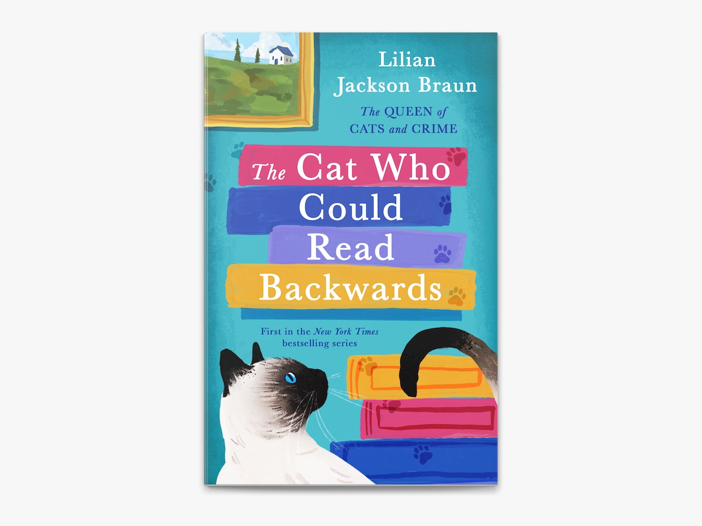
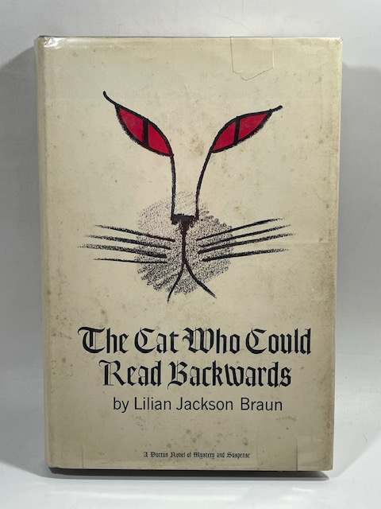

# 今天的文学猫角色：Koko

Koko 是一只很典型、又被 Lilian Jackson Braun 写得异常有个性的暹罗公猫。他的正式名字是 Kao K'o-Kung，取自中国元代画家高克恭（Gao Kegong）的旧式罗马字拼写；到了书里，几乎所有人都只叫他 Koko。后期作品对他的外形写得相当具体：身形长而瘦，肌肉轻巧，底毛呈浅黄褐色，面罩、耳朵和尾巴则是深海豹褐色，眼睛为深蓝色。现代版本的封面大多沿用这种经典重点色暹罗形象；而 1966 年初版护封反而更抽象，只留下红色猫眼、鼻口和长长的胡须，像是先把这只猫的“凝视”放在了故事最前面。

Koko 第一次登场于 1966 年的《The Cat Who Could Read Backwards》。那时，记者 Jim Qwilleran 正试图重新把生活拉回正轨。他原本是跑犯罪新闻的老手，却被安排去报社的艺术版，在一个自己几乎不懂的领域重新开始。负责评论当地艺术圈的 George Mountclemens 性格尖刻、孤僻，而且只有一只手；Koko 正是他的猫。Qwilleran 起初对猫并没有多少兴趣，却因为租住在 Mountclemens 楼下、又不断被托付照看 Koko，逐渐和这只要求很多、口味挑剔的暹罗猫生活到了一起。

第一本书很快从艺术圈讽刺滑向谋杀。画廊老板遇害，作品被毁，一位年轻艺术家又在表演现场坠亡，随后连 Mountclemens 也死去。真正把 Qwilleran 一次次带到关键位置的，却往往不是警察的线索，而是 Koko 看似毫无逻辑的坚持。有一次，他执意回到主人旧屋寻找自己的蓝色坐垫和玩具鼠 Minty Mouse，结果让 Qwilleran 无意间发现了一批藏起来的画。对猫来说，也许只是找回熟悉的东西；对人来说，却突然打开了案件中此前看不见的一层。

书名所说的“会倒着读”，也来自这种猫与人之间很奇妙的错位。故事后段，Koko 在一间隐蔽画室里对着画家 Scrano 的签名，从右往左一路嗅过去。Qwilleran 顺着这条反方向的轨迹，终于看出名字倒过来隐藏着另一重身份；就在真相逼近时，真正的凶手闯进来持刀袭击。Koko 直接扑向对方，打断攻击，让 Qwilleran 得以反击。到这里，这只猫不只是“给出线索”，而是实实在在救了人的命。

不过 Braun 最聪明的地方，是从不把 Koko 写成一位披着猫皮的人类侦探。他不会坐下来分析证据，也不会用语言宣布答案。绝大多数时候，他只是盯着某个地方、把东西从架子上拨下来、突然发出刺耳的叫声，或者坚持去做一件 Qwilleran 起初觉得莫名其妙的事。真正完成推理的仍是 Qwilleran。甚至在第一本结尾，他还会认真怀疑：Koko 之前那些“指引”究竟真的是洞察，还是猫为了找玩具、找舒服位置而碰巧把人带到了正确地方？Koko 对这个问题没有任何解释，只顾着用后腿挠耳朵。

这种若即若离的超常感后来成了整个系列的核心。Koko 仿佛总能比人更早察觉某种不对劲，可每一次又都能留下“也许只是猫”的余地。到了后来的故事里，他会对某些书名产生古怪兴趣，会把特定书从书架上弄下来，会因为某个人或某件事发出不寻常的声音，也会对气味、房间和物件表现出近乎执拗的注意。Qwilleran 慢慢学会把这些动作当成一种旁路信息：不是猫把答案告诉了他，而是猫迫使他重新看一次自己已经忽略的东西。

从第二本《The Cat Who Ate Danish Modern》开始，另一只暹罗母猫 Yum Yum 加入他们的生活。她更小、更亲人，也更容易直接激起人的保护欲；Koko 则始终显得高傲、敏感而难以取悦。两只猫与 Qwilleran 最终形成了这个系列最稳定的家庭结构。随着 Qwilleran 继承巨额遗产，他们又从最初那座匿名大城市搬到偏远的 Moose County，在 Pickax 定居。环境从都市艺术圈变成小镇报纸、古董店、图书馆、农场和邻里闲谈，Koko 却继续用同一种方式参与每一桩怪事。

Braun 在 1966 至 1968 年连续写了三本后，一度停笔近二十年，直到 1986 年才让这个世界重新运转起来；此后“Cat Who...”一路发展到 29 部小说。Koko 也从第一本里那只属于别人的猫，变成贯穿整个系列的真正中心之一。最后一部甚至直接叫《The Cat Who Had 60 Whiskers》——故事把他拥有六十根胡须这一异常特征再次推到台前，像是在多年之后仍然故意保留一个玩笑般的可能性：也许他确实比普通猫多接收到一点世界的信息。

可如果只把 Koko 记成“会破案的猫”，反而会错过他最有趣的地方。他挑食、固执、有自己的领地感，不喜欢的事绝不配合；关键时刻可以像侦探一样精准，下一秒又只是一只把身体拧成奇怪角度、舒服地挠耳朵的暹罗猫。Braun 从来没有要求读者决定他到底有没有某种超能力。Koko 的魅力正来自这个悬而未决的缝隙：当人类以为自己已经把事情想明白时，一只猫看了看别处，伸出爪子碰了某样东西，于是整个故事又多出了一条路。

### 视觉参考

图 1：Apple Books 当前电子版《The Cat Who Could Read Backwards》封面。来源页面：https://books.apple.com/us/book/the-cat-who-could-read-backwards/id361932485 。原始图片 URL：https://is1-ssl.mzstatic.com/image/thumb/Publication211/v4/b8/ea/4c/b8ea4c82-e443-46e9-2ec7-31ff6ef1163f/9781101215166.d.jpg/1200x900wz.jpg 。封面以重点色暹罗猫配合书本与明亮色块构图，直接呈现后世最常见的 Koko 视觉形象；本地化文件实际为 1200×900 像素 JPEG。

图 2：AbeBooks 上 BookEnds Bookstore & Curiosities 展示的 1966 年《The Cat Who Could Read Backwards》早期精装本护封照片。来源页面：https://www.abebooks.com/first-edition/Cat-Who-Read-Backwards-Braun-Lilian/32284285168/bd 。原始图片 URL：https://pictures.abebooks.com/inventory/32284285168.jpg 。护封以红色猫眼、鼻口和胡须构成极简猫脸，是作品早期出版史中很有代表性的视觉材料；本地化文件实际为 480×640 像素 JPEG，虽分辨率低于现代封面，但画面清晰可读，且具有不可替代的版本史价值。
