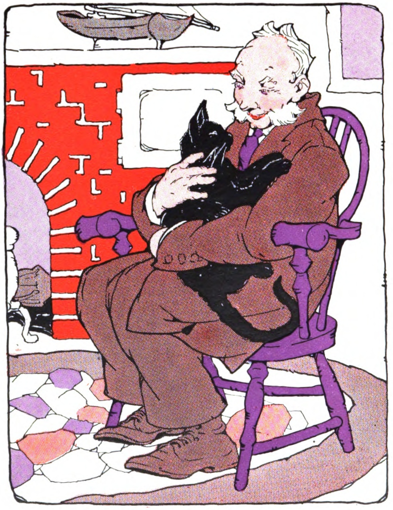
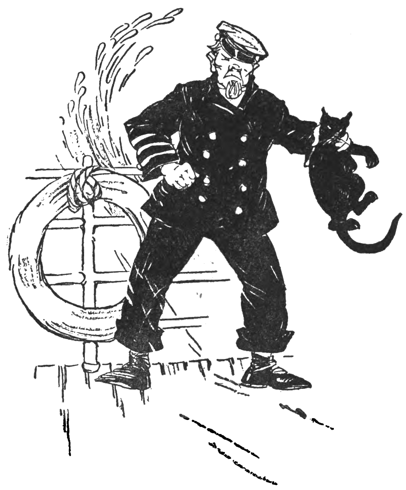

# 今天的文学猫角色：The Captain's Cat

The Captain's Cat 没有一个比“船长的猫”更正式的名字，但他绝不是一个模糊的无名角色。Elizabeth Coatsworth 在 1927 年的《The Cat and the Captain》里反复强调他乌黑的皮毛、大大的黑尾巴和一双在暗处格外醒目的眼睛；尾巴末端还有一点小小的卷曲。Gertrude Alice Kay 为初版所画的插图把这些特征变得更具体：他身形结实，耳朵尖直，黑色身体常常像一块剪影贴在船舱、窗边或船长身旁。最重要的却不是某一种精确的眼色，而是那副随时在观察、盘算、又颇为自得的神情——这是一个很早就把“猫有自己的主意”写得十分清楚的角色。

这本书也是 Coatsworth 最早的儿童读物之一。故事里的船长因为风湿离开了长期航海的生活，住回岸上的房子，却仍保留着水手的习惯：把家里的楼梯、门口和日常琐事都说得像一艘船上的事务。黑猫则是他真正从海上带回来的老伙伴。船长读报时会对他说话，仿佛猫能听懂一切；猫平时很少公开撒娇，可只要房间里没有别人，他就会跳上船长的膝盖，用头去蹭他的下巴，最后蜷进臂弯里睡觉。两者之间的亲密不是“主人疼爱宠物”那么简单，更像两名一起经历过航程的旧船友已经习惯了彼此的存在。

这只猫也绝不是乖巧型主角。他和负责家务的 Susannah 长期互相看不顺眼，甚至会故意把抓到的老鼠丢在她脚边，因为他知道这最能惹她生气；他还会为了扑墙上钟里的木头布谷鸟，把整座钟从墙上撞下来，随后躲到沙发底下，让船长趴在地上也抓不到他。后来厨房里的一碗糖霜又勾起他的兴趣，他把爪子伸进去偷尝，受惊时却把整碗糖霜扣到了自己身上。Coatsworth 并没有为了让读者喜欢他，就把这些麻烦抹掉。船长常替他辩解，说他“骨子里是只好猫”，可故事恰恰要到最后才让这句话真正得到证明。

这份证明其实早在一次海上往事里埋下了伏笔。过去，船长还驾着双桅帆船 Lively Ann 去哈瓦那时，船在返航途中遇上持续数日的猛烈风暴。迷信的大副认定黑猫会给海上带来厄运，突然抓住他的后颈，准备把他扔进巨浪。平日胆大的猫这一次彻底吓软了，只能拼命叫。就在大副走到船舷边时，船长赶来，一拳把他打倒，救下了猫。大副从此对船长和猫都怀恨在心，也最终离开了这艘船。这一幕是全书最惊险的画面之一，也解释了为什么船长后来会如此坚定地站在猫这一边：他们之间的信任，并不是在炉火旁慢慢养出来的，而是曾经在真正的危险里经受过考验。

离开海上之后，猫仍然保留着一副船员派头。去码头时，他会昂着尾巴走在船长前面；遇见狗，会立刻弓背、炸毛、迎上去；登上 Lively Ann 后，他又会安静下来，去船舱和货舱里巡视有没有老鼠。书里有一处说，他在黑暗里行动时，眼睛像两盏灯。与此同时，他又保留着许多很普通的猫式好奇：会蹲着看海鸥和水里的鱼，会踩到船长刚刷好的白油漆，再一本正经地把爪子舔干净。Coatsworth 很少让他像人一样长篇思考，更多时候只写动作、气味、耳朵、尾巴和突然的冲动，因此即使故事带着明显的童话气息，这只猫仍然有很强的动物质感。

在一次茶会上，这种“他终究是一只猫”的边界尤其清楚。猫本来对年幼的 Ted-Ted 十分警惕，喝过一碟奶油后却难得在人前跳上船长膝盖，舒服得开始呼噜。孩子听见声音，竟把呼噜当成小机器的轰鸣，又看到他尾巴末端那一点卷曲，便伸手把尾巴当作摇柄去拽。猫立刻回身抓了他一下。这个插曲既不是为了把猫写成坏脾气，也没有要求他无限容忍孩子；它只是很准确地保留了一条动物的界线：他可以接受亲近，但不会因为身处人类家庭，就失去用爪子表达“不可以”的权利。

真正的高潮发生在一个深夜。猫此前已经多次察觉房子附近有陌生的气味和动静，人类却没有完全理解他的警觉。那晚，他突然跑进船长卧室，把已经快睡着的人叫醒，又一次次领着他穿过走廊，最后停在备用房间的衣橱前。门被打开后，藏在里面的正是当年那个大副。他带着旧怨潜入屋中，打算等船长睡熟后出来抢劫，甚至可能做得更糟。猫发现了他，也确确实实救了船长。多年前在风暴里，是船长从大副手中把猫抢回来；多年后在安静的岸上，又轮到猫把船长从同一个人手里救下来。两次救援首尾相接，让一个原本充满家庭闹剧的小故事忽然有了很完整的情感回环。

事情过去以后，连一直嫌弃他的 Susannah 也不得不承认船长说得对。她郑重向猫道歉，又给了他一大条白嫩的鸡肉；猫则蹭了蹭她的脚踝，像是接受了这次和解。可他并没有因此变成另一只猫。那个会挑衅邻猫、偷吃糖霜、扑坏布谷钟、把老鼠当作恶作剧道具的家伙仍然在那里。也正因为如此，《The Cat and the Captain》最后给予他的肯定才显得可信：所谓“一只好猫”，并不是一只永远服从、永远不给人添麻烦的猫，而是一只拥有自己的脾气、判断和边界，却会在真正重要的时候站在自己伙伴身边的猫。对船长来说，他从来不只是家里的动物，而是退居岸上以后仍陪着自己的最后一位老船友。

### 视觉参考

图 1：来源页面：<https://commons.wikimedia.org/wiki/File:The_Cat_and_the_Captain_(1927)_frontispiece.png>  
原始图片 URL：<https://upload.wikimedia.org/wikipedia/commons/7/71/The_Cat_and_the_Captain_%281927%29_frontispiece.png>  
作者/机构：Gertrude Alice Kay；Wikimedia Commons。  
说明：1927 年 Macmillan 初版的卷首插图，画面标题为 “The Cat and the Captain”，是作品最早的权威视觉形象之一。

图 2：来源页面：<https://commons.wikimedia.org/wiki/File:The_Cat_and_the_Captain_(1927)_7.png>  
原始图片 URL：<https://upload.wikimedia.org/wikipedia/commons/d/d8/The_Cat_and_the_Captain_%281927%29_7.png>  
作者/机构：Gertrude Alice Kay；Wikimedia Commons。  
说明：1927 年初版插图，对应暴风雨中大副抓住黑猫后颈、企图将他扔下船的关键场景。