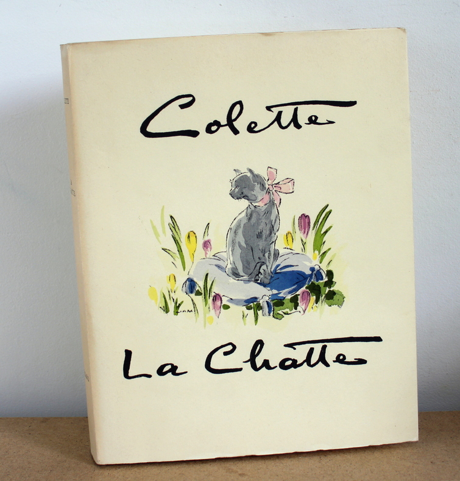
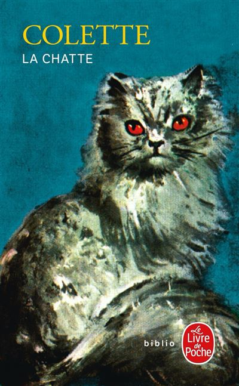

# 今天的文学猫角色：Saha

婚礼还有七天，Alain 坐在童年房间里摊牌占卜，Saha 从花园钻进来，轻巧地踩上他的胸口。她是一只纯种沙特勒猫，身形小而匀称，脸颊饱满，眼睛深陷而呈金黄色；灰蓝色的短毛在阳光下会泛出鸽子颈羽般的紫调。Alain 喜欢用只有两者熟悉的腔调叫她的名字，Saha 一听便兴奋起来，踩乱纸牌，用单独伸出的爪尖揉他的胸口，最后把湿凉的鼻尖贴到他脸上。科莱特（Colette）没有让这只猫开口说话，可从小说最初几页起，她已经拥有非常明确的意志：亲近谁、停在哪里、什么时候伸爪，都由她自己决定。

《La Chatte》先于 1933 年 4 月至 6 月在法国周刊《Marianne》连载，同年由 Grasset 出版单行本。故事表面上只有三名核心成员：即将结婚的 Alain、他的未婚妻 Camille，以及 Saha。可是三者并不处在同一种关系里。Camille 正走向成年生活，她期待新婚、现代公寓和共同的未来；Alain 却留恋母亲的旧宅、花园、童年家具，以及早已生活在那里的 Saha。当 Camille 试图把猫归入“宠物”这一普通位置时，Alain 给出的回答极短：“一只猫不过是一只猫。但 Saha 是 Saha。”这句话把他的偏爱说得毫无遮掩，也把婚姻中最难处理的裂缝暴露出来。

婚后，夫妻暂住在朋友位于高层的狭小公寓，Saha 起初仍留在旧宅。她因为 Alain 长久不归而消瘦，甚至不肯好好进食，Alain 最终把她接到新住处。对于习惯花园、树木和开阔空间的猫，这里只有约二十五平方米的房间、浴室小凳、家具底下和柜子里的阴影。她会藏起来，也会在夜里探索；最令 Camille 不安的，是她喜欢稳稳坐在九层楼高的女儿墙上，从高处注视下面的鸟。Saha 并没有主动争夺什么，她只是按照自己的习惯生活，可她每一次靠近 Alain、每一次从容占据空间，都让 Camille 更清楚地感到自己无法进入丈夫与猫之间那段早于婚姻的亲密关系。

嫉妒最后集中在阳台上的一场无声追逐里。Camille 趁 Alain 不在，悄悄逼近站在外侧的 Saha。猫察觉到危险，沿着狭窄边缘移动，极度恐惧让她的脚垫渗出汗，在墙面留下像小花一样的湿印；她没有持续尖叫，只专心寻找能够退开的地方。Camille 最终伸手把她推了下去。Saha 从九层坠落，却因下方遮篷缓冲，最后落到草地上，竟然活了下来。这里没有奇迹式的拟人英雄行为，科莱特写的是身体：紧贴墙面的脚掌、断裂的爪、惊恐中的沉默，以及一只猫在坠落后仍然顽强维持着的生命。

Alain 把受伤的 Saha 带回家后，她见到 Camille 立刻显出强烈的恐惧和敌意。此前无法说出的事情，由她的反应和破损的爪子代替语言讲明。Alain 很快逼问出真相，也明确表示自己不会放弃 Saha；这场短暂的婚姻由此走到尽头。他带着猫回到母亲的旧宅。小说里的选择并不因此显得轻松：Saha 固然是 Alain 爱护的生命，同时也和花园、旧房、童年一道，构成他迟迟不愿离开的过去。Camille 对猫施加的暴力不可辩护，而 Alain 对 Saha 的执着也让人看到，他与成年生活之间早已有一道并非婚后才出现的隔膜。

回到旧宅后，Saha 很快重新嵌进熟悉的气味和夜色。结尾处，天将亮未亮，Alain 坐在门廊上，伸手碰到她的毛、胡须和湿凉的鼻子；Saha 绕着他蹭过，身上带着薄荷、天竺葵和黄杨的气味。他忽然想到，一只猫的寿命也许只有十来年，于是说，在 Saha 之后，他或许还会属于女人，却不会再属于另一只猫。花园里的鸟声渐渐增多，晨光开始回来，Saha 仍在他手边。科莱特把这段关系停在这里，没有替人和猫安排更整齐的答案。

正文参考：Colette，《La Chatte》，1959 年 Ferenczi / LGF 重印本，Wikisource 全文（<https://fr.wikisource.org/wiki/Livre:Colette_-_La_Chatte,_1959.djvu>），重点参照第 I、IV—VIII 章；Bibliothèque nationale de France，“La chatte”作品题名与 1933 年版本记录（<https://catalogue.bnf.fr/ark:/12148/cb119433398>）；Le Livre de Poche，1971 年版《La Chatte》页面（<https://www.livredepoche.com/livre/la-chatte-9782253011712/>）。

### 视觉参考

1. 1945 年 Fayard 插图版，Jean A. Mercier 绘：灰猫 Saha
   - 来源页面：<https://www.livre-rare-book.com/book/28999787/095>
   - 原始图片：<https://static.livre-rare-book.com/pictures/MIU/095_1.jpg>
   - 作者/机构：Jean A. Mercier / Librairie Arthème Fayard
   - 说明：1945 年插图版封面以灰蓝色猫形象呈现 Saha，与原作对她沙特勒猫毛色的描写相呼应。

2. 1971 年 Le Livre de Poche 版，Leonor Fini 绘：Saha
   - 来源页面：<https://www.fnac.com/a139146/Sidonie-Gabrielle-Colette-La-Chatte>
   - 原始图片：<https://static.fnac-static.com/multimedia/PE/Images/FR/NR/8a/1f/02/139146/1507-1/tsp20250102083314/La-Chatte.jpg>
   - 作者/机构：Leonor Fini / Le Livre de Poche
   - 说明：Leonor Fini 为 1971 年 Le Livre de Poche 版绘制的封面，后来仍被出版社保留为该版的代表视觉。