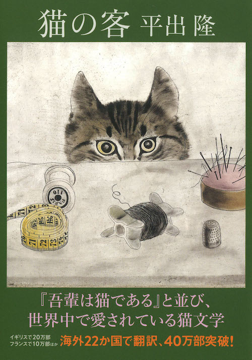
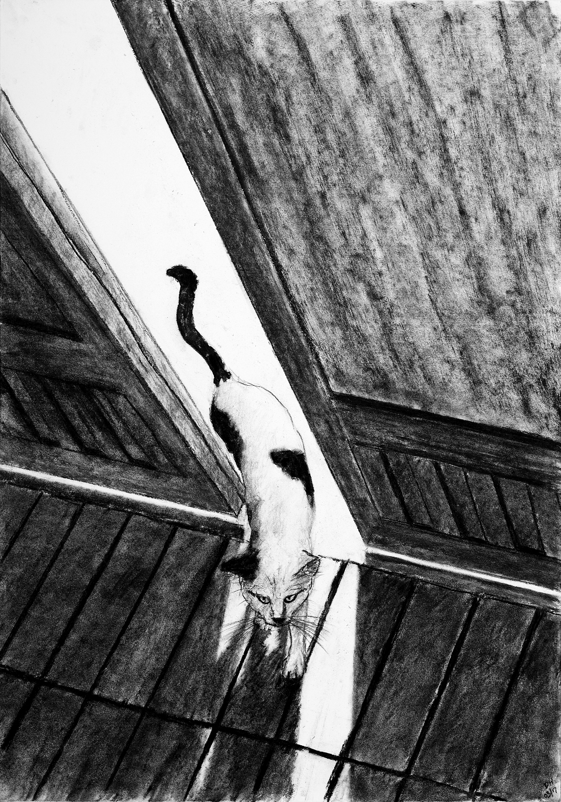

# 今天的文学猫角色：Chibi（小小）

乒乓球飞出去时，小小会先压低身体，把视线牢牢钉在那颗白球上，接着突然跃起，在半空中用两只前爪拨弄白球，再从人的腿间飞快穿过。平出隆写她时，常把注意力落在这种瞬间：她很小，身体纤细，耳朵尖而灵活；白色皮毛上散着墨黑的斑块，黑色里又夹着一点浅褐。她极少出声，脖子上的铃铛常常比叫声更早宣布她来了。日文名字“チビ”（Chibi）本就带有“小家伙”的意思，台湾版《稻妻小路的猫》（猫の客）把她译作“小小”。

《稻妻小路的猫》写于一段具体的生活经验之上。1988年秋天到初冬，叙述者与妻子租住在一座带庭园的大宅附属屋里，隔壁人家的幼猫开始从铁丝网的缺口钻进他们生活。小小先经过庭园和缘廊，只在附近停留；后来天气变冷，夫妻俩把窗户留出一道缝，她才一点点走进屋内。平出隆后来谈到，这只猫确实存在过，她年幼、敏感，并未被驯服，却会在两户人家之间自由往返。小说保存了这种若近若远的距离，没有把她改写成随叫随到的宠物。

她也有很清楚的边界。小小有时会安静地蹭过人的腿，却不喜欢被抱住；强行伸手，她甚至会咬人。虫子、爬行动物，以及人难以觉察的风和光的变化，都可能转移她的注意。平出隆在访谈里回忆，自己常常不知道她究竟看见了什么——人的视线只能跟着猫的视线走向庭园，却无法完全进入那个感官世界。于是她每次出现，都像重新改变一次房子的尺度：窗、围墙、树影、地面的小径，以及人平常不会留意的角落，都因为一只猫正在经过而获得了方向。

夫妻俩渐渐开始等她。他们给她食物，陪她玩球，甚至在心里产生一种错觉，好像小小已经属于这个家。但她依然是邻家的猫。书名里的“客”因此十分准确：她来得如此自然，以至于屋里的人开始按她的习惯安排生活；可她始终保留离开的自由。英文译本把铃铛带来的联想译成了昵称“Tinkerbell”，台湾译本相应使用“铃铃”，都捕捉到她尚未现身、声音已经从庭园里传来的那一刻。她想玩球时，会走进屋来凝视人，再转身往外走，如此重复，直到有人放下手里的事情跟出去。

别离却突然到来。这部获得木山捷平文学奖的作品，把人与猫的相处放在不断变化的居所与生活之中：人会面临搬迁，日常里看似安稳的陪伴也无法永远留住。平出隆本来就是诗人，他在访谈中将这本书放在私小说与诗歌实验的交会处，强调记下发生过的事情，而不为它们另造情节。小小留下的许多画面因而十分朴素。玩够以后，她会走进屋里，在沙发上蜷成逗号般的一团；叙述者望着她，觉得连这座房子都像刚刚梦见了这样的幸福。

正文参考：平出隆《稻妻小路的猫》，张智渊译，爱米粒，2016，第一至三节公开试读（[三民书店](https://www.sanmin.com.tw/product/index/005973262)）；《The Guest Cat》英文节选，Eric Selland译，Asymptote，2014年1月6日（[原文](https://www.asymptotejournal.com/blog/2014/01/06/the-guest-cat-by-takashi-hiraide/)）；Will Heyward访谈“Takashi Hiraide”，BOMB，2014年5月28日（[访谈](https://bombmagazine.org/articles/2014/05/28/takashi-hiraide/)）；河出书房新社《猫の客》河出文库版书目（[版本资料](https://www.kawade.co.jp/np/isbn/9784309409641/)）；Louise Jones，《The Guest Cat》书评，The Bookbag，2014年9月（[书评](https://www.thebookbag.co.uk/reviews/The_Guest_Cat_by_Takashi_Hiraide)）。

### 视觉参考

1. 2009年河出文库版《猫の客》封面：针线旁探头的猫
   - 来源页面：<https://www.kawade.co.jp/np/isbn/9784309409641/>
   - 原始图片：<https://www.kawade.co.jp/img/cover_l/9784309409641.jpg>
   - 作者/机构：河出书房新社
   - 说明：出版社提供的河出文库版封面书影，呈现该书的出版视觉形象。

2. David Howe《猫の客》插画：跨过门槛的猫
   - 来源页面：<https://creativepool.com/davidhoweillustration/projects/the-guest-cat>
   - 原始图片：<https://s3.eu-west-2.amazonaws.com/img.creativepool.com/files/candidate/portfolio/full/1361204.jpg>
   - 作者/机构：David Howe
   - 说明：画家基于小说创作并在“The Guest Cat”个人作品集中展示的插画，描绘佩戴项圈的黑白花猫从门缝进入室内。
