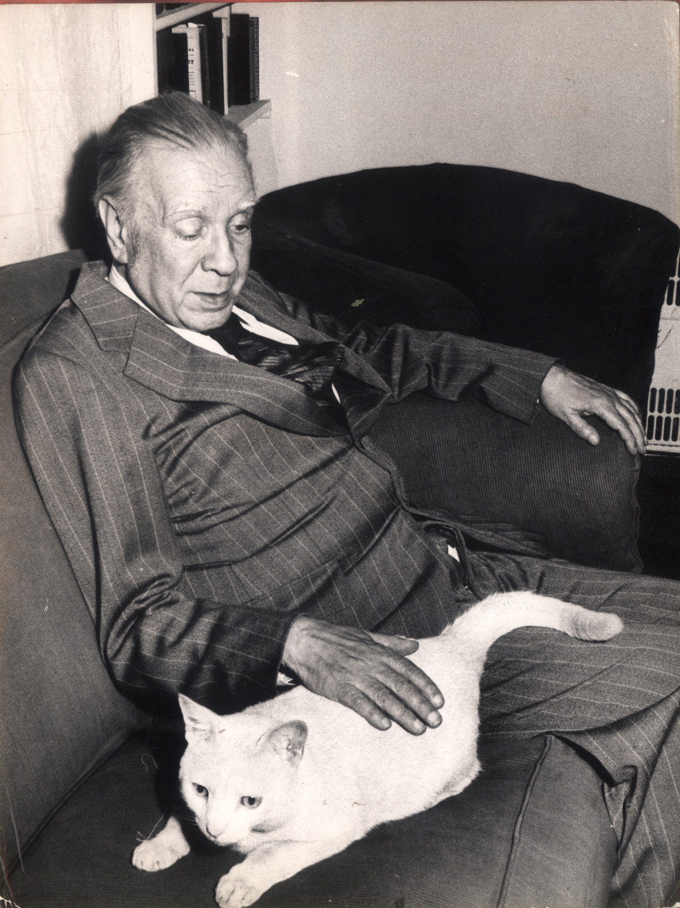
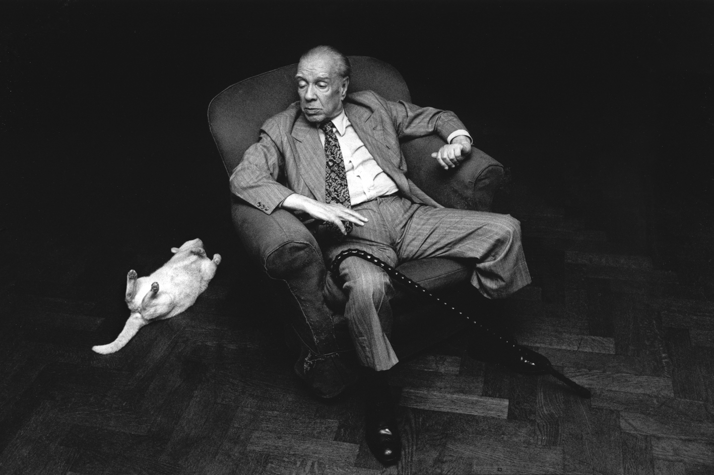

# 今天的文学猫角色：Beppo

镜子前，Beppo 看见一只陌生的白猫。那只猫和他一样有白色皮毛、金色眼睛，动作也分毫不差，可他并不知道自己面对的只是倒影。豪尔赫·路易斯·博尔赫斯（Jorge Luis Borges）把这个极普通的猫式疑惑写进诗歌《Beppo》：一只家猫凝视镜面，几行之后，镜子、时间、原型与人的存在全都被牵了进来。诗中的 Beppo 没有被赋予语言，也没有承担寓言人物的职责；他只是认真看着另一只猫，而诗人从他的目光里看见了两个世界。

Beppo 确实生活在博尔赫斯身边。女管家埃皮法尼娅·乌韦达·德·罗夫莱多（Epifanía Uveda de Robledo）回忆，是她把这只猫带到布宜诺斯艾利斯 Maipú 街的家中，起名 Pepo，因为她那时喜欢一位绰号“La Pepona”的足球运动员 Reinaldi。博尔赫斯嫌这个名字难听，改叫 Beppo，取自拜伦的长诗《Beppo》。1978 年的一张照片里，他是一只体格结实的白猫，趴在沙发上，贴着博尔赫斯的腿，让已经失明的主人把手搭在自己背上。

诗集《La cifra》出版于 1981 年，《Beppo》收在其中。博尔赫斯没有写猫怎样吃饭、玩耍或在房间里巡视，只抓住一个瞬间：镜中的白猫和镜外那只有体温的白猫同时存在。对 Beppo 来说，镜子里是一只无法理解的陌生动物；诗人却说，一只是玻璃的猫，一只是热血的猫，都是永恒原型在时间里投下的影子，并搬出普罗提诺的《九章集》作证。哲学进入了一首写家猫的短诗，却始终没有抹掉开头那个具体的生命——白毛、金眼，正在家里的镜子前看来看去。

现实中的 Beppo 并不讨人喜欢。博尔赫斯的外甥 Miguel de Torre 自己十分爱猫，被问起舅舅这只猫时却直言，他不攻击人，只是很不讨喜。这副脾气和博尔赫斯另一首《A un gato》里的猫倒很相称：那只猫守着自己的孤独和秘密，活在人进不去的时间里。Beppo 又比那只抽象的猫多了一份烟火气。马里奥·巴尔加斯·略萨（Mario Vargas Llosa）写博尔赫斯的日常时，记下作家住在市中心一套两居室公寓里，同住的有一只叫 Beppo 的猫和一位做饭兼引路的女佣，餐桌上方还漏雨。略萨后来说，博尔赫斯始终没原谅他写出漏雨这件事。

1980 年，意大利摄影师保拉·阿戈斯蒂（Paola Agosti）在布宜诺斯艾利斯又拍下他们。博尔赫斯坐在扶手椅里，手杖斜搭在腿上，身子朝猫那边侧过去；Beppo 仰面躺在人字形木地板上，四只爪子朝天，尾巴拖在身后。照片不需要替诗作解释什么，却让《Beppo》的镜子忽然有了现实重量：那只被写成原型投影的猫，也会占据地板、沙发和人的膝头。诗的最后从猫转向人，追问人是否也只是某个更古老存在的破碎映像；而 Beppo 仍停留在最初的姿势里，面对镜子里那只永远无法闻到、碰到，却始终与自己同步移动的白猫。

### 资料来源

- 豪尔赫·路易斯·博尔赫斯，[《Beppo》全文](https://www.cuentoneta.ar/literary-work/beppo)，收入《La cifra》，1981；La Cuentoneta 转载
- LA NACION，[“La vida literaria de los felinos”](https://www.lanacion.com.ar/la-nacion-revista/la-vida-literaria-de-los-gatos-nid07082021/)，2021 年 8 月
- Martín Hadis，[“Adiós a mi amigo Miguel de Torre, el sobrino que nos contaba anécdotas de Borges y que caminaba como él”](https://www.infobae.com/leamos/2022/09/30/adios-a-mi-amigo-miguel-de-torre-el-sobrino-que-nos-contaba-anecdotas-de-borges-y-que-caminaba-como-el/)，Infobae，2022 年 9 月 30 日
- EFE，[“Vargas Llosa: Borges nunca me perdonó que escribiera que tenía goteras”](https://www.infobae.com/america/agencias/2020/06/17/vargas-llosa-borges-nunca-me-perdono-que-escribiera-que-tenia-goteras/)，Infobae，2020 年 6 月 17 日
- Francia Fernández，[“Amores gatos: por qué los felinos les están pisando los talones al perro en la batalla por la mascota preferida”](https://www.clarin.com/viva/amores-gatos-felinos-pisando-talones-perro-batalla-mascota-preferida_0_RP5mpZ3AIi.html)，Clarín，2026 年 3 月 4 日
- Alejandra Niedermaier，[“Algunas consideraciones sobre la fotografía a través de la cosmovisión de Jorge Luis Borges”](https://dspace.palermo.edu/ojs/index.php/cdc/article/download/1685/1468/)，Cuadernos del Centro de Estudios en Diseño y Comunicación，Universidad de Palermo

### 视觉参考

1. 1978 年，博尔赫斯与白猫 Beppo，Clarín 档案照片
   - 来源页面：<https://www.clarin.com/viva/amores-gatos-felinos-pisando-talones-perro-batalla-mascota-preferida_0_RP5mpZ3AIi.html>
   - 原始图片：<https://images.clarin.com/2026/03/03/GemorszdQ_1200x0__1.jpg>
   - 作者/机构：Archivo Clarín
   - 说明：Clarín 图注确认照片中是博尔赫斯与他的猫 Beppo，摄于 1978 年。

2. 1980 年，Paola Agosti 摄：博尔赫斯与仰躺的 Beppo
   - 来源页面：<https://www.ilpontesulladora.it/paola-agosti/buenos-aires-1980/>
   - 原始图片：<https://www.ilpontesulladora.it/wp-content/uploads/2016/11/Paola-Agosti_1980.-Buenos-Aires-Jorge-Luis-Borges.jpg>
   - 作者/机构：Paola Agosti（摄影）；Libreria Il ponte sulla Dora
   - 说明：意大利摄影师 1980 年为博尔赫斯拍摄的肖像，Beppo 同在画面中。
