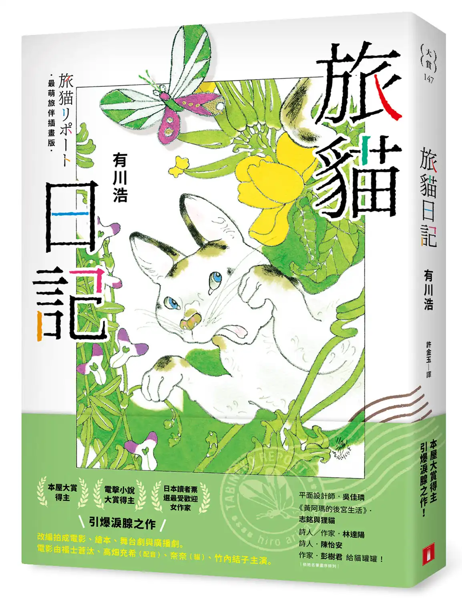
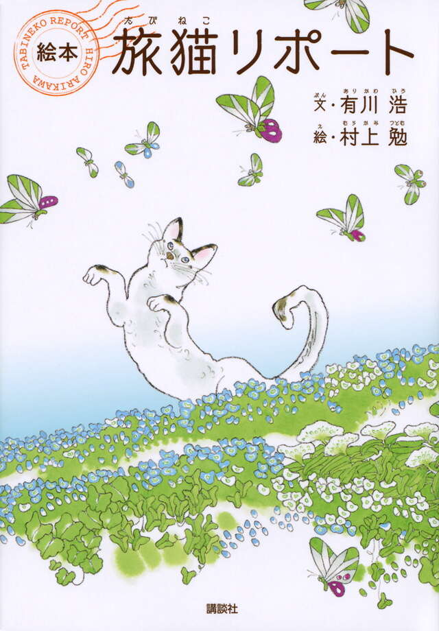

# 今天的文学猫角色：Nana（奈奈）

银色休旅车的引擎盖晒得暖和，流浪猫奈奈便把它当作床铺。车主悟想摸它，它立刻抬起前爪拒绝：人类把车停在外面，却又不许猫踩，规矩实在难懂。有川浩（Hiro Arikawa）的小说《旅猫日记》（旅猫リポート）让这只猫自己讲述往事。开篇借用了夏目漱石《我是猫》的无名宣言，奈奈随即得意地指出自己有名字。它观察人类时总带着一点不客气的幽默，既不急于讨好，也不肯放弃舒适的午睡地点。

一场车祸改变了它与悟之间原本若即若离的关系。悟照顾受伤的猫，奈奈痊愈后仍选择回到他的家门前；公寓不许养宠物，悟便为了它搬家。伤好后，车辆从身旁驶过，奈奈的尾巴仍会炸开，它立刻躲到悟身后。这个会反驳人类的讲述者，也会被旧痛吓住。奈奈是以白色为主的公猫，脸上有斑点，尾巴弯成钩。悟小时候养过一只模样相似的猫，叫小八；新来的猫尾钩方向相反，从上方看像数字七，于是得名“奈奈”。它嫌这名字太像女孩，却在悟挠下巴时忍不住打起呼噜，抗议也就没能传达到位。

他们一起生活了五年。后来，悟必须替奈奈寻找新主人，带它乘着那辆银色休旅车拜访旧友。奈奈不知道全部缘由，仍用自己的眼睛记录路途：大海的声响令它吃惊，富士山仿佛迎面压来，白色渡轮能把一辆辆汽车吞进肚里。遇见的猫、狗、马和人，也都先经过它敏锐而有主见的判断。寻找收养者的安排串起悟的往事，但读者始终有一位不肯被动等待命运的旅伴同行。

奈奈的嘴硬与亲近并不矛盾。悟一次次为它张罗归宿，事情没谈成，却又松了口气，带它继续上路；奈奈也从未把自己仅仅当作一件需要安置的行李。它接受旅行，却不愿意把与悟相处的日子当成一段已经结束的往事。小说没有让猫忽然懂得所有人类的秘密，而是保留了它的有限视角：它能记住车盖的温度、下巴被挠的感觉，以及悟说话时的迟疑。人与猫对旅程的理解并不相同，共同走过的道路因此有了两种声音。

《旅猫日记》原在《周刊文春》连载，2012 年出版单行本。连载时为故事作画的村上勉，后来又与有川浩合作绘本版；作家为画面重新写文，画家也添画新的场景。文字中的奈奈会顶嘴，画中的奈奈则在花草与蝴蝶间伸展身体。小说的开端是一块供流浪猫打盹的车盖，旅途中它成了奈奈熟悉的移动住所；即使前方的目的地一直在变，这只猫还是带着它的脾气，坐在悟身边看窗外的景色。

### 资料来源

- 有川浩（Hiro Arikawa），[《旅猫日记》繁体中文版与公开试读](https://www.crown.com.tw/view.aspx?bc=506147)，许金玉译，皇冠文化，2023 年
- 文艺春秋，[《旅猫リポート》初版图书页](https://books.bunshun.jp/ud/book/num/9784163817705)，2012 年
- 文艺春秋《本の話》编辑部，[村上勉谈《旅猫リポート》绘本创作](https://books.bunshun.jp/articles/-/2344)，2014 年
- 讲谈社，[《絵本「旅猫リポート」》图书页](https://www.kodansha.co.jp/book/products/0000189133)，2015 年
- Penguin Random House，[《The Travelling Cat Chronicles》英文版介绍](https://www.penguinrandomhouse.com/books/567049/the-travelling-cat-chronicles-by-hiro-arikawa-translated-by-philip-gabriel/)，2018 年

### 视觉参考

1. 2023 年皇冠插画版封面，村上勉绘：花丛中的奈奈
   - 来源页面：<https://www.crown.com.tw/view.aspx?bc=506147>
   - 原始图片：<https://www.crown.com.tw/images/large/506147.webp>
   - 作者/机构：村上勉（原插画）；皇冠文化
   - 说明：繁体中文版插画版封面以村上勉绘制的奈奈为主角。

2. 2015 年讲谈社绘本封面，村上勉绘：奈奈与蝴蝶
   - 来源页面：<https://www.kodansha.co.jp/book/products/0000189133>
   - 原始图片：<https://dvs-cover.kodansha.co.jp/0000189133/dgmcYi5SeO5Lj2YoTomWwo56FIBY5NcthJjhIoWz.jpg>
   - 作者/机构：村上勉；讲谈社
   - 说明：绘本版封面呈现奈奈在花间伸展、身旁飞着蝴蝶的形象。
