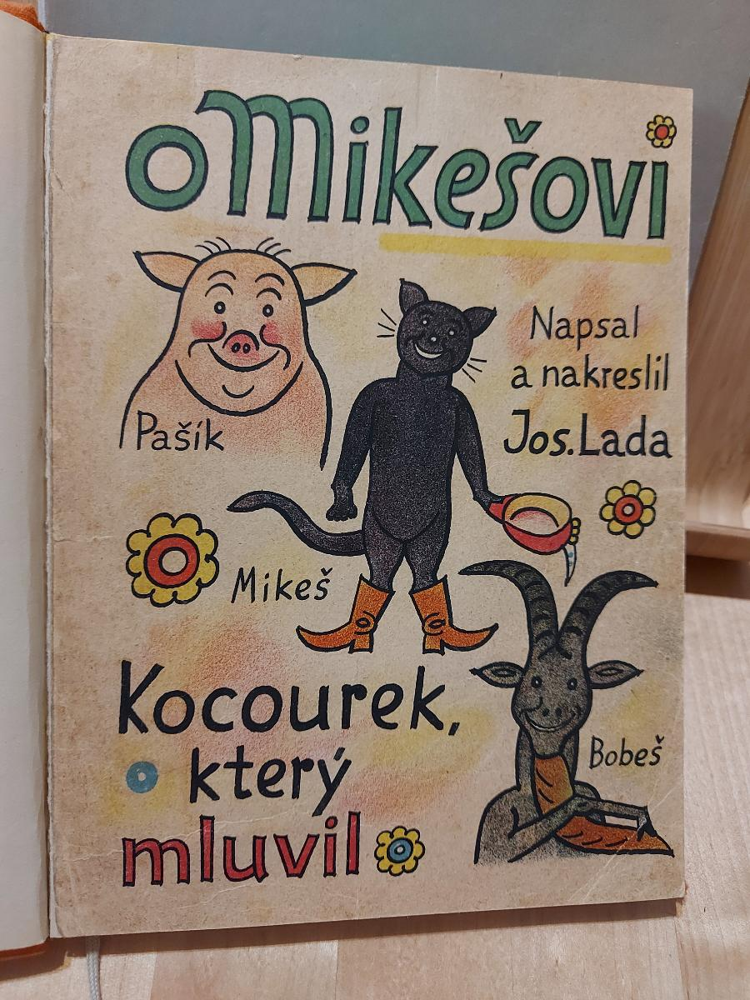
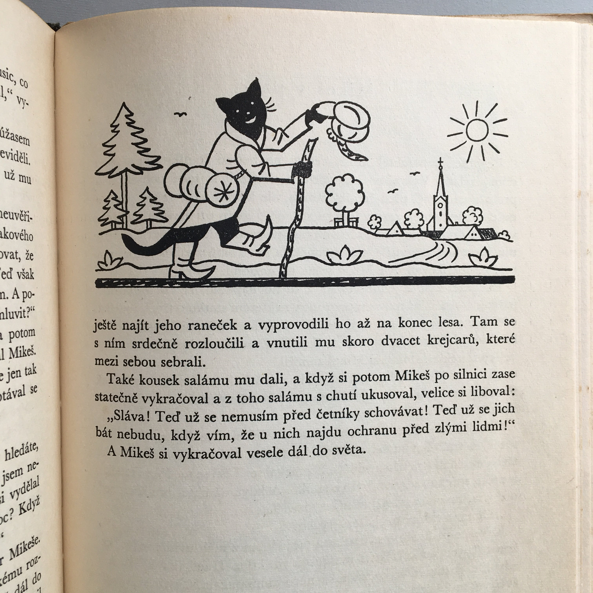

# 今天的文学猫角色：Mikeš

一只黑猫打翻了祖母的奶油罐，决定自己去挣一只新的回来。它叫 Mikeš，出自捷克作家兼画家约瑟夫·拉达（Josef Lada）的《Mikeš》。在拉达笔下，黑猫能说话，穿着靴子，像村里的人一样走路、帮忙，也会因为闯祸而羞愧。这个小小的过失把它从熟悉的家门带向了更大的世界。

故事的家在拉达故乡 Hrusice。Mikeš 与鞋匠家的 Pepík 要好；它从 Pepík 那里学会说话，又把这门本领教给猪和山羊。村民对这位会讲人话的客人感到惊奇，却也喜欢它的礼貌和亲切。拉达亲手绘制的黑猫是直立的小个子，圆眼、尖耳、长尾巴，穿上靴子后，既有童话人物的神气，也仍像一只随时会闯祸的猫。它的伙伴同样会说话，村庄因此既像寻常的乡间生活，又处处可能冒出意外的交谈。

奶油罐摔碎时，Mikeš 并没有留在家里等人替它收拾。那天祖母让它去地窖取奶油，它脚下失去平衡，连罐带奶油一起摔了下去。它难过，也担心受罚，便出走，打算赚到买新罐的钱再回来。它带着行囊上路，遇见放鹅的女孩，郑重介绍自己的来处，甚至自豪地说，家里的猪和山羊也会说话。这里的幽默不只来自一只猫会开口，还来自它把自己的责任和冒险都看得十分认真。

离家之后，Mikeš 在马戏团找到过工作，最后还是回到了村里。它走出去的理由始终牵着那只破掉的罐子和家里的人。拉达最初为自己的女儿们讲述这些故事，后来故事出现在儿童杂志上，再结集成书。他把村庄、孩子、动物和旅途连在一起，让会说话的黑猫既能带人去看热闹，又不失一个会犯错、会惦记祖母的小伙伴。读者可以跟着它跑到远方，再从它回家的念头里，认出这趟旅行的起点。

拉达既写故事也画插图，还为雅罗斯拉夫·哈谢克（Jaroslav Hašek）的作品作过画。1934 年《O Mikešovi》的旧版书影里，Mikeš 站在猪和山羊之间；1960 年捷克文版本的内页，又画它背着行囊、拄杖走向远方。简洁的黑色线条让靴子、尾巴和小小的行囊都醒目，读者一眼便能认出这位敢独自上路的旅伴。后来，奥特弗里德·普罗伊斯勒（Otfried Preußler）的德语版本《Kater Mikesch》在 1963 年获得德国青少年文学奖的儿童图书奖。不同年代的读者先后遇见这只黑猫，而它最容易让人记住的动作，仍是背起行囊，带着赔一只奶油罐的心事走出村庄。

### 资料来源

- Albatros Media，[《Mikeš》图书页与约瑟夫·拉达简介](https://www.albatrosmedia.cz/tituly/8169071/mikes/)
- Ladův kraj，[“Journey with Mikeš”（据拉达原书节选改写）](https://www.laduv-kraj.cz/journey-with-mikes)
- 德国青少年文学奖，[《Kater Mikesch》获奖记录](https://www.jugendliteratur.org/buch/kater-mikesch-1759)
- Fischer Sauerländer，[《Kater Mikesch》图书页](https://www.fischer-sauerlaender.de/buch/otfried-preussler-josef-lada-kater-mikesch-9783733601683)

### 视觉参考

1. 1934 年《O Mikešovi》旧版封面，约瑟夫·拉达绘：黑猫与伙伴
   - 来源页面：<https://aukro.cz/o-mikesovi-josef-lada-1934-7050068348>
   - 原始图片：<https://cdn.aukro.cz/images/sk1699916137664/o-mikesovi-josef-lada-1934-176733049.jpeg>
   - 作者/机构：约瑟夫·拉达（插画）；Aukro（书影）
   - 说明：旧版封面画出 Mikeš 与它的猪、山羊伙伴。

2. 1960 年捷克文《Mikeš》内页，约瑟夫·拉达绘：黑猫背包上路
   - 来源页面：<https://takahashima.thebase.in/items/68283501>
   - 原始图片：<https://baseec-img-mng.akamaized.net/images/item/origin/19e73662a1ddcb54f0665671cf676647.jpg>
   - 作者/机构：约瑟夫·拉达（插画）；髙橋麻帆書店（书影）
   - 说明：内页插画画出 Mikeš 带着行囊离村远行。
