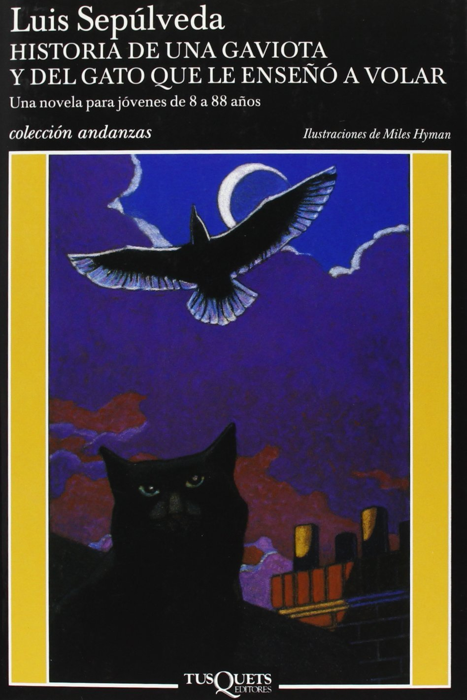
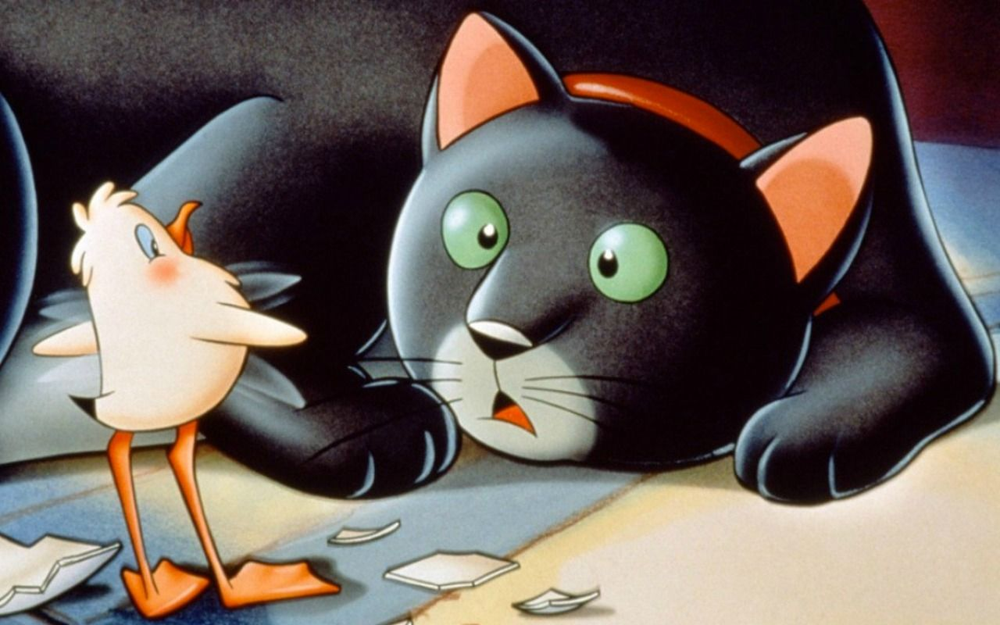

# 今天的文学猫角色：Zorbas（索尔巴斯）

一只浑身沾满石油的海鸥飞到汉堡港的阳台，撞见正在那里的黑猫索尔巴斯（Zorbas）。她已经无力再飞，却还惦记着即将产下的蛋，于是请猫答应三件事：不吃蛋、照顾孵出的幼鸟，以及教她飞翔。索尔巴斯又大、又黑、身形圆胖；他原本只需在阳台上晒太阳，现在却得为一只鸟学会履行母亲的责任。最棘手的是最后一项：猫能教会海鸥什么呢？

这只猫出自智利作家路易斯·塞普尔韦达（Luis Sepúlveda）1996 年的小说《教海鸥飞翔的猫》（Historia de una gaviota y del gato que le enseñó a volar）。作家曾答应两个孩子，写一个关于人类如何伤害环境的故事。海上的漏油让海鸥母亲失去生命，却把索尔巴斯推入了故事中心。污染不是远处抽象的灾难：它把一枚需要照看的蛋，留在一只港口猫的眼前。

索尔巴斯并非独自逞强。他找来港口的猫朋友，把自己的诺言变成大家共同承担的事。在同伴看来，一只港口猫给出的保证，也关乎整个猫群的信用。猫们平时还有自己的日常：到一家意大利餐馆的后门吃饭，竟也得先预约。这些近乎人类的小规矩，让港口成为一处热闹的生活场所，而非仅供冒险经过的布景。猫群中有人善于组织，有人爱翻百科全书；关于怎样养大一只海鸥、怎样让她飞起来，他们像处理一桩从未遇过的难题，边查边试。小海鸥出生后被取名“幸运”（Lucky），还把索尔巴斯当作妈妈。这个称呼有趣，也让他的处境更加具体：他必须喂养、保护她，同时承认她的翅膀终究要去猫无法到达的地方。

索尔巴斯的性格藏在这些实际的选择里。他没有因为承诺听起来不可能就把它忘掉，也没有把小海鸥当成一只需要学猫生活的“怪猫”。当猫们的知识不足以解决飞行的问题时，故事甚至让他们求助于一位诗人。飞翔最终仍要由小海鸥自己完成；索尔巴斯能做的，是把她带到可以尝试的地方，并信任她会张开翅膀。小说因而把“教”写得很特别：老师既要陪伴，也得容许学生离开自己熟悉的世界。

原作的西班牙语版本由迈尔斯·海曼（Miles Hyman）绘图，书封上黑猫在港口夜色中仰望飞鸟。1998 年，恩佐·达洛（Enzo D’Alò）又把这个故事拍成意大利动画电影《La Gabbianella e il gatto》，给索尔巴斯和小海鸥留下了另一种鲜明的形象。无论在书页还是银幕上，那只圆胖的黑猫面对的都是同一个难题：自己不会飞，却答应了要帮别人飞起来。

### 资料来源

- Tusquets Editores，[《Historia de una gaviota y del gato que le enseñó a volar》图书页](https://www.planetadelibros.com/libro-historia-de-una-gaviota-y-del-gato-que-le-enseno-a-volar/88363?soporte=88363)，1996 年版
- Agencia Literaria Carmen Balcells，[《Historia de una gaviota y del gato que le enseñó a volar》作品页](https://www.agenciabalcells.com/en/authors/works/luis-sepulveda/historia-de-una-gaviota-y-del-gato-que-le-enseno-a-volar/)
- Publishers Weekly，[《The Story of a Seagull and the Cat Who Taught Her to Fly》书评](https://www.publishersweekly.com/978-0-439-40186-9)，2003 年
- BookTrust，[《The Story of a Seagull and the Cat Who Taught her to Fly》图书介绍](https://www.booktrust.org.uk/book-recommendations/bookfinder/the-story-of-a-seagull-and-the-cat-who-taught-her-to-fly)，2016 年英语版
- ADRC，[《La Mouette et le chat》电影资料页](https://adrc-asso.org/patrimoine/diffusion/films-et-cycles/la-mouette-et-le-chat)，1998 年电影

### 视觉参考

1. 1996 年 Tusquets 版封面，Miles Hyman 绘：黑猫与海鸥
   - 来源页面：<https://libropolis.com.co/index.php?product_id=4686&route=product%2Fproduct>
   - 原始图片：<https://libropolis.com.co/image/catalog/portadas/Historia%20de%20una%20gaviota%20y%20del%20gato%20que%20le%20ense%C3%B1%C3%B3%20a%20volar.jpg>
   - 作者/机构：Miles Hyman / Tusquets Editores
   - 说明：原作西班牙语版封面呈现索尔巴斯与海鸥。

2. 1998 年动画电影剧照：黑猫与小海鸥
   - 来源页面：<https://adrc-asso.org/patrimoine/diffusion/films-et-cycles/la-mouette-et-le-chat>
   - 原始图片：<https://adrc-asso.org/sites/default/files/adrc/ged/la-mouette-et-le-chat_2.jpg>
   - 作者/机构：ADRC
   - 说明：1998 年意大利动画改编呈现黑猫与小海鸥相遇。
