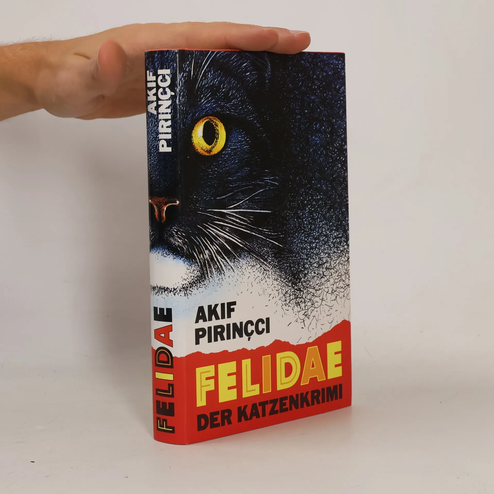
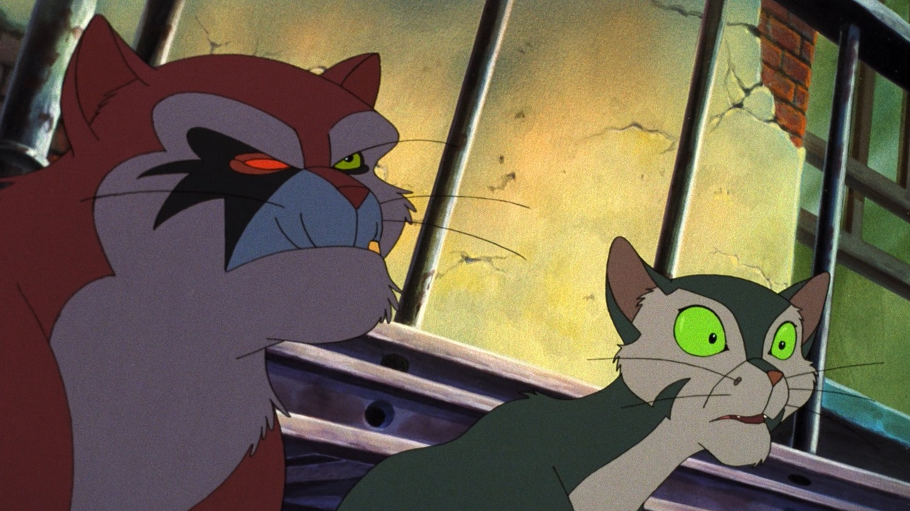

# 今天的文学猫角色：Francis

新搬来的家猫 Francis 刚开始巡视陌生街区，就撞见一只惨死的同类。主人古斯塔夫（Gustav）或许只是在安顿新家；对 Francis 来说，这片街区已经成了一宗必须弄清的案件。Akif Pirinçci 的德语小说《Felidae》于 1989 年出版，把侦探小说的追问交给一只会观察、会推理，也会对周围一切发表尖刻意见的猫。死者并非孤例，Francis 才踏进新领地，就得重新判断每个邻居是线索、帮手，还是危险。

Francis 是家猫，却没有安于窗台和食盆。他对陌生气味与异常举动保持警觉，发现尸体后也没有把恐惧当成退开的理由。他与受伤的老猫蓝胡子（Blaubart）相识，从对方那里得知附近已有多只猫遇害。两只猫的差别很能说明 Francis 的性格：蓝胡子熟悉地盘上的旧事和险处，新来的 Francis 则不停提出问题，连看似荒诞的说法也要追到能验证的地方。他的好奇心让故事向前走，讥诮的叙述口吻又让血腥的现场保留了猫的脾气。

调查中，Francis 遇到能操作电脑的猫 Pascal，也窥见一群猫围绕殉难者 Claudandus 形成的崇拜。更深处还有记录着猫实验的教授笔记。这些线索把普通的邻里凶案推向更阴暗的地方：猫会为信念伤害自己，也可能把别的猫当作某种计划的材料。Francis 所做的并非逐个盘问嫌疑者那么简单；他必须在传闻、证据和自己的不安之间反复辨认。读者跟着他的视角穿过街道、屋舍和藏尸的地下空间，同时也看到一座由猫组成、同样会制造权力与盲信的城市。

小说让猫拥有说话和使用工具的能力，却没有把它们写成穿着猫皮的人类侦探。它们会争地盘，会倚靠熟识的同伴，也会在危险面前露出身体上的脆弱。Francis 的聪明因此不是无所不能：他能提出问题，仍要靠别的猫提供记忆和线索；他能追进案件深处，也会被所见的残酷震动。正是这份不肯停止探查、又无法对死者无动于衷的劲头，使他的机敏有了重量。

《Felidae》后来被改编为 1994 年的德国动画电影。电影中的 Francis 有醒目的绿眼，和蓝胡子并肩站在阴暗街区里；小说的魅力则更多来自这只猫边走边想的声音。它把一桩猫的谋杀案写成对狂热、实验和暴力的追查，也让读者在一只新来者不断发问的目光中，重新看见熟悉街道背后的陌生秩序。

### 资料来源

- Kirkus Reviews，[《Felidae》书评](https://www.kirkusreviews.com/book-reviews/akif-pirinaci/felidae/)，1992 年 12 月刊
- Publishers Weekly，[《Felidae》书评](https://www.publishersweekly.com/9780679420699)，1993 年 1 月 4 日
- Siskel Film Center，[《Felidae》影片介绍](https://www.siskelfilmcenter.org/felidae)

### 视觉参考

1. 德语版《Felidae》书封，Goldmann：黑猫侧脸
   - 来源页面：<https://bookbot.com/g/1244436>
   - 原始图片：<https://rezised-images.knhbt.cz/1920x1920/93631766.webp>
   - 作者/机构：Goldmann Verlag；Bookbot
   - 说明：德语版《Felidae》书封实物照片，呈现作品的黑猫视觉形象。

2. 1994 年《Felidae》电影剧照：Francis 与蓝胡子
   - 来源页面：<https://www.siskelfilmcenter.org/felidae>
   - 原始图片：<https://www.siskelfilmcenter.org/sites/default/files/2026-05/image-w1280%20%284%29.jpg>
   - 作者/机构：Siskel Film Center
   - 说明：1994 年动画电影《Felidae》剧照，Francis 与蓝胡子同框。
