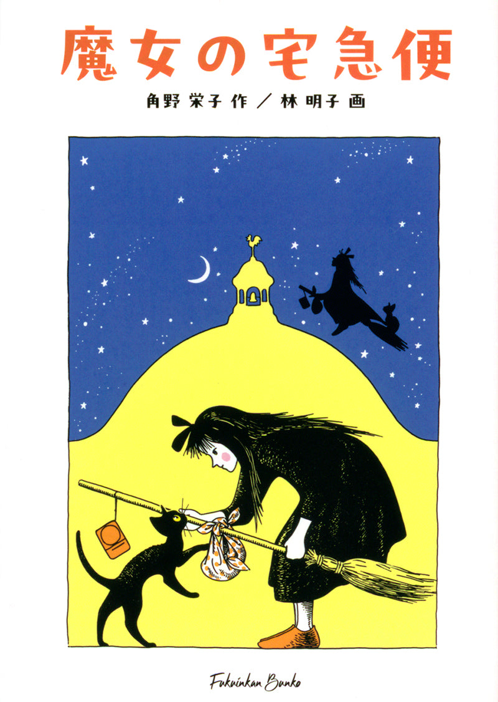
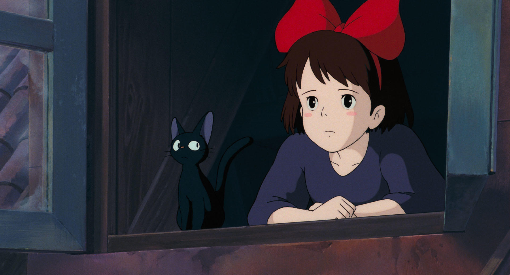

# 今天的文学猫角色：Jiji（吉吉）

满月之夜，十三岁的琪琪带着扫帚和收音机离家，黑猫吉吉也坐上了飞往陌生城市的旅程。角野荣子（Eiko Kadono）的《魔女宅急便》（魔女の宅急便）从一次独立生活的尝试写起：琪琪只有飞行这一种魔法，来到海边的柯里柯后，便用它为人送东西。吉吉与琪琪从小一同长大，第一次离家时，彼此都是对方最熟悉的同伴。

吉吉通身乌黑，林明子（Akiko Hayashi）绘制的书封让他站起身，前爪伸向琪琪的扫帚；两人的黑色轮廓又一起掠过夜空。角野荣子回忆，女儿画过一位骑扫帚、载着黑猫和收音机的魔女；她想象自己也坐上扫帚，由此开始写琪琪与吉吉的故事。黑猫从构思之初，就在这趟飞行里。

这只猫还会说话。琪琪与吉吉之间有自己的“魔女猫语”，让独自在城里生活的少女能把疑问和心事说给一个熟悉的伙伴听。但吉吉也要陪她应付工作中的意外。第一次送货时，装在笼子里的黑猫玩偶途中丢了，琪琪只好让吉吉暂时冒充玩偶，先去收件人家，再回头寻找真正的货物。这件差事把猫从扫帚旁的乘客变成了送货的一部分：他得安静地待在笼中，等琪琪来接。

吉吉却不会永远只围着琪琪转。系列第四部里，十七岁的琪琪满心惦记蜻蜓，吉吉看得有些无奈：从前总是一起行动的两个人，也开始各有自己的关注。到了第五部，快二十岁的琪琪发现，吉吉说起话来忽然像普通猫一样“喵喵”叫，还想学成年猫的语言。原来吉吉也恋爱了。两人从小使用的魔女猫语可能因此消失，琪琪一时不能像从前那样听懂他。角野荣子让成长同时发生在少女和猫身上：吉吉仍是伙伴，也有了自己的生活。

如果想从头认识吉吉，可以从 1985 年问世的《魔女宅急便》读起，再读以两人童年为中心的特别篇《キキとジジ》。后一本书从琪琪出生写到十岁，目录里有“相遇”“尾巴事件”和“吉吉离家出走”：在宅急便开张之前，吉吉已经有自己的小小冒险。1989 年，吉卜力工作室把小说搬上银幕，吉吉在动画中有了圆眼睛、尖耳朵和更鲜明的表情。书中的他从琪琪出生不久便来到家里，陪她经历离家与工作；多年后，那个曾帮她假扮玩偶的黑猫，开始认真学习成年猫的语言。

### 资料来源

- 角野荣子事务所，[《まじょのほん》：《魔女の宅急便》系列介绍](https://kiki-jiji.com/book/book-majo)
- 福音馆书店，[《魔女の宅急便》图书页](https://store.fukuinkan.co.jp/products/%E9%AD%94%E5%A5%B3%E3%81%AE%E5%AE%85%E6%80%A5%E4%BE%BF-1)
- 早稻田大学，[《キキの魔法はなぜ一つ？ 『魔女の宅急便』作者・角野栄子が語るその秘密》](https://www.waseda.jp/inst/weekly/features/specialissue-majotaku1/)
- Castel，[《ジブリ映画『魔女の宅急便』の原作を読む！》](https://castel.jp/p/6281)
- 日本国立国会图书馆，[《キキとジジ》书目与内容简介](https://ndlsearch.ndl.go.jp/books/R100000002-I028119542)，2017 年版
- 吉卜力工作室，[《魔女の宅急便》作品页](https://www.ghibli.jp/works/majo/)，1989 年电影

### 视觉参考

1. 2002 年福音馆文库版书封，林明子绘：吉吉与琪琪
   - 来源页面：<https://store.fukuinkan.co.jp/pages/%E5%88%8A%E8%A1%8C40%E5%91%A8%E5%B9%B4-%E9%AD%94%E5%A5%B3%E3%81%AE%E5%AE%85%E6%80%A5%E4%BE%BF-%E3%82%B7%E3%83%AA%E3%83%BC%E3%82%BA>
   - 原始图片：<https://store.fukuinkan.co.jp/cdn/shop/files/01-1812_01.jpg?v=1750122698>
   - 作者/机构：林明子／福音馆书店
   - 说明：角野荣子小说《魔女宅急便》的福音馆文库版书封，吉吉与琪琪同在画面中。

2. 1989 年吉卜力电影剧照：吉吉与琪琪在窗前
   - 来源页面：<https://www.ghibli.jp/works/majo/>
   - 原始图片：<https://www.ghibli.jp/gallery/majo018.jpg>
   - 作者/机构：吉卜力工作室
   - 说明：根据角野荣子小说改编的动画电影《魔女宅急便》剧照，吉吉与琪琪坐在窗前。
