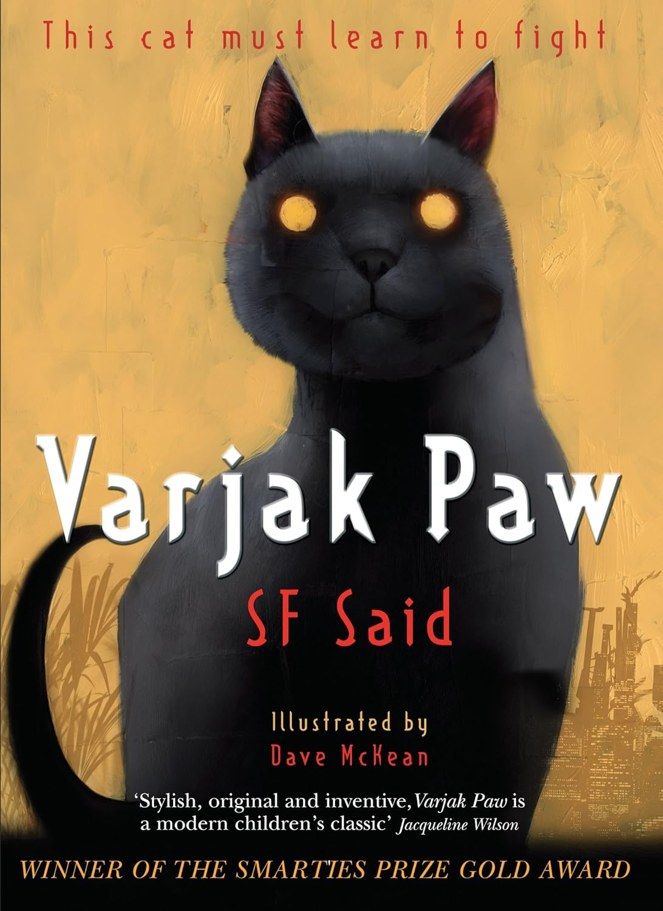
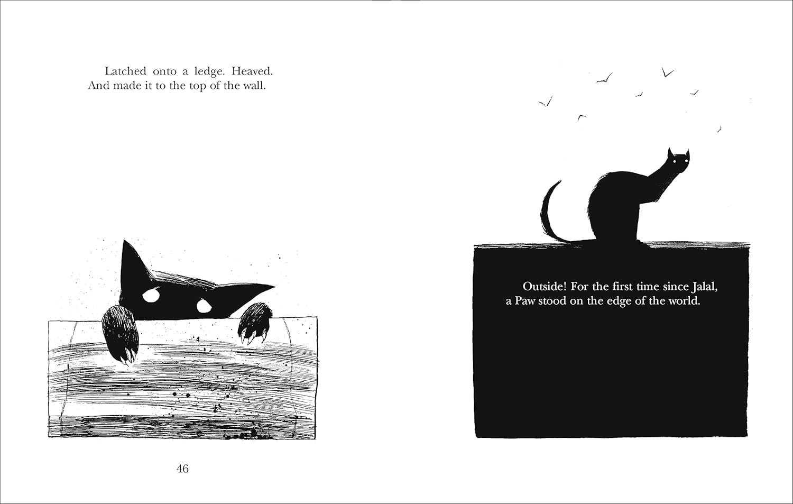

# 今天的文学猫角色：Varjak Paw

祖父讲起远祖曾走遍世界，Varjak Paw 听得心痒，悄悄走到猫门前，想去花园闻一闻外面的空气。父亲立刻喝止了它。在这个家里，狩猎是古老故事里的事，干净的爪子和关紧的门才是规矩；Varjak 偏要问：猫难道不该学会狩猎吗？

这只银蓝色的小猫是英国作家 SF Said 小说《Varjak Paw》的主角，中译本题为《功夫猫1·铁爪的传说》。它所属的“美索不达米亚蓝猫”并非现实中的品种，而是作者为故事创造的家族。Varjak 从出生起就住在山丘顶端的旧宅，窗户紧闭，花园外还有高高的石墙。家人引以为傲的眼睛是绿色的，唯独它不是；哥哥借此嘲弄它，连它想去花园的念头也显得不合群。母亲替它理好项圈，劝它安于室内的庇护，它却从这份安稳里闻到了灰尘和沉闷。哥哥取笑它的眼睛，它回嘴便被父亲责备，甚至没了晚饭；只有祖父仍肯在夜里给它讲 Jalal 的故事。

一个陌生男人带着两只黑猫闯进宅子，原来可以靠关门维持的生活突然失去了保障。那两只猫步调一致，眼睛黑得看不出表情，径直把 Varjak 推开。祖父讲的远祖 Jalal 和“道”——一种猫的秘传技艺——从此有了迫切的意义。Varjak 得走出去：它攀住墙沿，吃力地翻上围墙，第一次看到家族几代猫都未曾踏足的外面。Dave McKean 在书中用黑白插图画下这一刻，墙头上的小小身影与大片空白相对，像一道终于打开的门。

城里有狗，也有各自结伙的街猫；猫接连失踪的谜团，把 Varjak 带进更深的危险。它在梦中向 Jalal 学习，在街上向生存经验丰富的猫学习。旧宅的血统不能替它辨认敌友，祖传的技艺也得由它自己在陌生的地方试出来。它仍会害怕，却不再只等家人告诉它什么才算一只“正经”的蓝猫。起初被家人当作淘气的好奇心，到了城里，成了它观察危险、寻找出路的本领；所谓勇敢，是碰过墙壁、见过陌生的猫以后，还肯继续往前走。小说把探险和悬念放在猫的视野里：巨人的鞋、墙的高度、屋外的气味，都因一只初次出门的小猫而有了分量。

SF Said 在访谈中说，故事的起点是自己养过的一只同名小猫第一次翻过花园围墙的经历；他还说，插画家 Dave McKean 画出的 Varjak 与自己原先想象的样子并不完全相同。那只真实的小猫只越过了一道花园墙，小说里的 Varjak 则要穿过整座城市。祖父的冒险故事终于不再只是旧宅里的传闻：翻上墙头的它，正准备留下自己的足迹。

### 资料来源

- SF Said，[《Varjak Paw》第一章公开节选](https://www.rhcbooks.com/books/159802/varjak-paw-by-sf-said-illustrated-by-dave-mckean)
- SF Said，《Varjak Paw》，Dave McKean 绘，Corgi 2014 年版，第 46—47 页
- Penguin Books，[《Varjak Paw》图书页](https://www.penguin.co.uk/books/327130/varjak-paw-by-said-s-f/9780552572293)
- 安徽少年儿童出版社，《功夫猫1·铁爪的传说》，2018 年版，ISBN 9787539797496
- Kirkus Reviews，[《Varjak Paw》书评](https://www.kirkusreviews.com/book-reviews/sf-said-2/varjak-paw/)
- SF Said，[《卫报》访谈：谈《Varjak Paw》的创作与插画](https://www.theguardian.com/childrens-books-site/2014/mar/16/sf-said-interview-varjak-paw)

### 视觉参考

1. 2014 年版封面，Dave McKean 绘：Varjak 正面像
   - 来源页面：<https://www.expectamazing.co.uk/products/varjak-paw>
   - 原始图片：<https://www.expectamazing.co.uk/cdn/shop/files/81XNfifU1jL._SL1500.jpg?v=1752219351>
   - 作者/机构：Dave McKean／Corgi Children’s
   - 说明：2014 年英文版封面以银蓝猫的正面像呈现主角。

2. 2014 年版内页，Dave McKean 绘：Varjak 翻越围墙
   - 来源页面：<https://www.expectamazing.co.uk/products/varjak-paw>
   - 原始图片：<https://www.expectamazing.co.uk/cdn/shop/files/71Iw294ySnS._SL1500.jpg?v=1752219352>
   - 作者/机构：Dave McKean／Corgi Children’s
   - 说明：第 46—47 页的黑白插图描绘 Varjak 首次越过家族宅邸的围墙。
