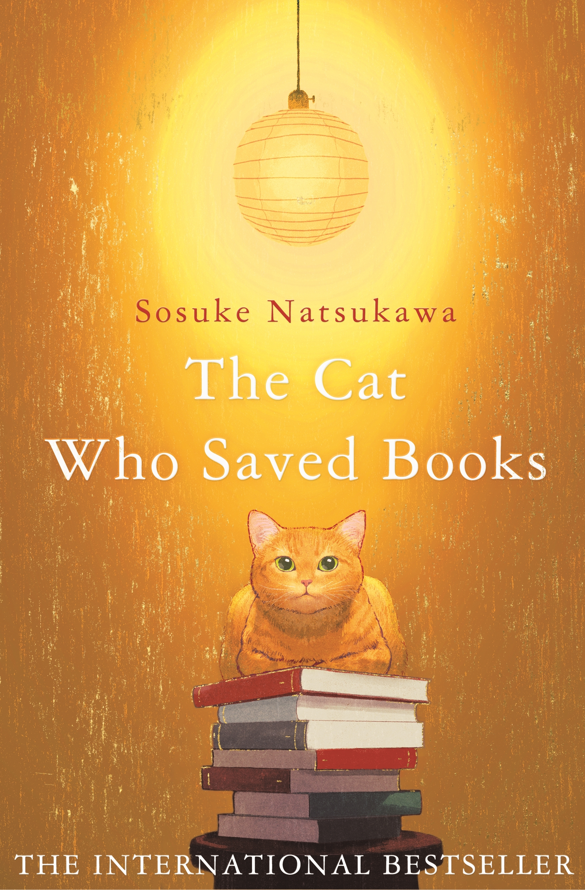
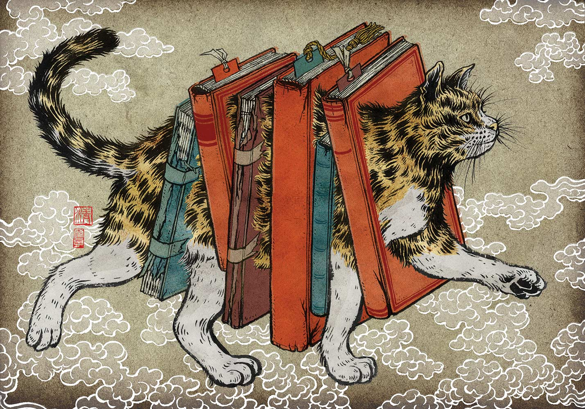

# 今天的文学猫角色：Tiger（阿虎）

祖父去世以后，夏木书店还立着一排排塞满旧书的高书架，高中生夏木林太郎却已经准备关门、搬去伯母家。就在他整理书店时，一只虎斑猫从书架深处现身，开口说人话，还要他跟自己去救书。猫的日文名字是トラ，繁体中文版叫它阿虎，英译本则称 Tiger。它径直领林太郎穿过书店尽头的墙，走进平常人看不到的迷宫。

夏川草介在 2017 年出版的《守护书的猫》（原题《本を守ろうとする猫の話》）里，让这只猫承担了奇特的向导工作。阿虎知道哪里有被困住的书，也知道通往迷宫的路；它直截了当地警告林太郎，若救不出书，人就走不出去。猫的要求听上去蛮横，挑中的搭档却并非冒险家，只是一个刚失去祖父、常把自己关在书店里的少年。林太郎熟悉那些书，因为他曾在祖父留下的书架间读过它们。夏川此前以写医生的《神的病历簿》为人熟悉，这部小说则把读书这件安静的事变成了需要当面争辩的冒险。

在第一座迷宫，号称爱书的人把书锁进书柜，拥有它们却不给它们被阅读的机会；另一人追求极快的阅读，把作品剪成便于吞下的片段；到了出版者那里，能否畅销又成了衡量书的尺度。阿虎带着林太郎一次次跨过那道不可思议的入口，但每次对面站着的都是会替自己辩护的人。爪子打不开这样的锁。林太郎必须听清对方为何如此对待书，再用自己的阅读经验回应。阿虎负责找路和催促，少年得亲自开口，不能一直躲在书架后面。

这只虎斑猫的脾气，使它不太像一团供人抚摸的安慰。它说话带着命令的口气，向少年提出请求时也没有掩饰危险；它选中林太郎作搭档，却不给他一条省力的捷径。书店原本是少年的避风处，如今猫从书架深处打开一条路，逼他走出去，看看别人怎样占有、消耗或者出售他珍爱的东西。林太郎不能仅凭“我喜欢书”赢得争论，阿虎也不能替他把每句话说完。这种一前一后的搭档关系，让猫的倔强和少年的犹疑都变得看得见。

几次营救之后，阿虎曾与林太郎告别，却又回来提出最后一次请求；这回少年还得独自面对一道更难的关口。它能领人进入迷宫，却把作决定的机会留给林太郎。读这部小说时，也许会记住那些怪异的藏书者和卖书人，但更容易记住古书店墙壁忽然让出通道的时刻：阿虎从书架深处出现，把通往迷宫的路指出来；接下来的话，得由林太郎自己说。

### 资料来源

- 小学馆，[《本を守ろうとする猫の話》作品介绍](https://www.shogakukan.co.jp/news/167640)，2017 年
- 爱米粒出版，经三民网路书店刊载，[《守護書的貓》爱藏版简介与第一章试读](https://www.sanmin.com.tw/product/index/011881830)，2023 年
- Pan Macmillan，[《The Cat Who Saved Books》图书页](https://www.panmacmillan.com/authors/sosuke-natsukawa/the-cat-who-saved-books/9781529081480)，2022 年版
- 吉田大助，[〈夏川草介「本を守ろうとする猫の話」　社会への悲観破る書物の力〉](https://book.asahi.com/article/16492925)，《朝日新闻》，2026 年

### 视觉参考

1. 2022 年 Picador 英文版封面：书堆上的阿虎
   - 来源页面：<https://www.panmacmillan.com.au/9781529081480/>
   - 原始图片：<https://dam.bibliolive.com/macmillanaus/getimage.aspx?class=books&assetversionid=895710&cat=default&size=origjpg&id=51321>
   - 作者/机构：Pan Macmillan Australia
   - 说明：Picador 英文版封面以坐在书堆上的橘色虎斑猫呈现阿虎。

2. 2021 年 HarperVia 原画，Yuko Shimizu 绘：背书的阿虎
   - 来源页面：<https://yukoart.com/work/the-cat-who-saved-books-cover/?work_type=illustrations>
   - 原始图片：<https://yukoart.com/wp-content/uploads/2021/05/cat_who_saved_books_jacket_SHIMIZU.jpg>
   - 作者/机构：Yuko Shimizu
   - 说明：画家公布的 HarperVia 英文版封面原画，把阿虎画成背负书册前行的猫。
