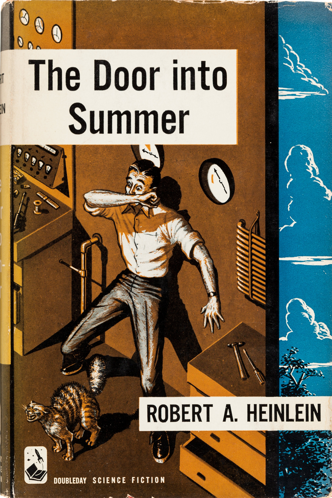
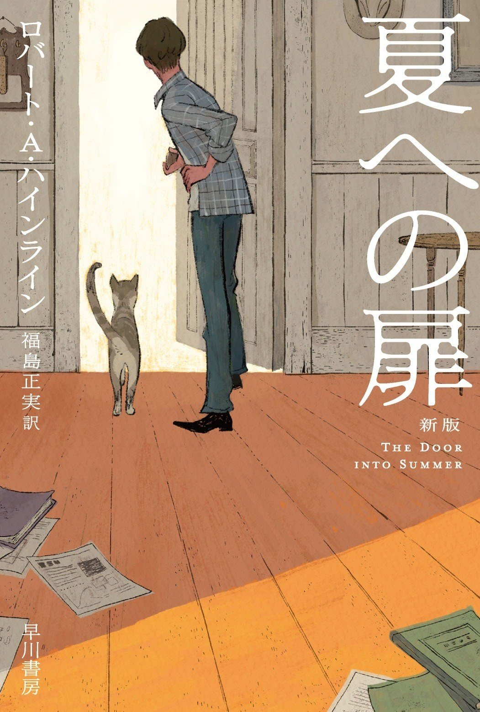

# 今天的文学猫角色：Pete（彼得）

冬天一到，彼得便要把家里的门逐扇检查。明明有专为它开的猫洞，它偏要主人打开人走的门；门外若还是积雪，就催着他开下一扇。十一扇门看完，彼得依旧相信，其中总有一扇能通向夏天。罗伯特·A·海因莱因（Robert A. Heinlein）的《进入盛夏之门》（The Door into Summer）由这场徒劳而认真的巡查开篇，猫的固执也成了整部小说的名字。

它的大名是彼得罗涅斯（Petronius the Arbiter），主人丹尼尔·戴维斯（Daniel Davis）通常叫它彼得。丹尼尔是工程师，习惯给问题找办法，甚至在旧农舍的窗上为彼得做了专用的小门。彼得却有自己的安排：住处、食物和天气归人管，其余的事归它管；尤其一旦下雪，它仿佛认定丹尼尔应当负责把天气修好。这不是会替主人解释世界的神奇动物，而是一只会挑门、会抗议、也会坚持己见的公猫。

1957 年出版的这部科幻小说，把故事放在想象中的 1970 年与 2000 年。丹尼尔发明家用机器人，却遭生意伙伴与未婚妻背叛，失去自己创办的事业。他原打算带彼得一起进入长达三十年的“冷眠”，结果独自被送往未来，猫留在了过去。机器人、冷眠和时间旅行推动故事急转直下；在那些技术之外，寻找彼得是丹尼尔仍要回头的一个切实理由。它不懂专利或时间机器，却把主人与原来的生活连在一起。

彼得的脾气在这里尤其有分量。它并未因为主人遭遇背叛就变成懂得安慰人的寓言角色：雪还是不能踩，人的门仍比猫洞合意。丹尼尔在失去事业和熟悉年代之后惦记的，恰恰是这个不会按计划行动的伙伴。小说后来让他借时间机器返回过去，接回彼得，再次进入冷眠；重逢属于一段曲折的科幻情节，猫本身却始终保持那种不肯迁就坏天气的日常性格。

彼得也有现实中的影子。海因莱因的妻子弗吉尼娅曾带着家里的猫 Pixie，一扇扇打开门，让它看清外面都是雪；她说它在找“通向夏天的门”。这句话给了海因莱因正在构思的故事一个核心画面。后来各版封面给彼得画出不同模样：1957 年初版护封里，它在仪器与惊慌的人旁边拱起背；早川书房 2020 年新版则让它跟着丹尼尔望向敞开的门。无论封面怎样变，那只在冬天要求再开一扇门的猫，都让一部关于未来的小说有了可以从第一页走进去的入口。

### 资料来源

- 罗伯特·A·海因莱因，[《The Door into Summer》第一章节选](https://www.hjkeen.net/halqn/dor2sumr.htm)，1957 年文本
- Joyce Duncan，[《The Door into Summer by Robert A. Heinlein》](https://www.ebsco.com/research-starters/literature-and-writing/door-summer-robert-heinlein/)，EBSCO Research Starters，2019 年
- 早川书房，[《2021年2月19日映画公開決定！ 『夏への扉』〔新版〕書影解禁。》](https://www.hayakawabooks.com/n/nb317fc0953a0)，2020 年
- 海因莱因协会，[《The Inspiration for The Door Into Summer》](https://www.heinleinsociety.org/the-inspiration-for-the-door-into-summer/)，据 William H. Patterson Jr. 传记摘录

### 视觉参考

1. 1957年初版护封，Mel Hunter设计：彼得在仪器旁拱背
   - 来源页面：<https://commons.wikimedia.org/wiki/File:The_Door_into_Summer_(1957)_front_cover,_first_edition.jpg>
   - 原始图片：<https://upload.wikimedia.org/wikipedia/commons/7/77/The_Door_into_Summer_%281957%29_front_cover%2C_first_edition.jpg>
   - 作者/机构：Mel Hunter；Wikimedia Commons
   - 说明：海因莱因小说初版护封以猫和仪器呈现原作中的科幻与家庭伙伴。

2. 2020年早川书房新版封面，まめふく绘：彼得与丹尼望向门外
   - 来源页面：<https://www.hayakawabooks.com/n/nb317fc0953a0>
   - 原始图片：<https://assets.st-note.com/production/uploads/images/39447420/picture_pc_8919bfb6e168297ed386d5cc386d72ec.jpg>
   - 作者/机构：まめふく；早川书房
   - 说明：早川书房新版封面呈现彼得与丹尼尔一同望向打开的门。
