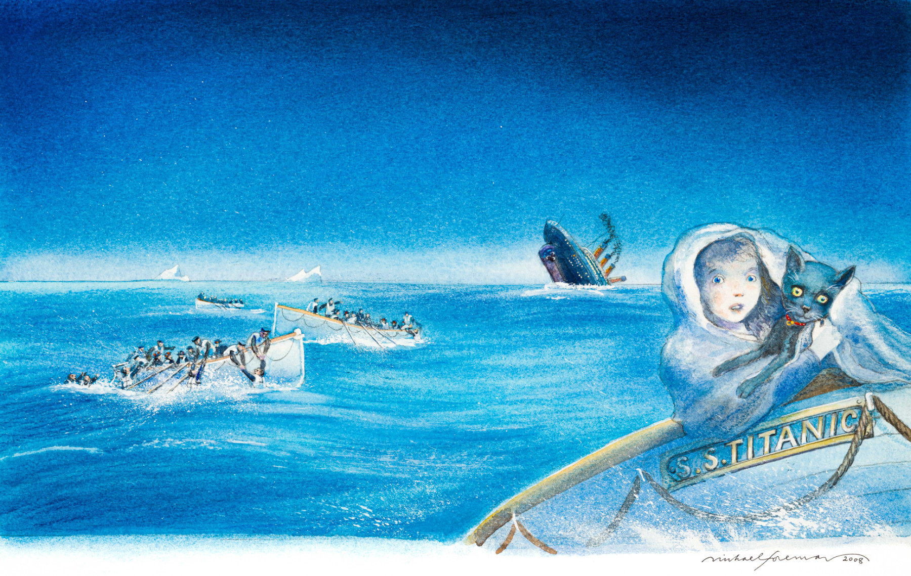
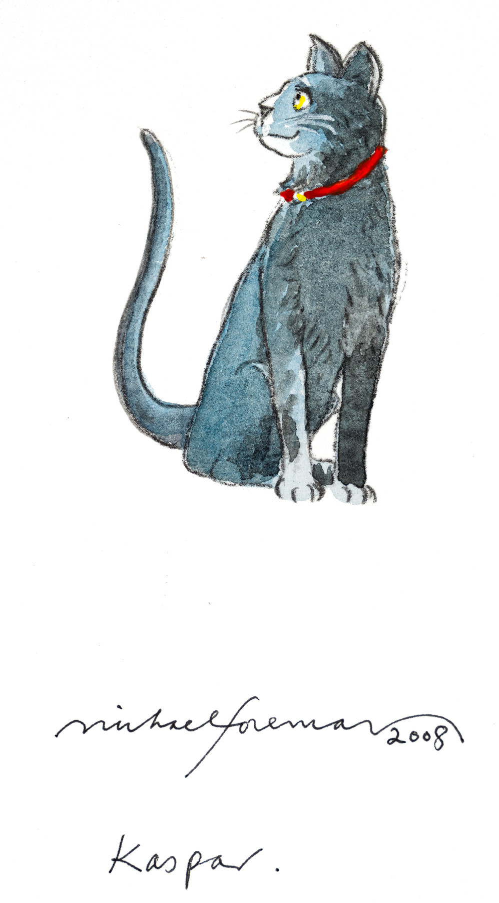

# 今天的文学猫角色：Kaspar

Kaspar 乘着篮子来到伦敦萨沃伊酒店，一路叫个不停。篮盖打开，它立刻安静下来：通身漆黑的毛光亮服帖，昂着头，摆着尾巴，在新房间里轻巧地巡视。窗帘和扶手椅很快留下它磨爪的痕迹，随后它选中壁炉边的椅子，眯眼打量人们。这样的出场，让“猫王子”这个称呼既有几分派头，也有猫占领新住处的日常趣味。

迈克尔·莫波格（Michael Morpurgo）在 2008 年出版的《Kaspar: Prince of Cats》中，让酒店少年侍者约翰尼·特罗特（Johnny Trott）讲述这只猫的经历。Kaspar 的主人是来自俄罗斯的康定斯基伯爵夫人；她说它不喜欢旅行，却要陪她来伦敦演出歌剧。在她眼里，Kaspar 不属于任何人，连她也不能把一位“王子”当成自己的物品。它刚出篮子便自行查验房间的举动，恰好替这句话添了一个可见的注脚。

伯爵夫人意外去世后，照料 Kaspar 的责任落到约翰尼身上。失去熟悉的人，这只原本神气的猫一度消沉；约翰尼得把它藏在酒店里，还要面对严厉的女管事。两人的处境并不相同，却都缺少一个可以安稳归属的家。Kaspar 后来与一位美国女孩亲近，故事也由酒店的房间、走廊和屋顶，驶向横渡大西洋的“泰坦尼克号”。小说让它经历海难，但这是一只虚构的猫，不是船难史实中的幸存者。

莫波格写 Kaspar，并没有让它开口解释人的遭遇。它会抗议被关进篮子，会在舒适的房间里寻找自己喜欢的位置，也会因伯爵夫人的离去而改变模样。约翰尼看见它重新抬起精神时，留意的是毛发又亮了、尾巴又摆起来了。这些小动作比“王子”的头衔更能让人认出它：一只骄傲、挑剔，也会依恋人的黑猫。故事中的友谊正从照看它的吃住、留意它的神情开始。

迈克尔·福尔曼（Michael Foreman）为小说绘制的水彩画，也给了 Kaspar 两种尺度。2008 年初版护封原画把它放进海上的救生艇，身后是倾斜的巨轮；书中一幅插图则只画它戴着红项圈端坐，黄色的眼睛望向一旁。海难使旅程惊险，单独的猫像又把目光带回那个会巡视房间、挑选椅子的家伙。读这部小说，读者可以跟着它走过大西洋，也能在它停下脚步时看清它自己。

### 资料来源

- 迈克尔·莫波格（Michael Morpurgo），[《Kaspar: Prince of Cats》公开试读](https://litres.com/book/michael-foreman/kaspar-prince-of-cats-39761713/read/)，〈The Coming of Kaspar〉，2008 年原作
- Michael Morpurgo，[《Kaspar: Prince of Cats》图书页](https://www.michaelmorpurgo.com/products/kaspar-prince-of-cats-michael-morpurgo-9780007266999/)，2008 年初版信息与故事简介
- Publishers Weekly，[《Kaspar the Titanic Cat》书评](https://www.publishersweekly.com/9780062006189)，2012 年
- Chris Beetles，[《His coat shone, his tail swished…》作品页](https://www.chrisbeetles.com/artwork/49636/his-coat-shone-his-tail-swished-and-when-one-day-he-smiled-up-at-me-i-knew-for-sure-that-prince-kaspar-kandinksy-was-himself-again)，2008 年插图及原文节录

### 视觉参考

1. 2008 年护封原画，福尔曼绘：Kaspar 乘救生艇
   - 来源页面：<https://www.chrisbeetles.com/artwork/49619/kaspar-prince-of-cats>
   - 原始图片：<https://chrisbeetles.com/storage/57133/conversions/433986kyctan-default.jpg>
   - 作者/机构：Michael Foreman；Chris Beetles
   - 说明：2008 年初版护封水彩原画让 Kaspar 与少年同乘“泰坦尼克号”的救生艇。

2. 2008 年书内插图，福尔曼绘：戴红项圈的 Kaspar
   - 来源页面：<https://www.chrisbeetles.com/artwork/49636/his-coat-shone-his-tail-swished-and-when-one-day-he-smiled-up-at-me-i-knew-for-sure-that-prince-kaspar-kandinksy-was-himself-again>
   - 原始图片：<https://chrisbeetles.com/storage/57151/conversions/5oxo6bb8df4l-default.jpg>
   - 作者/机构：Michael Foreman；Chris Beetles
   - 说明：小说第 71 页的水彩插图单独描绘了戴红项圈的 Kaspar。
