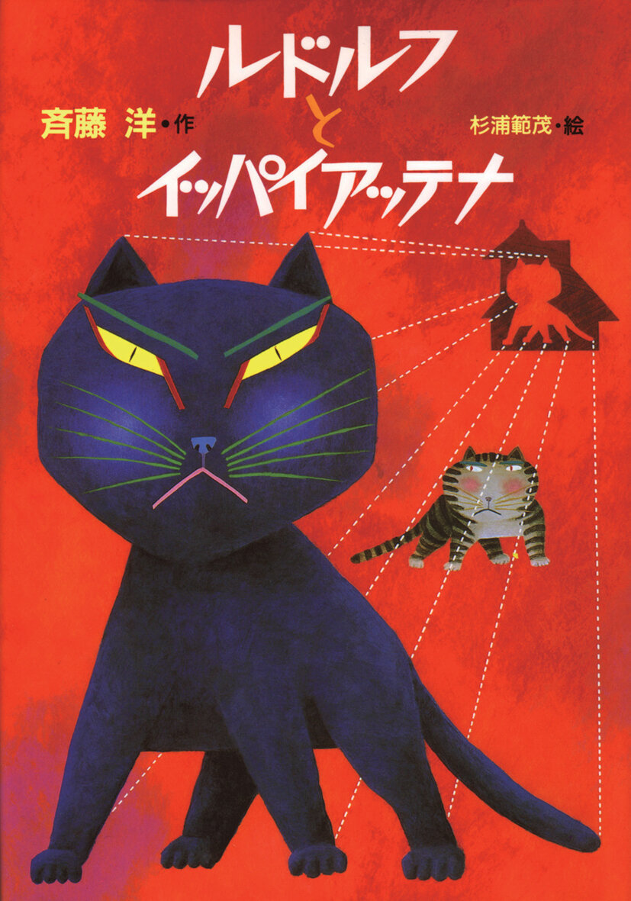
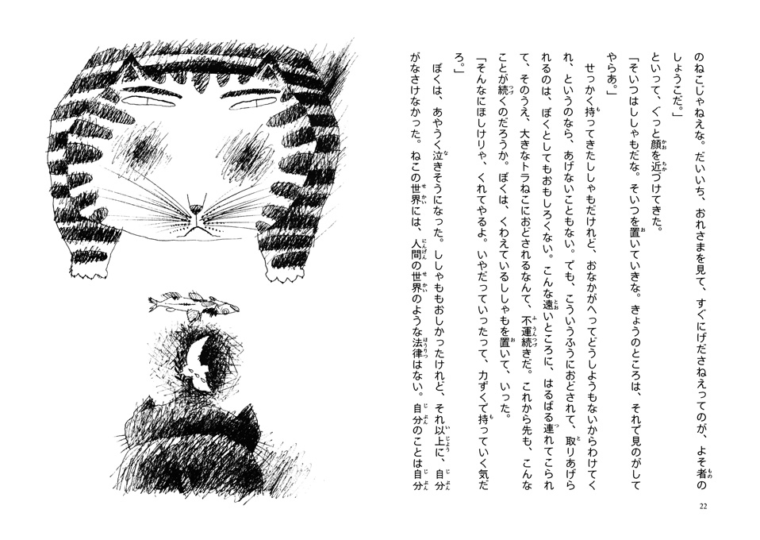

# 今天的文学猫角色：Rudolf（鲁道夫）

偷鱼之后，鲁道夫（ルドルフ）躲进一辆货车，等车停下，熟悉的家已经远得找不到了。这只原本由小女孩梨绘照顾的黑猫，落在东京街头；它知道自己想回家，却连故乡的地名都说不出。斋藤洋（斉藤洋）的儿童小说《鲁道夫和可多乐》（《ルドルフとイッパイアッテナ》）从这个仓促的出走写起：一个习惯有人照看的小家伙，忽然得自己弄清楚陌生城市的规矩。

鲁道夫遇到的第一位重要伙伴，是一只体格大、会打架的虎斑流浪猫。别人用许多名字叫它，它告诉鲁道夫自己的名字“有很多”；鲁道夫却把这句话听成了一个名字，“イッパイアッテナ”。中文译本称它为可多乐。这个误会很适合两只猫的初次相遇：一只刚到城里，连话都听不准；另一只早已熟悉街巷，也知道怎么同不同的人相处。鲁道夫个头小，脾气却不怯，跟着这位老练的朋友学习谋生，才逐渐从迷路的家猫变成能在街上行动的猫。起初可多乐像个难以接近的头领；相处久了，鲁道夫才看见它肯耐心教人的一面。

可多乐还有一项出乎鲁道夫意料的本领：它认识人写的字。它从前有主人，学会阅读后，也开始教鲁道夫认字。对急着回家的黑猫而言，读懂文字有非常实际的用处；它终于能辨认出故乡的名字，回家的计划才有了方向。斋藤洋让猫从低处重新看人类的城市：鱼店、货车和写着地名的文字都在，鲁道夫却必须逐一学会它们对一只猫意味着什么。读书在这里不是离开冒险的功课，而是让它有能力继续走下去。

鲁道夫和可多乐的关系，也随着这些日子改变。大猫能打，却不只是街头的强者；它把生存的方法和认字的本事交给一个比自己弱小的新朋友。鲁道夫想念梨绘和旧家，却也开始在新地方有了牵挂。就在它准备踏上归途时，可多乐被凶猛的斗牛犬打伤。原先迫切的“怎样回家”，于是碰上另一个更难的问题：朋友受了伤，它要怎样回应？小说把选择留在两只猫共同生活的细节里，友情并非一句好听的话，而是会改变鲁道夫脚步的事。

《鲁道夫和可多乐》于 1987 年由讲谈社出版，插图出自杉浦範茂；斋藤洋此前凭这部作品获得讲谈社儿童文学新人奖。鲁道夫后来继续出现在系列故事里，作品也在 2016 年改编成动画电影。不过，初次认识它，仍可以从那辆把它带离家门的货车开始读：一只黑猫从不认识自己的归路，到能读出故乡的名字，也慢慢学会辨认谁在等它、谁需要它留下。

### 资料来源

- 日本国际交流基金会，[《Rudorufu to Ippaiattena》作品介绍与作者资料](https://www.worthsharing.jpf.go.jp/en/lifelong-favorites/trans-rudolf-and-ippai-attena/)
- 讲谈社，[《ルドルフとイッパイアッテナ》作品与人物介绍](https://cocreco.kodansha.co.jp/special/NJ0SP)
- 日本国立国会图书馆，[《ルドルフとイッパイアッテナ》馆藏记录](https://ndlsearch.ndl.go.jp/books/R100000002-I000001858710)
- 新星出版社，《鲁道夫和可多乐》2016 年中文版[图书资料](https://www.megbook.com.tw/mall/detail.jsp?proID=2912253)

### 视觉参考

1. 1987 年讲谈社版封面，杉浦範茂绘：黑猫鲁道夫与虎斑猫
   - 来源页面：<https://cocreco.kodansha.co.jp/special/NJ0SP>
   - 原始图片：<https://d34gglw95p9zsk.cloudfront.net/item_field_assets/assets/000/009/663/large/97e971c1-d040-4385-bae4-80145a2d677b.jpg?1765329173>
   - 作者/机构：杉浦範茂／讲谈社
   - 说明：讲谈社所展示的原作封面，前景是黑猫鲁道夫，后方是虎斑猫可多乐。

2. 1987 年讲谈社版内页，杉浦範茂绘：两只猫与鱼
   - 来源页面：<https://www.worthsharing.jpf.go.jp/en/lifelong-favorites/trans-rudolf-and-ippai-attena/>
   - 原始图片：<https://www.worthsharing.jpf.go.jp/wp-content/uploads/lf-180_sample_1.jpg>
   - 作者/机构：杉浦範茂／日本国际交流基金会
   - 说明：日本国际交流基金会展示的原作内页，两只猫和鱼以黑白线描呈现。
