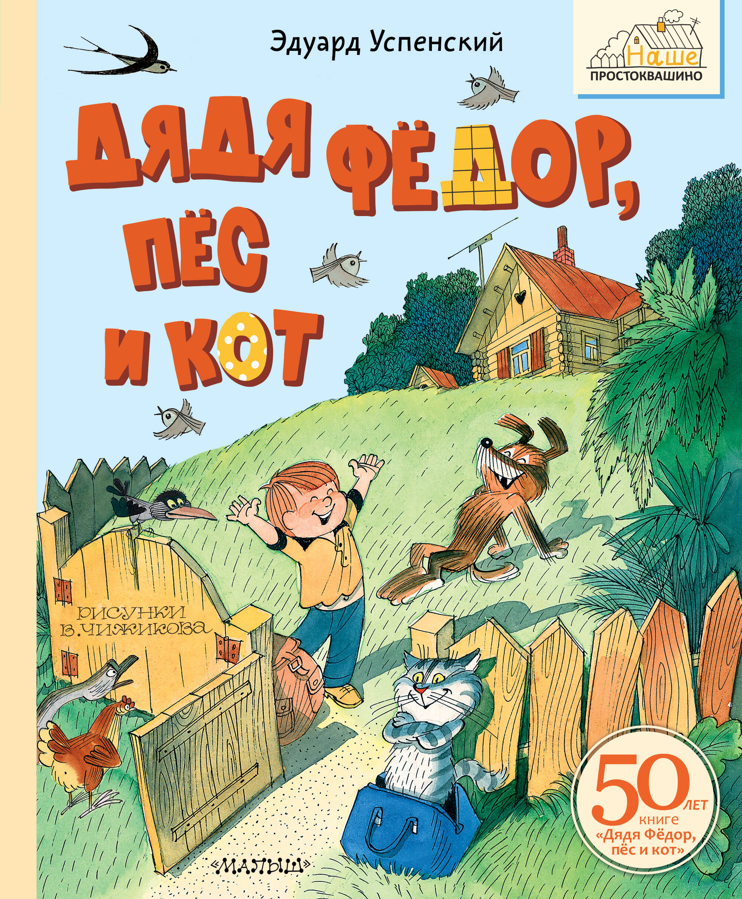
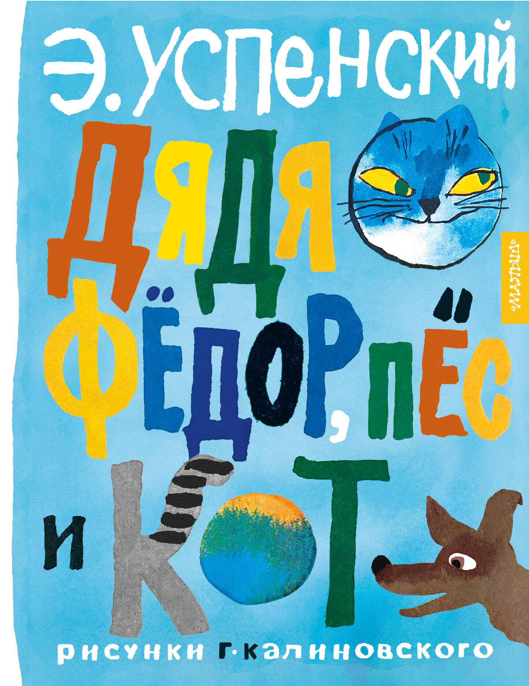

# 今天的文学猫角色：Matroskin

费奥多尔叔叔在楼梯间吃三明治，一只大大的条纹猫先开口纠正他：香肠应该朝下，贴着舌头才好吃。猫住在楼房阁楼里，却因装修快失去住处；它会说人话，也很清楚怎样让自己过得好。这个初次见面的建议，已经显出它的本领：把日常生活里最细小的事，也安排得头头是道。

它叫 Matroskin，出自爱德华·乌斯宾斯基（Eduard Uspensky）的俄语童话《Дядя Фёдор, пёс и кот》，书名意为“费奥多尔叔叔、狗和猫”。故事于 1974 年出版。费奥多尔其实是个能自己煮汤的小男孩；母亲不肯让猫留在家里，他便写信告别父母，带着猫坐车去了乡下。路上，这只曾被随意叫作各种名字的猫要求一个像样的姓氏。它说祖辈曾跟水手出海，自己向往海洋，却怕水；男孩于是给它取了带有水手意味的 Matroskin。它在提包里反复念着新名字，为终于拥有一个正式称呼而高兴。

到了普罗斯托克瓦希诺村，费奥多尔、Matroskin 和后来加入的狗沙里克住进空屋。男孩想骑车，狗想打猎，猫盘算的却是一头能产奶的母牛。它精于计算，常同沙里克拌嘴，甚至先盘问这位新伙伴会做什么活；但争论过后，它还是和大家一起把房子变成家。找到财宝时，它把钱用在心心念念的牛身上，给牛取名穆尔卡。牛很快吃掉窗帘和花，连桌布也不放过，Matroskin 先护着自己的牛，直到自己也被牛追得爬上屋顶，才肯承认需要把牛拴好。乌斯宾斯基让这位能干的“管家”在得意和狼狈之间来回切换，读者很难只把它看成一个爱说教的角色。

它的实用主义还延伸到一只捡来的寒鸦：Matroskin 教它学说“谁在那里”，好让外出时的屋子听起来像有人看守。结果邮差来敲门，和只会重复问话的鸟纠缠了许久。猫的办法确实有用，却总会把生活推向更荒诞的方向。这样的笑料并不妨碍它照顾同伴：费奥多尔生病、父母赶到村里后，Matroskin 给母亲递东西，烧茶、备点心，连原本反对养猫的母亲也对它改了看法。

同一只猫在不同画家笔下也有两副面貌。维克托·奇日科夫（Viktor Chizhikov）的版本让它像村里的总管，抱着前爪守在门边；根纳季·卡利诺夫斯基（Gennady Kalinovsky）则把它画成更像真猫的模样，圆脸、斜眼、条纹尾巴。无论哪一种画法，都能认出那位一边惦记牛奶和家务、一边认真要求别人叫对自己名字的住客。读到故事末尾，它仍留在村里照看牛和小牛，还惦记着让城里的朋友寄来书本与水手帽。

### 资料来源

- 爱德华·乌斯宾斯基（Eduard Uspensky），[《Дядя Фёдор, пёс и кот》原文](https://www.litra.ru/fullwork/get/woid/00586851256294861718)，第一、二、五、六章及结尾
- AST 出版社，[《Дядя Фёдор, пёс и кот. Рисунки В. Чижикова》图书页](https://ast.ru/book/dyadya-fyedor-pyes-i-kot-risunki-v-chizhikova-882301/)
- AST 出版社，[《Дядя Фёдор, пёс и кот. Рисунки Г. Калиновского》图书页](https://ast.ru/book/dyadya-fyedor-pes-i-kot-risunki-g-kalinovskogo-874074/)
- Olga Bukhina，[《Book Review: Uncle Fedya, His Dog, and His Cat》](https://wowlit.org/on-line-publications/review/volumevi3/12)，《WOW Review》，2014 年

### 视觉参考

1. AST 纪念版，奇日科夫绘：Matroskin 抱臂站在村口
   - 来源页面：<https://ast.ru/book/dyadya-fyedor-pyes-i-kot-risunki-v-chizhikova-882301/>
   - 原始图片：<https://cdn.ast.ru/v2/ASE000000000882301/COVER/cover1.jpg>
   - 作者/机构：维克托·奇日科夫（Viktor Chizhikov）／AST 出版社
   - 说明：该书纪念版封面让 Matroskin 与费奥多尔叔叔、沙里克同处村口。

2. AST 卡利诺夫斯基版封面：蓝色猫脸与条纹尾巴
   - 来源页面：<https://ast.ru/book/dyadya-fyedor-pes-i-kot-risunki-g-kalinovskogo-874074/>
   - 原始图片：<https://cdn.ast.ru/v2/ASE000000000874074/COVER/cover1.jpg>
   - 作者/机构：根纳季·卡利诺夫斯基（Gennady Kalinovsky）／AST 出版社
   - 说明：该书另一插画版本的封面，以蓝色猫脸和条纹尾巴表现 Matroskin。
