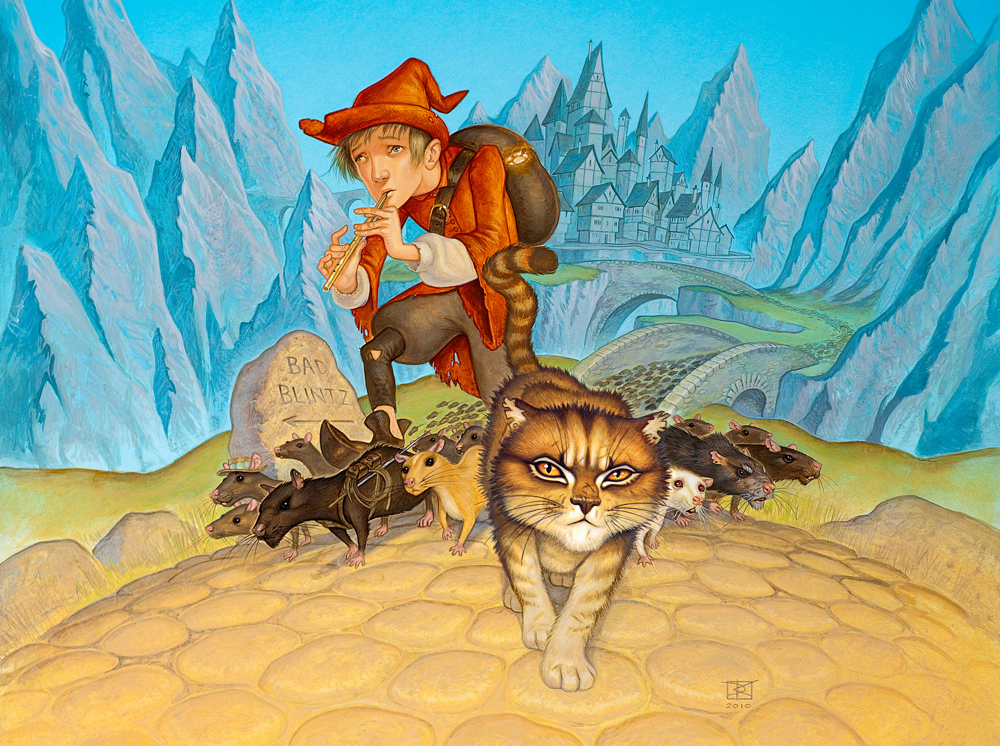
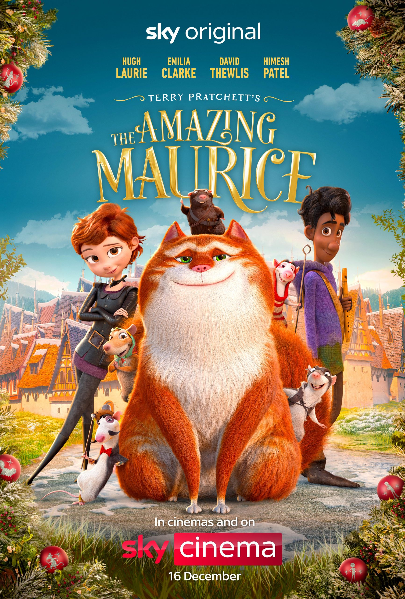

# 今天的文学猫角色：Maurice（莫里斯）

城镇里突然闹鼠灾：老鼠钻进面包箱，在餐桌上偷食，居民急着找人解决。正好有个会吹笛子的少年路过；等居民付钱请他赶走老鼠，鼠群便整整齐齐地撤退。整套把戏的主意来自一只会说话的猫。莫里斯把少年和聪明的老鼠组织成巡回搭档，懂得人们害怕什么，也懂得怎样把这种害怕变成收入。第一次遇见他，读者看到的不是童话里等待收养的猫，而是一位盘算生意的街头老手。

莫里斯出自英国作家特里·普拉切特（Terry Pratchett）2001 年的小说《碟形世界：猫和少年魔笛手》（The Amazing Maurice and His Educated Rodents）。这群老鼠会思考、会说话，还为自己取了名字；吹笛的少年叫基思（Keith）。猫与鼠本应互相提防，如今却靠彼此合作谋生。莫里斯反应快，嘴也快，能把坏点子说得像个周全的计划；鼠群渐渐有了良心，开始质疑靠骗局挣钱，他却更愿意算清下一笔账。同伴们有各自的主意，不能永远像普通老鼠那样任他安排。这种分歧让搭档关系有了比一次冒险更长的回声。

他们来到巴德·布林茨（Bad Blintz）时，熟悉的剧本失灵了。小镇声称鼠患严重，两个捕鼠人还拿得出许多鼠尾作证，可莫里斯和同伴找不到本该到处乱跑的老鼠。一个惯于制造假鼠患的骗子，忽然碰上更难看穿的骗局：他熟悉恐惧能怎样换来钱，却不能再像往常那样只盯着收入。普拉切特借用花衣魔笛手的旧故事，把读者领进一座既滑稽又令人不安的小镇；莫里斯的机灵在这里不只是逗人发笑的本领，也成了查明异样的工具。

莫里斯并未立刻变成无私的英雄。他仍爱占便宜，仍想替自己找退路；正因为如此，他后来为救一只同伴老鼠而冒险，才显得格外有分量。名叫 Dangerous Beans 的老鼠不只是骗局中的道具，而是与他一起经历危险的伙伴。面对它的生死，莫里斯不得不承认，自己很难再把这群老鼠当作任他调度的帮手。普拉切特没有抹去猫的狡黠，却让这种狡黠碰上了责任。

这是《碟形世界》里写给年轻读者的故事，却没有把欺骗、恐惧和良心处理成轻飘飘的游戏；小说获得了卡内基儿童文学奖。后来动画电影《神奇的莫里斯》把他画成圆滚滚的橘白大猫，保罗·基德比（Paul Kidby）的插画则让一只目光锐利的虎斑猫走在鼠群前方。两个形象相差不少，都保留了他像是随时能想出下一笔生意的神气。小说末尾，同伴们留在小镇，莫里斯却又走上了路，朝另一个少年提出赚钱的主意。

### 资料来源

- Terry Pratchett Estate，[《The Amazing Maurice and his educated rodents》作品页](https://terrypratchett.com/books/the-amazing-maurice-and-his-educated-rodents/)
- Terry Pratchett Estate，[《Notable Cats of the Disc》中的 Maurice 介绍](https://terrypratchett.com/explore-discworld/notable-cats-of-the-disc/)
- Publishers Weekly，[《The Amazing Maurice and His Educated Rodents》书评](https://www.publishersweekly.com/9780060012335)
- Terry Pratchett Estate，[《The Amazing Maurice》电影介绍](https://terrypratchett.com/film-tv/the-amazing-maurice/)
- 广东省立中山图书馆，[《2018 广东省公共图书馆童书推荐书目》](https://www.zslib.cn/__local/4/F9/5B/B0733827D07A777EA98217F5870_3A841DB6_119327.pdf?e=.pdf)

### 视觉参考

1. 保罗·基德比 2010 年插画：莫里斯与鼠群同行
   - 来源页面：<https://terrypratchett.com/explore-discworld/notable-cats-of-the-disc/>
   - 原始图片：<https://terrypratchett.com/management/wp-content/uploads/2022/12/maurice-kidby.jpg>
   - 作者/机构：Paul Kidby
   - 说明：普拉切特官方网站展示的莫里斯与鼠群插画。

2. 2022 年 Sky 电影海报：橘猫莫里斯与同伴
   - 来源页面：<https://terrypratchett.com/discworld/the-amazing-maurice-official-film-poster-revealed/>
   - 原始图片：<https://terrypratchett.com/management/wp-content/uploads/2022/10/FgJDfmpWQAAQ3rw-scaled.jpg>
   - 作者/机构：Sky Cinema
   - 说明：小说改编动画电影的官方海报，呈现莫里斯与同行伙伴。
