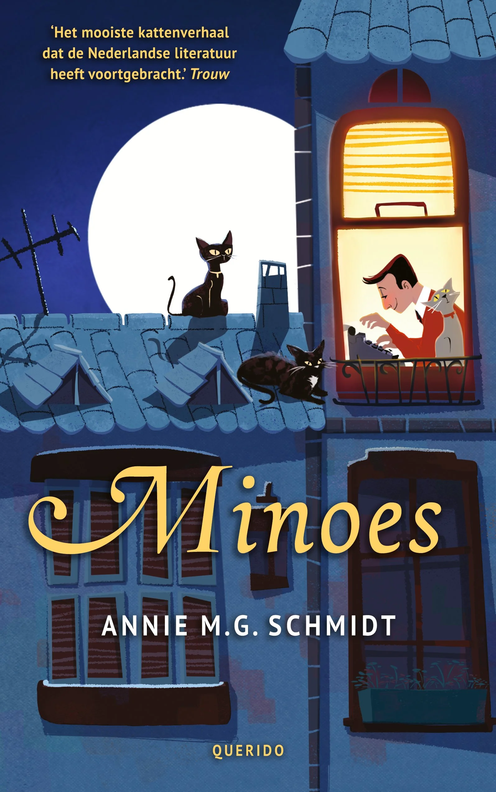
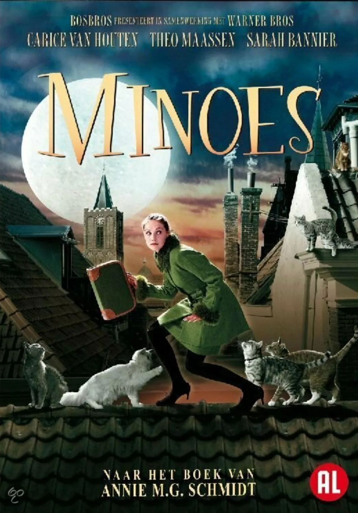

# 今天的文学猫角色：Minoes（咪妮）

一位穿着得体的年轻女子坐在树上，对经过的人发出嘶声；她还会蹭人、打呼噜，遇到金鱼便移不开眼。这些举动并非她在模仿猫。咪妮原本就是一只猫，忽然变成人以后，人的外表和猫的习性被一起留在了她身上。安妮·M.G.施密特（Annie M.G. Schmidt）在《猫女咪妮》（Minoes）里，让她带着这个秘密走进小镇，也让读者从她的动作认出那只尚未离开的猫。

记者蒂贝很会写猫，却不善于追问人，报社给他的工作已岌岌可危。他收留了来到家中的咪妮，咪妮则把屋顶上的猫朋友组织成一条消息线：人们在街上、院子里说过什么，猫们都可能听见。她能听懂猫语，又能把消息讲给蒂贝，成了两边之间的传话人。屋顶上的闲谈因此变成报纸新闻；蒂贝得到继续工作的机会，咪妮也找到一个容得下自己特殊本领的地方。

她对猫群的熟悉并不只是故事里的魔法便利。即使换了人的身体，她仍爱在夜里走屋顶，喜欢用猫的方式亲近或抗拒别人；与人同住时，这些习惯有时显得可笑，有时也使她局促。她想查清自己为何会变成人，寻找恢复原状的办法，却也渐渐与蒂贝和小镇的生活有了牵连。她既不能轻松地回到从前，也没有完全学会按人的规矩生活。施密特把这种不合拍写得轻快，却让它始终跟着咪妮：她能够替人解决麻烦，自己的身份仍悬而未决。

猫们送来的消息后来触及镇上的一位显要人物。他以爱护动物的面目赢得信任，暗地里却做着相反的事。咪妮和猫群帮助蒂贝揭开他的真面目；报道一出，镇民起初站在有势力的人那边，蒂贝再次丢了工作。咪妮没有把消息送到报社便算完成任务，她继续与猫朋友们奔走，替那位敢于刊出真相的记者争回公道。平日里那些看似散漫的猫，在这里成了一群会观察、会记事，也愿意互相援手的伙伴。

这部荷兰童书初版于 1970 年，翌年获得荷兰儿童文学“银石笔奖”。2001 年的电影改编让卡里斯·范·侯登（Carice van Houten）穿着绿色套装，在屋顶与猫群同行；书的近年封面则画出月光下的猫、窗前的记者和小镇房舍。两种画面都抓住了咪妮最难分开的两处生活：在人类的房间里说话，在猫的屋顶上听消息。故事走到后来，她仍要面对一个只有自己能回答的问题：留在人间，还是回到猫的世界？

### 资料来源

- Querido Children's Books，[《Minnie》作品介绍](https://queridochildrensbooksrights.com/highlights/pluk-fj2y2)
- Dutch Foundation for Literature，[《Minoes》作品介绍](https://www.letterenfonds.nl/en/books/minoes)
- Eye Filmmuseum，[《Minoes》电影资料页](https://www.eyefilm.nl/en/whats-on/minoes/1597503)
- 瓯海区图书馆，[《2023 年 4 月配送清单》中的《猫女咪妮》书目](https://lib.ouhai.gov.cn/art/2023/4/10/art_1671409_58830401.html)

### 视觉参考

1. Querido 版书影，Eda Kaban 绘：屋顶猫群
   - 来源页面：<https://queridochildrensbooksrights.com/highlights/pluk-fj2y2>
   - 原始图片：<https://images.squarespace-cdn.com/content/v1/622897749cc1f32486901d56/a1432568-86b6-49db-8eab-648136224748/Minoes.jpg?format=2500w>
   - 作者/机构：Eda Kaban／Querido Children's Books
   - 说明：出版社展示的《Minoes》书影，画出屋顶的猫与窗前的记者。

2. 2001 年电影海报，Eye Filmmuseum：咪妮与猫群
   - 来源页面：<https://www.eyefilm.nl/en/whats-on/minoes/1597503>
   - 原始图片：<https://assets.eyefilm.nl/images/posters/_1280x1832_crop_center-center_none/274419/minoes_affiche.webp>
   - 作者/机构：Eye Filmmuseum
   - 说明：电影资料馆展示的《Minoes》海报，呈现咪妮与屋顶猫群。
